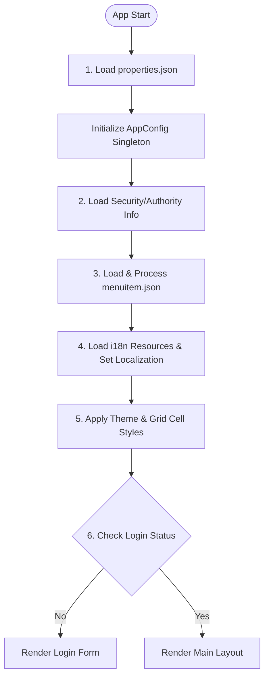
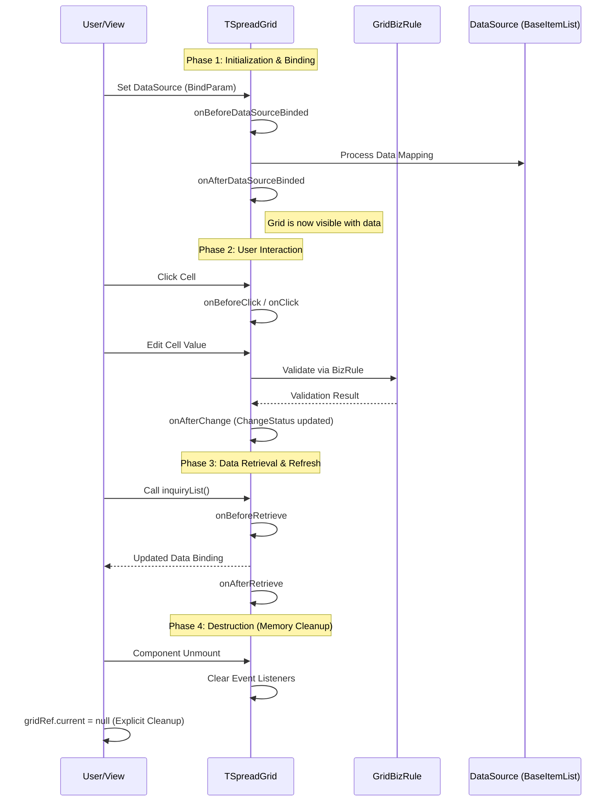
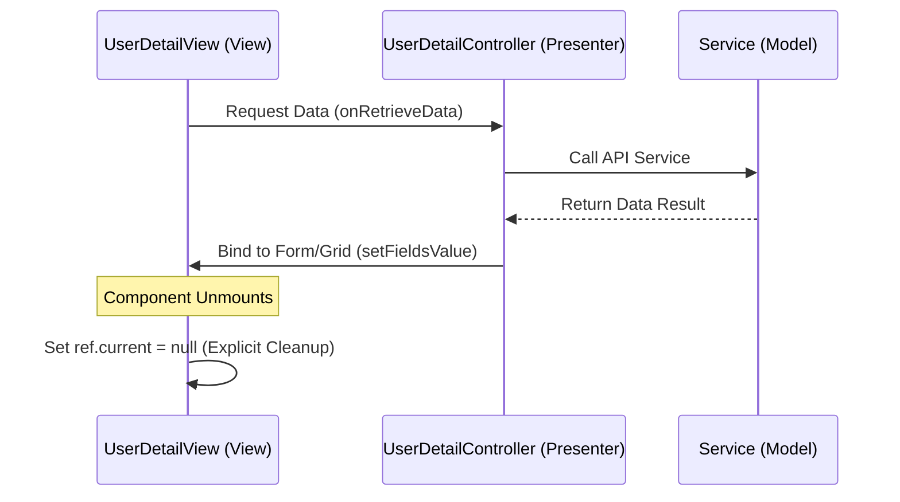
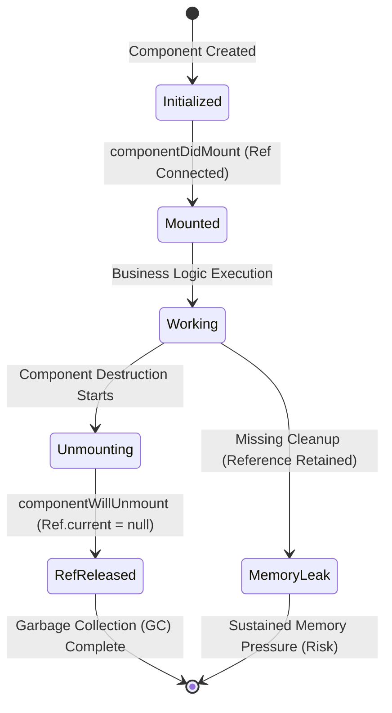

# [tsb-fontos-core] Developer Guide

This guide is for developers who want to use the `tsb-fontos-core` framework to build TypeScript applications with core utilities, data management, and service layer functionality.

## Table of Contents

1. [Introduction](#1-introduction)
2. [Installation](#2-installation)
3. [GUID Types](#3-guid-types)
4. [Utilities](#4-utilities)
   - 4.1 [DateFormatter](#41-dateformatter)
   - 4.2 [ArrayUtil](#42-arrayutil)
   - 4.3 [StringUtil](#43-stringutil)
   - 4.4 [ConvertUtil](#44-convertutil)
   - 4.5 [CheckUtils](#45-checkutils)
   - 4.6 [DownloadUtils](#46-downloadutils)
   - 4.7 [CookieUtil](#47-cookieutil)
   - 4.8 [PriorityQueue](#48-priorityqueue)
   - 4.9 [SortedMap](#49-sortedmap)
   - 4.10 [CallbackManager](#410-callbackmanager)
5. [Events](#5-events)
   - 5.1 [TEvent](#51-tevent)
   - 5.2 [TEventArgs](#52-teventargs)
   - 5.3 [TPropertyChangedEvent](#53-tpropertychangedevent)
6. [Common Structures](#6-common-structures)
   - 6.1 [DayOfWeek](#61-dayofweek)
   - 6.2 [OpCodes](#62-opcodes)
7. [Data Items](#7-data-items)
   - 7.1 [IDataItem](#71-idataitem)
   - 7.2 [BaseDataItem](#72-basedataitem)
   - 7.3 [BaseItemList](#73-baseitemlist)
8. [Commands](#8-commands)
   - 8.1 [CommandUndoManager](#81-commandundomanager)
   - 8.2 [ActionCommand](#82-actioncommand)
   - 8.3 [CommandAdd](#83-commandadd)
   - 8.4 [CommandDelete](#84-commanddelete)
9. [JSON Mapping](#9-json-mapping)
   - 9.1 [JsonMapper](#91-jsonmapper)
   - 9.2 [JsonMapperBindingUtil](#92-jsonmapperbindingutil)
   - 9.3 [MapDecoratorMetaData](#93-mapdecoratormetadata)
   - 9.4 [ArrayMetaData](#94-arraymetadata)
   - 9.5 [DimensionalArrayMetaData](#95-dimensionalarraymetadata)
10. [Logger](#10-logger)
    - 10.1 [GeneralLogger](#101-generallogger)
    - 10.2 [FrontendLogService](#102-frontendlogservice)
11. [Environments](#11-environments)
    - 11.1 [AppConfig](#111-appconfig)
    - 11.2 [Localization](#112-localization)
    - 11.3 [LoginedUserInfo](#113-logineduserinfo)
    - 11.4 [AppConstant](#114-appconstant)
12. [DAO (Data Access Object)](#12-dao-data-access-object)
    - 12.1 [BaseDaoSupport](#121-basedaosupport)
    - 12.2 [HttpWebDaoSupport](#122-httpwebdaosupport)
    - 12.3 [HttpWebDaoBindingSupport](#123-httpwebdaobindingsupport)
    - 12.4 [IRemoteServerDaoSupport](#124-iremoteserverdaosupport)
13. [Exception Handling](#13-exception-handling)
    - 13.1 [AppNormanErrorBoundary](#131-appnormanerrorboundary)
    - 13.2 [BizError](#132-bizerror)
    - 13.3 [HttpErrorsHandler](#133-httperrorshandler)
14. [Remote Server](#14-remote-server)
    - 14.1 [BaseRemoteServerKeys](#141-baseremoteserverkeys)
    - 14.2 [RemoteServerCfgProvider](#142-remoteservercfgprovider)
    - 14.3 [RemoteServerCfgHdl](#143-remoteservercfghdl)
    - 14.4 [TRemoteConfig](#144-tremoteconfig)
    - 14.5 [TRemoteServerConfig](#145-tremoteserverconfig)
15. [HTTP Handlers](#15-http-handlers)
    - 15.1 [HttpBaseRequestHandler](#151-httpbaserequesthandler)
    - 15.2 [HttpWebRequestHandler](#152-httpwebrequesthandler)
    - 15.3 [IRemoteRequestHandler](#153-iremoterequesthandler)
    - 15.4 [TRequest](#154-trequest)
    - 15.5 [TResponse](#155-tresponse)
    - 15.6 [TRestResponse](#156-trestresponse)
16. [Services](#16-services)
    - 16.1 [BaseService](#161-baseservice)
    - 16.2 [BizServiceLocator](#162-bizservicelocator)
    - 16.3 [BizServiceProvider](#163-bizserviceprovider)
    - 16.4 [BizServiceProxy](#164-bizserviceproxy)
    - 16.5 [BizServiceProxyFactory](#165-bizserviceproxyfactory)
17. [Cache Management](#17-cache-management)
    - 17.1 [CacheManager](#171-cachemanager)
    - 17.2 [GeneralCacheProvider](#172-generalcacheprovider)
    - 17.3 [ICacheProvider](#173-icacheprovider)
    - 17.4 [ICacheDataProvider](#174-icachedataprovider)
18. [Code Management](#18-code-management)
    - 18.1 [CodeManager](#181-codemanager)
    - 18.2 [CodeDataItem](#182-codedataitem)
    - 18.3 [CodeDataItemList](#183-codedataitemlist)
    - 18.4 [CodeDataParam](#184-codedataparam)
    - 18.5 [BaseCodeDataService](#185-basecodedataservice)
    - 18.6 [CodeCacheDataProvider](#186-codecachedataprovider)
    - 18.7 [CodeBindTypes](#187-codebindtypes)
    - 18.8 [CodeGroupTypes](#188-codegrouptypes)
19. [Security](#19-security)
    - 19.1 [BaseUserInfo](#191-baseuserinfo)
    - 19.2 [BaseUserToken](#192-baseusertoken)
    - 19.3 [ISecurityDao](#193-isecuritydao)
    - 19.4 [ISecurityService](#194-isecurityservice)
    - 19.5 [AuthorInfoItem](#195-authorinfoitem)
    - 19.6 [AuthorRuleScopeTypes](#196-authorrulescopetypes)
    - 19.7 [AuthorTargetTypes](#197-authortargettypes)
    - 19.8 [AuditUtil](#198-auditutil)
    - 19.9 [DefaultLoginStrategy](#199-defaultloginstrategy)
    - 19.10 [ILoginStrategy](#1910-iloginstrategy)
20. [Observer Pattern](#20-observer-pattern)
    - 20.1 [DataSyncAgent](#201-datasyncagent)
    - 20.2 [DataSyncManager](#202-datasyncmanager)
    - 20.3 [DataSyncNotifiedEventArgs](#203-datasyncnotifiedeventargs)
21. [Export Utilities](#21-export-utilities)
    - 21.1 [ExportGridItem](#211-exportgriditem)
    - 21.2 [ExportGridCellItem](#212-exportgridcellitem)
    - 21.3 [ExportGridHeaderItem](#213-exportgridheaderitem)
    - 21.4 [ExportGridComplexHeader](#214-exportgridcomplexheader)
    - 21.5 [FileExportParm](#215-fileexportparm)
    - 21.6 [FileExportConstants](#216-fileexportconstants)
    - 21.7 [IExportGridDataService](#217-iexportgriddataservice)
22. [Common Types](#22-common-types)
    - 22.1 [TPageInfo](#221-tpageinfo)
    - 22.2 [ExceptionItem](#222-exceptionitem)
    - 22.3 [TErrorMsgItem](#223-terrormsgitem)
    - 22.4 [TRestErrorResponseItem](#224-tresterrorresponseitem)
    - 22.5 [DownloadFileItem](#225-downloadfileitem)
    - 22.6 [IPageParam](#226-ipageparam)
23. [Constants](#23-constants)
    - 23.1 [CoreServerName](#231-coreservername)
24. [Best Practices](#24-best-practices)
25. [Appendix](#25-appendix)

---

## 1. Introduction

`tsb-fontos-core` is a comprehensive core framework library that provides essential utilities, data management, service layer functionality, and infrastructure components for building TypeScript applications. It serves as the foundation layer for the Fontos Framework ecosystem.

### Key Features

- **Utility Functions**: Date formatting, array manipulation, string operations, type conversion, and validation utilities
- **Event System**: Type-safe event handling with property change notifications
- **Data Management**: Base classes for data items, lists, and collections
- **Command Pattern**: Undo/redo functionality with command pattern implementation
- **JSON Mapping**: Object-to-JSON and JSON-to-object mapping with decorator support
- **Service Layer**: Service locator pattern, dependency injection, and service proxies
- **DAO Layer**: Data access abstraction for HTTP-based remote services
- **Cache Management**: Generic caching system with providers
- **Code Management**: Centralized code/constant management system
- **Security**: Authentication, authorization, and audit utilities
- **Observer Pattern**: Data synchronization and notification system
- **Export Utilities**: Grid data export functionality
- **Logger**: Logging infrastructure for frontend applications

### Architecture

The framework follows a layered architecture:

```
tsb-fontos-core/
├── utils/              # Utility functions
├── common/             # Common structures and items
├── dao/                # Data Access Object layer
├── service/            # Service layer
├── remote/             # Remote server configuration
├── caches/             # Cache management
├── codes/              # Code management
├── security/           # Security and authentication
├── observer/           # Observer pattern implementation
├── logger/             # Logging infrastructure
└── environments/       # Application environment configuration
```

---

## 2. Installation

### Prerequisites

- Node.js 16+
- TypeScript 5.5.4+
- reflect-metadata (for decorator support)

### Install from Workspace

If you're working in a monorepo workspace:

```json
{
  "dependencies": {
    "tsb-fontos-core": "^1.0.0",
    "guid-typescript": "^1.0.9",
    "dayjs": "^1.10.7",
    "reflect-metadata": "^0.1.13"
  }
}
```

---

## 3. GUID Types

The framework re-exports all types from `guid-typescript` for generating and working with GUIDs.

```typescript
import { Guid } from "tsb-fontos-core";

// Generate a new GUID
const id = Guid.newGuid();

// Parse a GUID string
const guid = Guid.parse("550e8400-e29b-41d4-a716-446655440000");

// Check if a string is a valid GUID
const isValid = Guid.isGuid("550e8400-e29b-41d4-a716-446655440000");
```

---

## 4. Utilities

### 4.1 DateFormatter

Utility class for formatting dates and performing date calculations using dayjs.

**Static Properties:**

- `InitialDate: Date` - Initial date constant (new Date(0))

**Methods:**

```typescript
import { DateFormatter } from "tsb-fontos-core";

// Format date string with format string
const formatted = DateFormatter.format("2024-01-15", "YYYY-MM-DD"); // "2024-01-15"
const customFormat = DateFormatter.format("2024-01-15T10:30:00", "DD/MM/YYYY HH:mm:ss"); // "15/01/2024 10:30:00"

// Subtract two dates (returns milliseconds)
const date1 = new Date(2024, 0, 15);
const date2 = new Date(2024, 0, 10);
const diffMs = DateFormatter.subtract(date1, date2); // milliseconds difference

// Sum two dates (returns milliseconds)
const sumMs = DateFormatter.sum(date1, date2);

// Add days to a date
const newDate = DateFormatter.addDays(new Date(), 7); // 7 days from now

// Add hours to a date
const futureTime = DateFormatter.addHours(new Date(), 2); // 2 hours from now

// Add minutes to a date
const laterTime = DateFormatter.addMinutes(new Date(), 30); // 30 minutes from now

// Convert milliseconds to years
const years = DateFormatter.getTotalYears(31536000000); // 1 year

// Convert milliseconds to days
const days = DateFormatter.getTotalDays(86400000); // 1 day

// Convert milliseconds to hours
const hours = DateFormatter.getTotalHours(3600000); // 1 hour

// Convert milliseconds to minutes
const minutes = DateFormatter.getTotalMinutes(60000); // 1 minute
```

**Note:** The `subtract` method returns the difference in milliseconds. You can calculate days, hours, and minutes using the conversion methods or by dividing:
- Days: `diffMs / 86400000`
- Hours: `Math.floor((diffMs % 86400000) / 3600000)`
- Minutes: `Math.round(((diffMs % 86400000) % 3600000) / 60000)`

### 4.2 ArrayUtil

A collection of utility functions for array operations.

```typescript
import { ArrayUtil } from "tsb-fontos-core";

// Group array items by a key, returns a Map
const grouped = ArrayUtil.groupBy(items, "category");

// Select values for a specific key in every array item
const names = ArrayUtil.select(items, "name");

// Get the maximum value from a number array
const maxVal = ArrayUtil.max([1, 5, 3, 8]);

// Get the maximum value for a given key (number)
const maxScore = ArrayUtil.maxNumber(users, "score");

// Get the maximum value for a given key (string, lexicographical)
const maxName = ArrayUtil.maxString(users, "name");

// Get the minimum value from a number array
const minVal = ArrayUtil.min([7, 3, 12]);

// Check if all elements match a predicate
const allAdults = ArrayUtil.all(users, user => user.age >= 18);

// Check if any element matches a predicate
const hasMinor = ArrayUtil.any(users, user => user.age < 18);

// Sum values for a specific key
const totalScore = ArrayUtil.sum(users, "score");
```

API List:

- `groupBy(list: any[], key: string): Map<any, any>`
- `select(list: any[], key: string): any[]`
- `max(list: number[]): number`
- `maxNumber(list: any[], key: string): number`
- `maxString(list: any[], key: string): string`
- `min(list: number[]): number`
- `all(list: any[], predicate: (element: any) => boolean): boolean`
- `any(list: any[], predicate: (element: any) => boolean): boolean`
- `sum(list: any[], key: string): number`

Utility functions for array operations.


### 4.3 StringUtil

String manipulation and validation utilities. Provides static methods for checking string states, joining/splitting strings, and extracting substrings.

**Static Properties:**

- `Empty: string` - Empty string constant ("")

**Methods:**

#### Null/Empty Checks

```typescript
import { StringUtil } from "tsb-fontos-core";

// Check if value is null or undefined
const isNull = StringUtil.isNull(null); // true
const isNull2 = StringUtil.isNull(""); // false

// Check if string is null or empty
const isEmpty = StringUtil.isNullOrEmpty(null); // true
const isEmpty2 = StringUtil.isNullOrEmpty(""); // true
const isEmpty3 = StringUtil.isNullOrEmpty("text"); // false

// Check if string is null, empty, or whitespace only
const isWhitespace = StringUtil.isNullOrWhiteSpace("   "); // true
const isWhitespace2 = StringUtil.isNullOrWhiteSpace(""); // true
const isWhitespace3 = StringUtil.isNullOrWhiteSpace("text"); // false

// Check if string is blank (empty or only whitespace)
const isBlank = StringUtil.isBlank("   "); // true
const isBlank2 = StringUtil.isBlank(""); // true
const isBlank3 = StringUtil.isBlank("text"); // false

// Check if any of the provided strings is blank
const hasBlank = StringUtil.hasBlank("Hello", null, "", "  "); // true
const hasBlank2 = StringUtil.hasBlank("Hello", "World"); // false
```

#### String Length

```typescript
// Get string length (returns 0 for null/undefined)
const len1 = StringUtil.strLength("hello"); // 5
const len2 = StringUtil.strLength(null); // 0
const len3 = StringUtil.strLength(undefined); // 0
```

#### String Joining and Splitting

```typescript
// Join strings with a delimiter
const joined = StringUtil.join(",", ["a", "b", "c"]); // "a,b,c"
const joined2 = StringUtil.join("-", ["hello", "world"]); // "hello-world"
const joined3 = StringUtil.join(",", []); // ""

// Split string into array
const array = StringUtil.toArray(",", "a,b,c"); // ["a", "b", "c"]
const array2 = StringUtil.toArray("-", "hello-world"); // ["hello", "world"]
```

#### String Extraction

```typescript
// Extract substring between two strings
const between = StringUtil.substringBetween("wx[b]yz", "[", "]"); // "b"
const between2 = StringUtil.substringBetween("yabcz", "y", "z"); // "abc"
const between3 = StringUtil.substringBetween("yabczyabcz", "y", "z"); // "abc" (first match only)
const between4 = StringUtil.substringBetween("text", "[", "]"); // null (no match)
```

#### String Combination

```typescript
// Combine strings with dot separator
const combined = StringUtil.combineDot("a", "b", "c"); // "a.b.c"
const combined2 = StringUtil.combineDot("com", "example", "app"); // "com.example.app"
const combined3 = StringUtil.combineDot("key"); // "key"
```

#### Utility Methods

```typescript
// Get newline character
const newline = StringUtil.newLine(); // "\n"

// Check if all values are not null
const allNotNull = StringUtil.allNotNull("a", "b", "c"); // true
const allNotNull2 = StringUtil.allNotNull("a", null, "c"); // false
const allNotNull3 = StringUtil.allNotNull(null); // false
```

**Complete Example:**

```typescript
import { StringUtil } from "tsb-fontos-core";

// Validation
function validateInput(input: string | null | undefined): boolean {
  if (StringUtil.isNullOrWhiteSpace(input)) {
    return false;
  }
  return true;
}

// String manipulation
function processData(data: string[]): string {
  // Filter out empty strings
  const filtered = data.filter(s => !StringUtil.isNullOrEmpty(s));
  
  // Join with comma
  return StringUtil.join(",", filtered);
}

// Extract key from nested structure
function extractKey(fullKey: string): string | null {
  // Extract "key" from "prefix.key.suffix"
  return StringUtil.substringBetween(fullKey, "prefix.", ".suffix");
}

// Build resource key
function buildResourceKey(module: string, component: string, key: string): string {
  return StringUtil.combineDot(module, component, key);
  // Returns: "module.component.key"
}
```

### 4.4 ConvertUtil

Utility class for converting OLE color values to RGB/RGBA color strings.

```typescript
import { ConvertUtil } from "tsb-fontos-core";

// Convert OLE color (number) to RGBA string
const rgba1 = ConvertUtil.oleToRGB(16711680); // "rgba(0,0,255)" - blue
const rgba2 = ConvertUtil.oleToRGB(255); // "rgba(255,0,0)" - red
const rgba3 = ConvertUtil.oleToRGB(65280); // "rgba(0,255,0)" - green

// Convert OLE color (string) to RGBA string
const rgba4 = ConvertUtil.oleToRGB("16711680"); // "rgba(0,0,255)"

// Returns empty string for invalid input
const empty = ConvertUtil.oleToRGB(null); // ""
const empty2 = ConvertUtil.oleToRGB(undefined); // ""
```

**OLE Color Format:**

OLE colors are stored as numbers where:
- Red component: `value % 256`
- Green component: `Math.floor((value / 256) % 256)`
- Blue component: `Math.floor((value / 65536) % 256)`

### 4.5 CheckUtils

Validation and checking utilities for various data types.

```typescript
import { CheckUtils } from "tsb-fontos-core";

// Check if object is empty (undefined or null)
const isEmptyObj = CheckUtils.isEmptyByObj(null); // true
const isEmptyObj2 = CheckUtils.isEmptyByObj(undefined); // true
const isEmptyObj3 = CheckUtils.isEmptyByObj({}); // false

// Check if string is blank (null, empty, or whitespace only)
const isBlank = CheckUtils.isBlank(""); // true
const isBlank2 = CheckUtils.isBlank("   "); // true
const isBlank3 = CheckUtils.isBlank("text"); // false
const isBlank4 = CheckUtils.isBlank(null); // true

// Check if value is empty (supports multiple types)
const isEmpty1 = CheckUtils.isEmpty(null); // true
const isEmpty2 = CheckUtils.isEmpty(undefined); // true
const isEmpty3 = CheckUtils.isEmpty(""); // true
const isEmpty4 = CheckUtils.isEmpty("   "); // true (whitespace only)
const isEmpty5 = CheckUtils.isEmpty([]); // true (empty array)
const isEmpty6 = CheckUtils.isEmpty({}); // true (empty object)
const isEmpty7 = CheckUtils.isEmpty("text"); // false
const isEmpty8 = CheckUtils.isEmpty([1, 2, 3]); // false

// Check if value is not empty (opposite of isEmpty)
const isNotEmpty = CheckUtils.isNotEmpty("text"); // true
const isNotEmpty2 = CheckUtils.isNotEmpty(null); // false

// Check if string is not blank
const isNotBlank = CheckUtils.isNotBlank("text"); // true
const isNotBlank2 = CheckUtils.isNotBlank("   "); // false
const isNotBlank3 = CheckUtils.isNotBlank(""); // false
```

### 4.6 DownloadUtils

Utility class for downloading files from Blob data in the browser.

```typescript
import { DownloadUtils } from "tsb-fontos-core";

// Download file from Blob
const fileData = new Blob(["Hello, World!"], { type: "text/plain" });
DownloadUtils.downloadFile("hello.txt", fileData);

// Download PDF file
const pdfBlob = new Blob([pdfData], { type: "application/pdf" });
DownloadUtils.downloadFile("document.pdf", pdfBlob);

// Download Excel file
const excelBlob = new Blob([excelData], { 
  type: "application/vnd.openxmlformats-officedocument.spreadsheetml.sheet" 
});
DownloadUtils.downloadFile("report.xlsx", excelBlob);

// Download image
const imageBlob = new Blob([imageData], { type: "image/png" });
DownloadUtils.downloadFile("image.png", imageBlob);
```

**How it works:**

The method creates a temporary URL from the Blob, creates an anchor element, sets the download attribute, programmatically clicks it, and then cleans up by removing the element and revoking the URL.

### 4.7 CookieUtil

Utility class for handling browser cookies.

```typescript
import { CookieUtil } from "tsb-fontos-core";

// Get cookie value (returns null if not found)
const username = CookieUtil.getCookie("username"); // "john" or null

// Get cookie value (returns empty string if not found)
const token = CookieUtil.getCookieByString("token"); // "abc123" or ""

// Set cookie with default path ("/")
CookieUtil.setCookie("username", "john");

// Set cookie with max age (in seconds)
CookieUtil.setCookie("session", "abc123", 3600); // expires in 1 hour

// Set cookie with custom path
CookieUtil.setCookie("pref", "dark", 86400, "/settings"); // expires in 1 day, path /settings

// Set secure cookie (HTTPS only)
CookieUtil.setCookie("token", "secret", 3600, "/", true);

// Delete cookie
CookieUtil.deleteCookie("username");

// Delete cookie with custom path
CookieUtil.deleteCookie("pref", "/settings");
```

**Methods:**

- `getCookie(name: string): string | null` - Get cookie value, returns null if not found
- `getCookieByString(name: string): string` - Get cookie value, returns empty string if not found
- `setCookie(name: string, value: string, maxAgeSeconds?: number, path?: string, secure?: boolean): void` - Set cookie
- `deleteCookie(name: string, path?: string): void` - Delete cookie by setting max-age to 0

### 4.8 PriorityQueue

Priority queue implementation where elements are ordered by priority (lower numbers = higher priority).

```typescript
import { PriorityQueue } from "tsb-fontos-core";

// Create priority queue
const queue = new PriorityQueue<string>();

// Enqueue items with priority (lower number = higher priority)
queue.enqueue("high priority", 1);
queue.enqueue("medium priority", 5);
queue.enqueue("low priority", 10);
queue.enqueue("very high priority", 0);

// Get front element (highest priority, without removing)
const front = queue.front(); // "very high priority"

// Get rear element (lowest priority, without removing)
const rear = queue.rear(); // "low priority"

// Dequeue (remove and get highest priority element)
const item1 = queue.dequeue(); // "very high priority"
const item2 = queue.dequeue(); // "high priority"

// Check if queue is empty
const isEmpty = queue.isEmpty(); // false

// Get queue length
const length = queue.length; // 2

// Print queue (for debugging)
const queueStr = queue.printPQueue(); // "medium priority low priority "
```

**Properties:**

- `items: Entry<T>[]` - Array of queue entries (internal)

**Methods:**

- `enqueue(element: T, priority: number): void` - Add element with priority (lower = higher priority)
- `dequeue(): T | undefined` - Remove and return highest priority element
- `isEmpty(): boolean` - Check if queue is empty
- `front(): T | undefined` - Get highest priority element without removing
- `rear(): T | undefined` - Get lowest priority element without removing
- `printPQueue(): string` - Return string representation of queue
- `get length(): number` - Get number of elements in queue

### 4.9 SortedMap

Map implementation that automatically maintains sorted order of entries by key. Extends the native `Map<K, V>` class.

```typescript
import { SortedMap } from "tsb-fontos-core";

// Create sorted map
const map = new SortedMap<string, number>();

// Add entries (automatically sorted by key)
map.set("zebra", 100);
map.set("apple", 200);
map.set("banana", 300);

// Entries are automatically sorted
for (const [key, value] of map) {
  console.log(key, value);
}
// Output:
// apple 200
// banana 300
// zebra 100

// Get value
const value = map.get("apple"); // 200

// All Map methods are available
map.has("banana"); // true
map.delete("zebra");
map.size; // 2
map.clear();
```

**Note:** The map is sorted whenever a new entry is added via `set()`. The sorting is based on the natural order of keys (using `Array.sort()`).

### 4.10 CallbackManager

Static utility class for managing callback functions with registration and invocation by key.

```typescript
import { CallbackManager } from "tsb-fontos-core";

// Register callback with a key
CallbackManager.registerCallback("onSave", () => {
  console.log("Save button clicked");
});

CallbackManager.registerCallback("onDelete", () => {
  console.log("Delete operation");
});

// Invoke callback by key
CallbackManager.doCallback("onSave"); // "Save button clicked"
CallbackManager.doCallback("onDelete"); // "Delete operation"

// If callback doesn't exist, nothing happens (no error)
CallbackManager.doCallback("nonExistent"); // (no output)
```

**Methods:**

- `registerCallback(key: string, callback: Function): void` - Register a callback function with a key
- `doCallback(key: string): void` - Invoke the callback registered with the given key (does nothing if key doesn't exist)

**Note:** This is a static class that maintains a global map of callbacks. All callbacks are stored in memory and can be invoked from anywhere in the application.

---

## 5. Events

### 5.1 TEvent

Generic event class for type-safe event handling.

```typescript
import { TEvent, TEventHandler } from "tsb-fontos-core";

// Create event
const event = new TEvent<string>();

// Subscribe to event
const handler: TEventHandler<string> = (sender, args) => {
  console.log("Event fired:", args);
};
event.subscribe(handler);

// Fire event
event.fire(this, "event data");

// Unsubscribe
event.unsubscribe(handler);
```

### 5.2 TEventArgs

Base class for event arguments.

```typescript
import { TEventArgs } from "tsb-fontos-core";

// Create custom event args
class CustomEventArgs extends TEventArgs {
  constructor(public data: string) {
    super();
  }
}

// Use in event
const event = new TEvent<CustomEventArgs>();
event.fire(this, new CustomEventArgs("test"));
```

### 5.3 TPropertyChangedEvent

Event for property change notifications.

```typescript
import {
  TPropertyChangedEvent,
  TPropertyChangedEventArgs
} from "tsb-fontos-core";

class MyClass {
  private _name: string = "";
  public readonly propertyChanged = new TPropertyChangedEvent();

  get name(): string {
    return this._name;
  }

  set name(value: string) {
    if (this._name !== value) {
      const oldValue = this._name;
      this._name = value;
      this.propertyChanged.fire(
        this,
        new TPropertyChangedEventArgs("name", oldValue, value)
      );
    }
  }
}

// Subscribe to property changes
const obj = new MyClass();
obj.propertyChanged.subscribe((sender, args) => {
  console.log(`Property ${args.propertyName} changed from ${args.oldValue} to ${args.newValue}`);
});
```

---

## 6. Common Structures

### 6.1 DayOfWeek

Enumeration for days of the week. Values correspond to JavaScript Date.getDay() return values (0 = Sunday, 6 = Saturday).

```typescript
import { DayOfWeek } from "tsb-fontos-core";

// Use day of week
const today = new Date().getDay();
const day = DayOfWeek[today]; // DayOfWeek.Monday, etc.

// Check specific day
if (day === DayOfWeek.Monday) {
  console.log("It's Monday!");
}

// Check if weekend
const isWeekend = day === DayOfWeek.Saturday || day === DayOfWeek.Sunday;

// Enum values
DayOfWeek.Sunday; // 0
DayOfWeek.Monday; // 1
DayOfWeek.Tuesday; // 2
DayOfWeek.Wednesday; // 3
DayOfWeek.Thursday; // 4
DayOfWeek.Friday; // 5
DayOfWeek.Saturday; // 6
```

### 6.2 OpCodes

Enumeration for operation codes used to track data item CRUD states and operations.

```typescript
import { OpCodes } from "tsb-fontos-core";

// Use operation codes
const createOp = OpCodes.CREATE; // "CREATE"
const readOp = OpCodes.READ; // "READ"
const updateOp = OpCodes.UPDATE; // "UPDATE"
const deleteOp = OpCodes.DELETE; // "DELETE"
const errorOp = OpCodes.ERROR; // "ERROR"
const noOp = OpCodes.NONE; // "NONE"

// Check operation code
if (item.opCode === OpCodes.CREATE) {
  // Handle new item
} else if (item.opCode === OpCodes.UPDATE) {
  // Handle updated item
} else if (item.opCode === OpCodes.DELETE) {
  // Handle deleted item
}
```

**Enum Values:**

- `CREATE = "CREATE"` - Item is newly created
- `READ = "READ"` - Item is being read
- `UPDATE = "UPDATE"` - Item is being updated
- `DELETE = "DELETE"` - Item is marked for deletion
- `ERROR = "ERROR"` - Operation resulted in error
- `NONE = "NONE"` - No operation (default state)

---

## 7. Data Items

### 7.1 IDataItem

Interface for data items with operation tracking.

```typescript
import type { IDataItem } from "tsb-fontos-core";

class MyDataItem implements IDataItem {
  opCode: string = OpCodes.None;
  // ... other properties
}
```

### 7.2 BaseDataItem

Base class for data items with property change events and change tracking. **This class is designed to be extended by client applications when creating custom data item classes.** It provides automatic GUID generation, operation code tracking, property change notifications, and backup functionality.

**Properties:**

- `guid: Guid` - Unique identifier automatically generated using `Guid.create()` when the item is instantiated
- `opCode: OpCodes` - Operation code indicating the current state of the item (NONE, CREATE, READ, UPDATE, DELETE, ERROR). Automatically changes to UPDATE when properties are modified (if not READ or DELETE state)
- `key?: string` - Optional key identifier for the item. Defaults to `"NOT_ASSIGNED_KEY"` in constructor. Mapped to JSON property `"Key"` when serializing
- `lockNotifyPropertyChanged: boolean` - Flag to lock/unlock property change notifications. When `true`, property changes won't trigger notifications or opCode changes. Defaults to `true`
- `backupItem: BaseDataItem | undefined` - Backup copy of the item for undo/rollback operations. Created using `makeBackupItem()`

**Methods:**

- `notifyPropertyChanged(propertyName: string): void` - Notifies that a property has changed. Automatically changes opCode to UPDATE (unless READ or DELETE). Only works if `lockNotifyPropertyChanged` is `false`
- `setPropertyChanged(propertyName: string): void` - Directly fires the property changed event if handlers are registered
- `makeBackupItem(): void` - Creates a deep copy backup of the current item and stores it in `backupItem`. Unlocks property change notifications
- `addPropertyChangedHandler(eventHandler: TPropertyChangedEventDelegate): void` - Registers a handler for property change events
- `removePropertyChangedHandler(eventHandler: TPropertyChangedEventDelegate): void` - Unregisters a property change event handler

**Usage Example:**

```typescript
import { BaseDataItem, OpCodes } from "tsb-fontos-core";

// Extend BaseDataItem to create your custom item class
class ProductItem extends BaseDataItem {
  private _name: string = "";
  private _price: number = 0;

  get name(): string {
    return this._name;
  }

  set name(value: string) {
    if (this._name !== value) {
      this._name = value;
      // Notify property change (unlocks notifications first)
      this.notifyPropertyChanged("name");
    }
  }

  get price(): number {
    return this._price;
  }

  set price(value: number) {
    if (this._price !== value) {
      this._price = value;
      this.notifyPropertyChanged("price");
    }
  }
}

// Usage
const product = new ProductItem();
console.log(product.guid); // Automatically generated GUID
console.log(product.key); // "NOT_ASSIGNED_KEY"
console.log(product.opCode); // OpCodes.NONE

// Set key
product.key = "PROD-001";

// Modify properties (automatically changes opCode to UPDATE)
product.lockNotifyPropertyChanged = false; // Unlock notifications
product.name = "Product 1"; // opCode changes to UPDATE
product.price = 100;

// Mark as new item
product.opCode = OpCodes.CREATE;

// Create backup for undo functionality
product.makeBackupItem();
product.name = "Product 2"; // Modify after backup
// product.backupItem.name is still "Product 1"

// Subscribe to property changes
product.addPropertyChangedHandler((event) => {
  console.log(`Property ${event.propertyName} changed on item ${event.item.key}`);
});

// When properties change, handler is called
product.price = 200; // Handler fires
```

**Key Points:**

1. **Client applications should extend this class** to create their own data item types
2. Property change notifications are locked by default (`lockNotifyPropertyChanged = true`)
3. When `notifyPropertyChanged()` is called, opCode automatically changes to UPDATE (unless it's READ or DELETE)
4. The `key` property is used for identification and is mapped to JSON property `"Key"` during serialization
5. Backup functionality allows for undo/rollback operations by storing a copy of the item before changes
6. GUID is automatically generated for each instance, providing a unique identifier

### 7.3 BaseItemList

Base class for collections of data items. Extends JavaScript's native `Array` class and provides additional functionality for managing collections of data items.

**Important:** The generic type parameter `T` must extend `IDataItem` interface. **Client applications can use classes that inherit from `BaseDataItem` as the generic type.**

**Properties:**

- `isChangedList: boolean` (protected) - Indicates if the list has been modified
- `isBackupRequired: boolean` - Whether backup items should be created automatically when items are added

**Methods:**

- `getItem(key: string): T | undefined` - Get item by key
- `getItemBySortedMap<TKey>(key: TKey): T | undefined` - Get item using sorted map lookup
- `getSortedMap<TKey>(sample?: TKey): Map<TKey, T>` - Get sorted map of items by key
- `getItemByProp(propName: string, compareValue: any): T | undefined` - Get item by property value
- `addEntry(key: string, item: T): boolean` - Add item with a key
- `removeEntry(key: string): boolean` - Remove item by key
- `containsKey(key: string): boolean` - Check if key exists in the list
- `clear(): void` - Clear all items
- `setChangedStatus(isChanged: boolean): void` - Set changed status
- `getList(propName: string, compareValue: string): T[]` - Get filtered list by property value

**Usage:**

```typescript
import { BaseItemList, BaseDataItem, OpCodes } from "tsb-fontos-core";

// First, create a data item class extending BaseDataItem
class ProductItem extends BaseDataItem {
  private _name: string = "";
  private _price: number = 0;

  get name(): string {
    return this._name;
  }

  set name(value: string) {
    if (this._name !== value) {
      this._name = value;
      this.notifyPropertyChanged("name");
    }
  }

  get price(): number {
    return this._price;
  }

  set price(value: number) {
    if (this._price !== value) {
      this._price = value;
      this.notifyPropertyChanged("price");
    }
  }
}

// Create list class - generic type must extend BaseDataItem
class ProductList extends BaseItemList<ProductItem> {
  constructor(list?: ProductItem[], isBackupRequired?: boolean) {
    super(list, isBackupRequired);
  }

  // Add custom methods
  findByPrice(minPrice: number): ProductItem[] {
    return this.filter(item => item.price >= minPrice);
  }
}

// Usage
const products = new ProductList();

// Create items
const product1 = new ProductItem();
product1.key = "PROD-001";
product1.name = "Product 1";
product1.price = 100;

const product2 = new ProductItem();
product2.key = "PROD-002";
product2.name = "Product 2";
product2.price = 200;

// Add items using addEntry (sets key automatically)
products.addEntry("PROD-001", product1);
products.addEntry("PROD-002", product2);

// Or use native array methods
products.push(product1);
products.push(product2);

// Access items
const firstProduct = products[0];
const itemByKey = products.getItem("PROD-001");

// Check if key exists
const exists = products.containsKey("PROD-001"); // true

// Get sorted map
const sortedMap = products.getSortedMap<string>();

// Get item by property
const foundProduct = products.getItemByProp("name", "Product 1");

// Filter by property
const expensiveProducts = products.getList("price", "200");

// Iterate (native array methods work)
for (const product of products) {
  console.log(product.name, product.price);
}

// Use custom method
const highPriceProducts = products.findByPrice(150);
```

**Key Points:**

1. **The generic type `T` must be a class that extends `IDataItem`**
2. Extends native `Array<T>`, so all array methods (push, pop, filter, map, etc.) are available
3. Provides key-based lookup and sorted map functionality
4. Supports automatic backup creation when `isBackupRequired` is `true`
5. Tracks change status for efficient updates

---

## 8. Commands

### 8.1 CommandUndoManager

Manages undo/redo operations for commands.

```typescript
import { CommandUndoManager, ActionCommand } from "tsb-fontos-core";

// Create undo manager
const undoManager = new CommandUndoManager();

// Execute command
const command = new ActionCommand(
  () => console.log("Do"),
  () => console.log("Undo")
);
undoManager.execute(command);

// Undo last command
undoManager.undo();

// Redo last undone command
undoManager.redo();

// Check if undo/redo is available
const canUndo = undoManager.canUndo();
const canRedo = undoManager.canRedo();
```

### 8.2 ActionCommand

Command implementation for actions with undo support.

```typescript
import { ActionCommand } from "tsb-fontos-core";

// Create command with do/undo actions
const command = new ActionCommand(
  () => {
    // Execute action
    item.opCode = OpCodes.Add;
  },
  () => {
    // Undo action
    item.opCode = OpCodes.None;
  }
);

// Execute command
command.execute();

// Undo command
command.undo();
```

### 8.3 CommandAdd

Command for adding items to collections.

```typescript
import { CommandAdd } from "tsb-fontos-core";

// Create add command
const command = new CommandAdd(itemList, newItem);

// Execute
command.execute(); // Adds item to list

// Undo
command.undo(); // Removes item from list
```

### 8.4 CommandDelete

Command for deleting items from collections.

```typescript
import { CommandDelete } from "tsb-fontos-core";

// Create delete command
const command = new CommandDelete(itemList, itemToDelete);

// Execute
command.execute(); // Removes item from list

// Undo
command.undo(); // Restores item to list
```

---

## 9. JSON Mapping

### 9.1 JsonMapperBindingUtil

Utility class for JSON serialization and deserialization with decorator-based property mapping support. **This is the primary utility for JSON mapping in the framework.** It supports property name mapping, nested objects, arrays, and BaseDataItem instances.

**Key Features:**

- Property name mapping using `@JsonMapperProperty` decorator
- Automatic handling of nested objects and arrays
- Support for `BaseDataItem` instances
- Type-safe deserialization with class constructors
- Recursive serialization/deserialization

**Methods:**

- `serialize(instance: any): any` - Serialize object/instance to JSON
- `serializeList(instanceList: any): any[]` - Serialize array of objects to JSON array
- `deserialize<T>(clazz: { new (): T }, obj: any): T` - Deserialize JSON to object instance
- `deserializeList<T>(clazz: { new (): T }, obj: any): T[]` - Deserialize JSON array to array of object instances

**JsonMapperProperty Decorator:**

The `@JsonMapperProperty` decorator is used to map TypeScript property names to JSON property names and specify nested class types.

```typescript
import {
  JsonMapperBindingUtil,
  JsonMapperProperty
} from "tsb-fontos-core";

// Simple property name mapping
class User {
  @JsonMapperProperty("user_name")
  public name: string = "";

  @JsonMapperProperty("user_id")
  public id: number = 0;
}

// With nested class type
class Address {
  @JsonMapperProperty("street_address")
  public street: string = "";

  @JsonMapperProperty("city_name")
  public city: string = "";
}

class Person {
  @JsonMapperProperty("full_name")
  public name: string = "";

  @JsonMapperProperty({ name: "home_address", clazz: Address })
  public address: Address = new Address();
}

// Serialize to JSON
const person = new Person();
person.name = "John Doe";
person.address.street = "123 Main St";
person.address.city = "New York";

const json = JsonMapperBindingUtil.serialize(person);
// Result: { full_name: "John Doe", home_address: { street_address: "123 Main St", city_name: "New York" } }

// Deserialize from JSON
const jsonData = {
  full_name: "Jane Doe",
  home_address: {
    street_address: "456 Oak Ave",
    city_name: "Los Angeles"
  }
};

const person2 = JsonMapperBindingUtil.deserialize(Person, jsonData);
console.log(person2.name); // "Jane Doe"
console.log(person2.address.city); // "Los Angeles"
```

**Array Serialization/Deserialization:**

```typescript
class Product extends BaseDataItem {
  @JsonMapperProperty("product_name")
  public name: string = "";

  @JsonMapperProperty("product_price")
  public price: number = 0;
}

// Serialize array
const products = [
  new Product(),
  new Product()
];
products[0].name = "Product 1";
products[0].price = 100;
products[1].name = "Product 2";
products[1].price = 200;

const jsonArray = JsonMapperBindingUtil.serializeList(products);
// Result: [{ product_name: "Product 1", product_price: 100 }, { product_name: "Product 2", product_price: 200 }]

// Deserialize array
const jsonData = [
  { product_name: "Product 3", product_price: 300 },
  { product_name: "Product 4", product_price: 400 }
];

const products2 = JsonMapperBindingUtil.deserializeList(Product, jsonData);
console.log(products2.length); // 2
console.log(products2[0].name); // "Product 3"
```

**Nested Arrays:**

```typescript
class OrderItem {
  @JsonMapperProperty("item_name")
  public name: string = "";

  @JsonMapperProperty("quantity")
  public quantity: number = 0;
}

class Order {
  @JsonMapperProperty("order_id")
  public id: string = "";

  @JsonMapperProperty({ name: "items", clazz: OrderItem })
  public items: OrderItem[] = [];
}

// Usage
const order = new Order();
order.id = "ORD-001";
order.items = [
  { name: "Item 1", quantity: 2 } as OrderItem,
  { name: "Item 2", quantity: 3 } as OrderItem
];

const json = JsonMapperBindingUtil.serialize(order);
// Result: { order_id: "ORD-001", items: [{ item_name: "Item 1", quantity: 2 }, { item_name: "Item 2", quantity: 3 }] }
```

**BaseDataItem Support:**

`JsonMapperBindingUtil` automatically handles `BaseDataItem` instances:

```typescript
class ProductItem extends BaseDataItem {
  @JsonMapperProperty("name")
  private _name: string = "";

  get name(): string {
    return this._name;
  }

  set name(value: string) {
    this._name = value;
    this.notifyPropertyChanged("name");
  }
}

// BaseDataItem instances are automatically serialized recursively
const product = new ProductItem();
product.key = "PROD-001";
product.name = "Product";

const json = JsonMapperBindingUtil.serialize(product);
// Includes all BaseDataItem properties (guid, opCode, key, etc.)
```

**Complete Example:**

```typescript
import {
  JsonMapperBindingUtil,
  JsonMapperProperty,
  BaseDataItem
} from "tsb-fontos-core";

// Define nested classes
class Category extends BaseDataItem {
  @JsonMapperProperty("category_name")
  public name: string = "";
}

class Product extends BaseDataItem {
  @JsonMapperProperty("product_name")
  public name: string = "";

  @JsonMapperProperty("product_price")
  public price: number = 0;

  @JsonMapperProperty({ name: "product_category", clazz: Category })
  public category: Category = new Category();

  @JsonMapperProperty({ name: "tags", clazz: String })
  public tags: string[] = [];
}

// Serialize
const product = new Product();
product.name = "Laptop";
product.price = 999;
product.category.name = "Electronics";
product.tags = ["computer", "portable"];

const json = JsonMapperBindingUtil.serialize(product);
console.log(JSON.stringify(json, null, 2));
/*
{
  "product_name": "Laptop",
  "product_price": 999,
  "product_category": {
    "category_name": "Electronics",
    "guid": "...",
    "opCode": "NONE",
    "key": "NOT_ASSIGNED_KEY"
  },
  "tags": ["computer", "portable"],
  "guid": "...",
  "opCode": "NONE",
  "key": "NOT_ASSIGNED_KEY"
}
*/

// Deserialize
const jsonData = {
  product_name: "Smartphone",
  product_price: 599,
  product_category: {
    category_name: "Electronics"
  },
  tags: ["mobile", "smart"]
};

const product2 = JsonMapperBindingUtil.deserialize(Product, jsonData);
console.log(product2.name); // "Smartphone"
console.log(product2.category.name); // "Electronics"
console.log(product2.tags); // ["mobile", "smart"]
```

**Key Points:**

1. **Use `@JsonMapperProperty` decorator** to map property names and specify nested types
2. **For simple property mapping**, use string: `@JsonMapperProperty("json_name")`
3. **For nested objects/arrays**, use object: `@JsonMapperProperty({ name: "json_name", clazz: ClassType })`
4. **BaseDataItem instances** are automatically handled recursively
5. **Arrays** are automatically serialized/deserialized when using `serializeList`/`deserializeList`
6. **Null/undefined values** are handled gracefully
7. **Requires `reflect-metadata`** to be imported for decorator support

### 9.3 MapDecoratorMetaData

Metadata class for mapping `Map<K, V>` type properties to/from JSON. When serializing to JSON, Map objects are converted to arrays, and when deserializing, arrays are converted back to Map objects. This metadata provides the necessary information for this conversion process.

**Constructor Parameters:**

- `jsonPropertyName: string` - The name of the property in JSON
- `valueClass: Class` - The class type for Map values

**Usage:**

`MapDecoratorMetaData` is used with `@JsonMapperProperty` decorator to specify how Map properties should be serialized/deserialized.

```typescript
import { MapDecoratorMetaData, JsonMapperProperty } from "tsb-fontos-core";

class YBayItem {
  // ... properties
}

class BlockItem {
  // Map property with MapDecoratorMetaData
  @JsonMapperProperty(new MapDecoratorMetaData<YBayItem>("bayList", YBayItem))
  private _bayList!: Map<number, YBayItem>;
  
  public get bayList(): Map<number, YBayItem> {
    return this._bayList;
  }
  
  public set bayList(value: Map<number, YBayItem>) {
    this._bayList = value;
  }
}

// When serializing to JSON:
// Map<number, YBayItem> -> JSON array
// { bayList: [{...}, {...}] }

// When deserializing from JSON:
// JSON array -> Map<number, YBayItem>
// [{...}, {...}] -> Map with proper YBayItem instances
```

**Complete Example:**

```typescript
import { MapDecoratorMetaData, JsonMapperProperty, JsonMapperBindingUtil } from "tsb-fontos-core";

class ProductItem {
  id: number = 0;
  name: string = "";
}

class OrderItem {
  @JsonMapperProperty(new MapDecoratorMetaData<ProductItem>("products", ProductItem))
  private _products!: Map<number, ProductItem>;
  
  get products(): Map<number, ProductItem> {
    return this._products;
  }
  
  set products(value: Map<number, ProductItem>) {
    this._products = value;
  }
}

// Usage with JsonMapperBindingUtil
const order = new OrderItem();
const product1 = new ProductItem();
product1.id = 1;
product1.name = "Product 1";

const product2 = new ProductItem();
product2.id = 2;
product2.name = "Product 2";

order.products = new Map([
  [1, product1],
  [2, product2]
]);

// Serialize to JSON - Map becomes array
const json = JsonMapperBindingUtil.serialize(order);
// Result: { products: [{ id: 1, name: "Product 1" }, { id: 2, name: "Product 2" }] }

// Deserialize from JSON - Array becomes Map
const restoredOrder = JsonMapperBindingUtil.deserialize<OrderItem>(OrderItem, json);
// restoredOrder.products is now Map<number, ProductItem>
```

**Key Points:**

- Map keys are typically preserved as object properties or array indices
- Map values are converted to/from the specified class type
- The JSON property name can differ from the TypeScript property name
- Supports nested Map structures when combined with other metadata types

### 9.4 ArrayMetaData

Metadata class for mapping array type properties (`T[]`) to/from JSON. Used with `@JsonMapperProperty` decorator to specify how array properties should be serialized/deserialized. This is for **regular arrays** (one-dimensional arrays).

**Constructor Parameters:**

- `name: string` - The name of the property in JSON
- `type: { new (): T }` - The class type for array elements

**Usage:**

`ArrayMetaData` is used with `@JsonMapperProperty` decorator to specify how array properties should be serialized/deserialized.

```typescript
import { ArrayMetaData, JsonMapperProperty, JsonMapperBindingUtil } from "tsb-fontos-core";

class ProductItem {
  id: number = 0;
  name: string = "";
}

class OrderItem {
  @JsonMapperProperty(new ArrayMetaData<ProductItem>("products", ProductItem))
  private _products!: ProductItem[];
  
  get products(): ProductItem[] {
    return this._products;
  }
  
  set products(value: ProductItem[]) {
    this._products = value;
  }
}

// Usage with JsonMapperBindingUtil
const order = new OrderItem();
const product1 = new ProductItem();
product1.id = 1;
product1.name = "Product 1";

const product2 = new ProductItem();
product2.id = 2;
product2.name = "Product 2";

order.products = [product1, product2];

// Serialize to JSON - Array stays as array
const json = JsonMapperBindingUtil.serialize(order);
// Result: { products: [{ id: 1, name: "Product 1" }, { id: 2, name: "Product 2" }] }

// Deserialize from JSON - Array becomes typed array
const jsonData = {
  products: [
    { id: 3, name: "Product 3" },
    { id: 4, name: "Product 4" }
  ]
};

const restoredOrder = JsonMapperBindingUtil.deserialize<OrderItem>(OrderItem, jsonData);
// restoredOrder.products is now ProductItem[]
console.log(restoredOrder.products[0].name); // "Product 3"
```

**Complete Example:**

```typescript
import { ArrayMetaData, JsonMapperProperty, JsonMapperBindingUtil } from "tsb-fontos-core";

class TagItem {
  @JsonMapperProperty("tag_name")
  public name: string = "";
}

class Product extends BaseDataItem {
  @JsonMapperProperty("product_name")
  public name: string = "";

  @JsonMapperProperty(new ArrayMetaData<TagItem>("tags", TagItem))
  public tags: TagItem[] = [];
}

// Serialize
const product = new Product();
product.name = "Laptop";
product.tags = [
  { name: "electronics" } as TagItem,
  { name: "portable" } as TagItem
];

const json = JsonMapperBindingUtil.serialize(product);
// Result: { product_name: "Laptop", tags: [{ tag_name: "electronics" }, { tag_name: "portable" }] }

// Deserialize
const jsonData = {
  product_name: "Smartphone",
  tags: [
    { tag_name: "mobile" },
    { tag_name: "smart" }
  ]
};

const product2 = JsonMapperBindingUtil.deserialize<Product>(Product, jsonData);
// product2.tags is ProductItem[] with proper instances
```

**Key Points:**

- Used for **regular arrays** (`T[]`) - one-dimensional arrays
- Array elements are converted to/from the specified class type
- The JSON property name can differ from the TypeScript property name
- Supports nested object arrays when combined with other metadata types

### 9.5 DimensionalArrayMetaData

Metadata class for mapping multi-dimensional array type properties (`T[][]`) to/from JSON. Used with `@JsonMapperProperty` decorator to specify how multi-dimensional array properties should be serialized/deserialized. This is for **multi-dimensional arrays** (arrays of arrays).

**Constructor Parameters:**

- `name: string` - The name of the property in JSON
- `type: { new (): T }` - The class type for array elements

**Usage:**

`DimensionalArrayMetaData` is used with `@JsonMapperProperty` decorator to specify how multi-dimensional array properties should be serialized/deserialized.

```typescript
import { DimensionalArrayMetaData, JsonMapperProperty, JsonMapperBindingUtil } from "tsb-fontos-core";

class CellItem {
  value: number = 0;
  color: string = "";
}

class GridItem {
  @JsonMapperProperty(new DimensionalArrayMetaData<CellItem>("cells", CellItem))
  private _cells!: CellItem[][];
  
  get cells(): CellItem[][] {
    return this._cells;
  }
  
  set cells(value: CellItem[][]) {
    this._cells = value;
  }
}

// Usage with JsonMapperBindingUtil
const grid = new GridItem();

// Create 2D array
const row1 = [
  { value: 1, color: "red" } as CellItem,
  { value: 2, color: "blue" } as CellItem
];
const row2 = [
  { value: 3, color: "green" } as CellItem,
  { value: 4, color: "yellow" } as CellItem
];

grid.cells = [row1, row2];

// Serialize to JSON - 2D array stays as 2D array
const json = JsonMapperBindingUtil.serialize(grid);
// Result: { 
//   cells: [
//     [{ value: 1, color: "red" }, { value: 2, color: "blue" }],
//     [{ value: 3, color: "green" }, { value: 4, color: "yellow" }]
//   ]
// }

// Deserialize from JSON - 2D array becomes typed 2D array
const jsonData = {
  cells: [
    [{ value: 5, color: "purple" }, { value: 6, color: "orange" }],
    [{ value: 7, color: "pink" }, { value: 8, color: "cyan" }]
  ]
};

const restoredGrid = JsonMapperBindingUtil.deserialize<GridItem>(GridItem, jsonData);
// restoredGrid.cells is now CellItem[][]
console.log(restoredGrid.cells[0][0].value); // 5
console.log(restoredGrid.cells[1][1].color); // "cyan"
```

**Complete Example:**

```typescript
import { DimensionalArrayMetaData, JsonMapperProperty, JsonMapperBindingUtil } from "tsb-fontos-core";

class SeatItem {
  @JsonMapperProperty("seat_number")
  public number: string = "";

  @JsonMapperProperty("is_occupied")
  public occupied: boolean = false;
}

class Theater extends BaseDataItem {
  @JsonMapperProperty("theater_name")
  public name: string = "";

  @JsonMapperProperty(new DimensionalArrayMetaData<SeatItem>("seats", SeatItem))
  public seats: SeatItem[][] = []; // 2D array: rows of seats
}

// Serialize
const theater = new Theater();
theater.name = "Main Theater";
theater.seats = [
  // Row 1
  [
    { number: "A1", occupied: false } as SeatItem,
    { number: "A2", occupied: true } as SeatItem,
    { number: "A3", occupied: false } as SeatItem
  ],
  // Row 2
  [
    { number: "B1", occupied: true } as SeatItem,
    { number: "B2", occupied: true } as SeatItem,
    { number: "B3", occupied: false } as SeatItem
  ]
];

const json = JsonMapperBindingUtil.serialize(theater);
// Result: {
//   theater_name: "Main Theater",
//   seats: [
//     [
//       { seat_number: "A1", is_occupied: false },
//       { seat_number: "A2", is_occupied: true },
//       { seat_number: "A3", is_occupied: false }
//     ],
//     [
//       { seat_number: "B1", is_occupied: true },
//       { seat_number: "B2", is_occupied: true },
//       { seat_number: "B3", is_occupied: false }
//     ]
//   ]
// }

// Deserialize
const jsonData = {
  theater_name: "VIP Theater",
  seats: [
    [
      { seat_number: "V1", is_occupied: false },
      { seat_number: "V2", is_occupied: true }
    ],
    [
      { seat_number: "V3", is_occupied: false },
      { seat_number: "V4", is_occupied: false }
    ]
  ]
};

const theater2 = JsonMapperBindingUtil.deserialize<Theater>(Theater, jsonData);
// theater2.seats is SeatItem[][] with proper instances
console.log(theater2.seats[0][0].number); // "V1"
console.log(theater2.seats[1][1].occupied); // false
```

**Key Points:**

- Used for **multi-dimensional arrays** (`T[][]`) - arrays of arrays
- Each element in the nested arrays is converted to/from the specified class type
- The JSON property name can differ from the TypeScript property name
- Supports nested object arrays in multi-dimensional structures
- Commonly used for grid/matrix data structures, seating charts, game boards, etc.

---

## 10. Logger

### 10.1 GeneralLogger

Static utility class for application logging. Provides console-based logging methods and remote logging capabilities. All log methods output to the browser console with a prefix indicating the log level.

**Methods:**

- `debug(message: any): void` - Log debug message (prefix: "Debug : ")
- `info(message: any): void` - Log info message (prefix: "Info : ")
- `warn(message: any): void` - Log warning message (prefix: "Warn : ")
- `error(message: any): void` - Log error message (prefix: "Error : ")
- `fatal(message: any): void` - Log fatal error message (prefix: "Fatal : ")
- `remoteWriteLog(logLevel: FrontendLogLevel, logItem: any): void` - Write log to remote log service

**Basic Usage:**

```typescript
import { GeneralLogger } from "tsb-fontos-core";

// Log different levels
GeneralLogger.debug("Debug information");
GeneralLogger.info("Information message");
GeneralLogger.warn("Warning message");
GeneralLogger.error("Error occurred");
GeneralLogger.fatal("Fatal error occurred");

// Log with objects/values
GeneralLogger.info("User logged in: " + userId);
GeneralLogger.error("Failed to load data: " + JSON.stringify(errorData));
```

**Error Handling in Try-Catch:**

The most common use case for `GeneralLogger` is logging errors in try-catch blocks:

```typescript
import { GeneralLogger } from "tsb-fontos-core";

// Basic error handling
try {
  // Some operation that might fail
  const result = await fetchData();
  GeneralLogger.info("Data fetched successfully");
} catch (error) {
  GeneralLogger.error("Failed to fetch data: " + error);
  // Handle error appropriately
}

// Error handling with error object details
try {
  const response = await apiService.getProducts();
  GeneralLogger.info("Products loaded: " + response.length + " items");
} catch (error: any) {
  GeneralLogger.error("API call failed: " + (error.message || error));
  GeneralLogger.error("Error stack: " + (error.stack || "No stack trace"));
  // Re-throw or handle error
  throw error;
}

// Error handling with context information
async function processOrder(orderId: string) {
  try {
    GeneralLogger.info("Processing order: " + orderId);
    const order = await orderService.getOrder(orderId);
    
    if (!order) {
      GeneralLogger.warn("Order not found: " + orderId);
      return;
    }
    
    await orderService.process(order);
    GeneralLogger.info("Order processed successfully: " + orderId);
  } catch (error: any) {
    GeneralLogger.error("Failed to process order " + orderId + ": " + error);
    GeneralLogger.error("Error details: " + JSON.stringify(error));
    
    // Log to remote service if needed
    // GeneralLogger.remoteWriteLog(FrontendLogLevel.ERROR, {
    //   message: "Order processing failed",
    //   orderId: orderId,
    //   error: error.toString()
    // });
    
    throw error;
  }
}

// Nested try-catch with different log levels
function complexOperation() {
  try {
    GeneralLogger.info("Starting complex operation");
    
    try {
      const data = loadData();
      GeneralLogger.debug("Data loaded: " + data.length + " items");
      
      if (data.length === 0) {
        GeneralLogger.warn("No data available");
        return;
      }
      
      processData(data);
      GeneralLogger.info("Operation completed successfully");
    } catch (innerError: any) {
      GeneralLogger.error("Inner operation failed: " + innerError);
      throw innerError;
    }
  } catch (outerError: any) {
    GeneralLogger.fatal("Complex operation failed: " + outerError);
    // Critical error handling
  }
}

// Error handling in async operations
async function fetchUserData(userId: string) {
  try {
    GeneralLogger.info("Fetching user data for: " + userId);
    const user = await userService.getUser(userId);
    
    if (!user) {
      GeneralLogger.warn("User not found: " + userId);
      return null;
    }
    
    GeneralLogger.debug("User data retrieved: " + JSON.stringify(user));
    return user;
  } catch (error: any) {
    GeneralLogger.error("Error fetching user data for " + userId + ": " + error);
    
    // Log additional context
    if (error.response) {
      GeneralLogger.error("Response status: " + error.response.status);
      GeneralLogger.error("Response data: " + JSON.stringify(error.response.data));
    }
    
    return null;
  }
}
```

**Remote Logging:**

```typescript
import { GeneralLogger, FrontendLogLevel } from "tsb-fontos-core";

// Write log to remote service
try {
  // Some operation
  await processData();
} catch (error: any) {
  // Log to console
  GeneralLogger.error("Operation failed: " + error);
  
  // Also log to remote service
  GeneralLogger.remoteWriteLog(FrontendLogLevel.ERROR, {
    message: "Operation failed",
    error: error.toString(),
    timestamp: new Date(),
    userId: currentUserId,
    moduleId: "ORDER_MODULE"
  });
}
```

**Best Practices:**

1. **Use appropriate log levels:**
   - `debug`: Detailed information for debugging
   - `info`: General informational messages
   - `warn`: Warning messages for potential issues
   - `error`: Error messages for caught exceptions
   - `fatal`: Critical errors that may cause application failure

2. **Include context in error messages:**
   ```typescript
   catch (error: any) {
     GeneralLogger.error("Failed to save order " + orderId + ": " + error);
   }
   ```

3. **Log errors before re-throwing:**
   ```typescript
   catch (error: any) {
     GeneralLogger.error("Operation failed: " + error);
     throw error; // Re-throw after logging
   }
   ```

4. **Use remote logging for production errors:**
   ```typescript
   catch (error: any) {
     GeneralLogger.error("Critical error: " + error);
     GeneralLogger.remoteWriteLog(FrontendLogLevel.FATAL, {
       message: error.toString(),
       timestamp: new Date()
     });
   }
   ```

### 10.2 FrontendLogService

Service interface for remote logging.

```typescript
import type {
  IFrontendLogService,
  IFrontendLogItem,
  FrontendLogLevel,
  FrontendLogItem
} from "tsb-fontos-core";

// Create log item
const logItem: IFrontendLogItem = new FrontendLogItem({
  level: FrontendLogLevel.ERROR,
  message: "Error occurred",
  timestamp: new Date(),
  userId: "user123",
  moduleId: "MODULE1"
});

// Send to log service
await logService.log(logItem);
```

---

## 11. Environments

### 11.1 AppConfig

Application configuration manager using singleton pattern. Manages application-wide configuration including language settings, paths, authorization information, and mobile detection.

**Properties:**

- `authMenuInfos?: AuthorInfoItem[]` - Authorization information for menu items
- `authToolbarInfos?: AuthorInfoItem[]` - Authorization information for toolbar items
- `language: string` - Application language code (default: "enUS")
- `language_namespaces: string[] | {}[]` - Language namespace configuration
- `language_gridnamespace: string | {}` - Grid namespace for localization (default: "grid")
- `file_menuitem: string` - Menu item file name
- `path_environment: string` - Environment path
- `path_grid: string` - Grid schema path
- `path_log: string` - Log file path
- `path_styles: string` - Styles path
- `pgm_code: string` - Program code identifier
- `pgm_name: string` - Program name identifier
- `module_id: string` - Module identifier
- `isMobile: boolean` (readonly) - Whether the application is running on a mobile device

**Methods:**

- `getInstance(): AppConfig` - Get singleton instance
- `authorityMenuCheck(id: string): boolean` - Check if menu item is authorized
- `authorityToolbarCheck(menuId: string, toolbarKey: string): boolean` - Check if toolbar is authorized

```typescript
import { AppConfig } from "tsb-fontos-core";

// Get singleton instance
const config = AppConfig.getInstance();

// Access configuration properties
config.language = "koKR";
config.pgm_code = "WS";
config.pgm_name = "MyApplication";
config.module_id = "MODULE1";

// Check if running on mobile device
if (config.isMobile) {
  console.log("Running on mobile device");
}

// Check menu authorization
const canAccessMenu = config.authorityMenuCheck("menuId");

// Check toolbar authorization
const canAccessToolbar = config.authorityToolbarCheck("menuId", "toolbarKey");

// Set authorization information
config.authMenuInfos = [
  // AuthorInfoItem instances
];

config.authToolbarInfos = [
  // AuthorInfoItem instances
];
```

**Example: Complete Configuration Setup**

```typescript
import { AppConfig } from "tsb-fontos-core";

// Get instance
const appConfig = AppConfig.getInstance();

// Configure application paths
appConfig.path_environment = "environments";
appConfig.path_grid = "grid";
appConfig.path_log = "logs";
appConfig.path_styles = "styles";

// Configure language
appConfig.language = "enUS";
appConfig.language_namespaces = ["grid", "page", "vocabulary"];
appConfig.language_gridnamespace = "grid";

// Configure program information
appConfig.pgm_code = "WS";
appConfig.pgm_name = "MyApplication";
appConfig.module_id = "MODULE1";

// Configure menu file
appConfig.file_menuitem = "menuitem";
```

### 11.2 Localization

Localization and internationalization manager built on top of i18next. Provides vocabulary and message resource management with support for multiple namespaces and dynamic resource loading.

**Properties:**

- `language: string` - Get/set current language code (e.g., "enUS", "koKR")
- `translator: any` - Get/set translator function (defaults to `i18n.t`)

**Methods:**

- `loadLanguage(): Promise<void>` - Load language resources asynchronously from JSON files
- `getCommonVocabularyResources(): any` - Get common vocabulary resources
- `getCommonMessageResources(): any` - Get common message resources
- `addVocabularyResource(vocabulary: any): void` - Add vocabulary resources dynamically
- `addMessageResource(message: any): void` - Add message resources dynamically
- `getVocabulary(resourceKey: string): string` - Get translated vocabulary string by key
- `getMessage(resourceKey: string, ...args: string[]): string` - Get translated message string by key with parameter substitution

**Basic Usage:**

```typescript
import { Localization } from "tsb-fontos-core";

// Set language
Localization.language = "enUS";

// Get current language
const currentLang = Localization.language; // "enUS"

// Load language resources (must be called after setting language)
await Localization.loadLanguage();

// Get vocabulary (label/text)
const label = Localization.getVocabulary("button.save"); // Returns translated label or key if not found

// Get message with parameters
const message = Localization.getMessage("validation.required", "Email"); 
// If message is "Field {0} is required", returns "Field Email is required"
```

**Language Initialization:**

```typescript
import { Localization, AppConfig } from "tsb-fontos-core";

// Set language in AppConfig first
const appConfig = AppConfig.getInstance();
appConfig.language = "enUS";
appConfig.language_namespaces = ["grid", "page", "vocabulary"];

// Set language in Localization
Localization.language = appConfig.language;

// Load language resources
try {
  await Localization.loadLanguage();
  console.log("Language loaded successfully");
} catch (error) {
  console.error("Failed to load language:", error);
}
```

**Getting Vocabulary (Labels):**

```typescript
import { Localization } from "tsb-fontos-core";

// Get vocabulary - used for UI labels, buttons, etc.
const saveLabel = Localization.getVocabulary("button.save"); // "Save"
const cancelLabel = Localization.getVocabulary("button.cancel"); // "Cancel"
const deleteLabel = Localization.getVocabulary("button.delete"); // "Delete"

// If key doesn't exist, returns the key itself
const missingKey = Localization.getVocabulary("non.existent.key"); // "non.existent.key"

// Use in components
function SaveButton() {
  return <button>{Localization.getVocabulary("button.save")}</button>;
}
```

**Getting Messages with Parameters:**

```typescript
import { Localization } from "tsb-fontos-core";

// Get message without parameters
const welcomeMsg = Localization.getMessage("welcome.message"); 
// "Welcome to our application"

// Get message with single parameter
const validationMsg = Localization.getMessage("validation.required", "Email");
// If message is "Field {0} is required", returns "Field Email is required"

// Get message with multiple parameters
const formattedMsg = Localization.getMessage("user.greeting", "John", "Admin");
// If message is "Hello {0}, you are logged in as {1}", 
// returns "Hello John, you are logged in as Admin"

// Use in error handling
function validateEmail(email: string) {
  if (!email) {
    const errorMsg = Localization.getMessage("validation.required", "Email");
    throw new Error(errorMsg);
  }
}
```

**Adding Resources Dynamically:**

```typescript
import { Localization } from "tsb-fontos-core";

// Add vocabulary resources
Localization.addVocabularyResource({
  "custom.button.ok": "OK",
  "custom.button.close": "Close",
  "custom.label.status": "Status"
});

// Now you can use them
const okLabel = Localization.getVocabulary("custom.button.ok"); // "OK"

// Add message resources
Localization.addMessageResource({
  "custom.error.notfound": "Item {0} not found",
  "custom.success.saved": "Item {0} saved successfully"
});

// Use with parameters
const errorMsg = Localization.getMessage("custom.error.notfound", "Product-123");
// "Item Product-123 not found"
```

**Complete Example:**

```typescript
import { Localization, AppConfig } from "tsb-fontos-core";

// Initialize localization
async function initializeLocalization() {
  try {
    // Configure language
    const appConfig = AppConfig.getInstance();
    appConfig.language = "enUS";
    appConfig.language_namespaces = [
      "grid",
      "page",
      { "vocabulary": ["vocabulary", "vocabulary_custom"] }
    ];
    
    // Set language
    Localization.language = appConfig.language;
    
    // Load language resources
    await Localization.loadLanguage();
    
    console.log("Localization initialized:", Localization.language);
  } catch (error) {
    console.error("Failed to initialize localization:", error);
  }
}

// Use in application
function MyComponent() {
  // Get vocabulary for UI elements (using keys from src/resource/locales/enUS/vocabulary.json)
  const saveLabel = Localization.getVocabulary("WRD_FTCO_Save"); // "Save"
  const cancelLabel = Localization.getVocabulary("WRD_FTCO_Cancel"); // "Cancel"
  const deleteLabel = Localization.getVocabulary("WRD_FTCO_Delete"); // "Delete"
  const newLabel = Localization.getVocabulary("WRD_FTCO_New"); // "New"
  const okLabel = Localization.getVocabulary("WRD_FTCO_Ok"); // "Ok"
  
  // Get messages for notifications (using keys from src/resource/locales/enUS/message.json)
  const confirmMsg = Localization.getMessage("MSG_FTCO_00005"); // "Are you sure?"
  const saveConfirmMsg = Localization.getMessage("MSG_FTCO_00004"); // "Do you want to save changes?"
  const mandatoryMsg = Localization.getMessage("MSG_FTCO_00170", "Email"); // "Mandatory item is not typed in.\n\rEmail"
  
  return (
    <div>
      <button>{saveLabel}</button>
      <button>{cancelLabel}</button>
      <button>{deleteLabel}</button>
      <button>{newLabel}</button>
      <div>{confirmMsg}</div>
      <div>{saveConfirmMsg}</div>
      <div>{mandatoryMsg}</div>
    </div>
  );
}

// Error handling with localization
function handleError(error: any, context: string) {
  try {
    // Use message key from src/resource/locales/enUS/message.json
    const errorMessage = Localization.getMessage(
      "MSG_FTCO_00000", // "{0}" - generic message template
      context + ": " + error.toString()
    );
    console.error(errorMessage);
    return errorMessage;
  } catch (ex) {
    // Fallback if localization fails
    return `Error in ${context}: ${error}`;
  }
}

// Form validation example using actual resource keys
function validateForm(fieldName: string, value: string) {
  if (!value || value.trim() === "") {
    // Use MSG_FTCO_00170 with field name parameter
    const errorMsg = Localization.getMessage("MSG_FTCO_00170", fieldName);
    return errorMsg; // "Mandatory item is not typed in.\n\r{fieldName}"
  }
  return "";
}

// Button labels using vocabulary resources
function Toolbar() {
  return (
    <div>
      <button>{Localization.getVocabulary("WRD_FTCO_New")}</button>
      <button>{Localization.getVocabulary("WRD_FTCO_Save")}</button>
      <button>{Localization.getVocabulary("WRD_FTCO_Delete")}</button>
      <button>{Localization.getVocabulary("WRD_FTCO_Refresh")}</button>
      <button>{Localization.getVocabulary("WRD_FTCO_Find")}</button>
    </div>
  );
}
```

**Resource File Structure:**

Language resources are loaded from JSON files located at `./locales/{language}/{namespace}.json`. The framework includes built-in resources in `src/resource/locales/enUS/`:

**Built-in Vocabulary: `src/resource/locales/enUS/vocabulary.json`**
```json
{
  "WRD_FTCO_New": "New",
  // Vocabulary resources
}
```

**Built-in Messages: `src/resource/locales/enUS/message.json`**
```json
{
  "MSG_FTCO_00000": "{0}",
  // Message resources
}
```

**Key Points:**

1. **Language must be set** before calling `loadLanguage()`
2. **Namespaces are configured** in `AppConfig.language_namespaces`
3. **Vocabulary** is used for UI labels and static text
4. **Messages** support parameter substitution using `{0}`, `{1}`, etc.
5. **Resources can be added dynamically** at runtime
6. **If a key is not found**, the key itself is returned
7. **Uses i18next** under the hood for translation management
8. **Common resources** (vocabulary, message) are automatically loaded from built-in files

### 11.3 LoginedUserInfo

Static utility class for managing logged-in user information and login state. Provides properties for user identification and a callback system for login state changes.

**Properties:**

- `isLogined: boolean` - Get/set login status. When changed, all registered callbacks are invoked
- `staffCd: string` - Staff code of the logged-in user
- `userGroup: string` - User group of the logged-in user
- `roleId: string` (readonly) - Returns `userGroup` if available, otherwise returns `staffCd`
- `callbacks: Map<string, (isLogined: boolean) => void>` - Map of callback functions to be called when login state changes

**Basic Usage:**

```typescript
import { LoginedUserInfo } from "tsb-fontos-core";

// Check if user is logged in
const isLoggedIn = LoginedUserInfo.isLogined; // false

// Set login status
LoginedUserInfo.isLogined = true;

// Set user information
LoginedUserInfo.staffCd = "STAFF001";
LoginedUserInfo.userGroup = "ADMIN";

// Get role ID (returns userGroup if available, otherwise staffCd)
const roleId = LoginedUserInfo.roleId; // "ADMIN" (if userGroup is set) or "STAFF001"

// Check login status
if (LoginedUserInfo.isLogined) {
  console.log("User is logged in");
  console.log("Staff Code:", LoginedUserInfo.staffCd);
  console.log("User Group:", LoginedUserInfo.userGroup);
  console.log("Role ID:", LoginedUserInfo.roleId);
}
```

**Login State Change Callbacks:**

Register callbacks to be notified when the login state changes:

```typescript
import { LoginedUserInfo } from "tsb-fontos-core";

// Register callback for login state changes
const callbackId = "myLoginCallback";
LoginedUserInfo.callbacks.set(callbackId, (isLogined: boolean) => {
  if (isLogined) {
    console.log("User logged in");
    // Perform actions when user logs in
  } else {
    console.log("User logged out");
    // Perform actions when user logs out
  }
});

// When login state changes, all callbacks are automatically invoked
LoginedUserInfo.isLogined = true; // All callbacks are called with true

// Remove callback
LoginedUserInfo.callbacks.delete(callbackId);
```

**Complete Example:**

```typescript
import { LoginedUserInfo } from "tsb-fontos-core";

// Login function
function loginUser(staffCd: string, userGroup?: string) {
  try {
    // Set user information
    LoginedUserInfo.staffCd = staffCd;
    if (userGroup) {
      LoginedUserInfo.userGroup = userGroup;
    }
    
    // Set login status (this will trigger all callbacks)
    LoginedUserInfo.isLogined = true;
    
    console.log("User logged in:", LoginedUserInfo.staffCd);
    console.log("Role ID:", LoginedUserInfo.roleId);
  } catch (error) {
    console.error("Login failed:", error);
  }
}

// Logout function
function logoutUser() {
  try {
    // Set login status to false (this will trigger all callbacks)
    LoginedUserInfo.isLogined = false;
    
    // Clear user information
    LoginedUserInfo.staffCd = "";
    LoginedUserInfo.userGroup = "";
    
    console.log("User logged out");
  } catch (error) {
    console.error("Logout failed:", error);
  }
}

// Register login state change handler
function setupLoginStateHandler() {
  const handlerId = "appLoginHandler";
  
  LoginedUserInfo.callbacks.set(handlerId, (isLogined: boolean) => {
    if (isLogined) {
      // User logged in - initialize user-specific features
      console.log("Initializing user session for:", LoginedUserInfo.staffCd);
      console.log("User role:", LoginedUserInfo.roleId);
      
      // Load user preferences, permissions, etc.
      loadUserPreferences();
    } else {
      // User logged out - cleanup
      console.log("Cleaning up user session");
      clearUserData();
    }
  });
  
  return handlerId;
}

// Use in React component
function UserProfile() {
  const [isLoggedIn, setIsLoggedIn] = React.useState(LoginedUserInfo.isLogined);
  
  React.useEffect(() => {
    const callbackId = "profileComponent";
    
    // Register callback
    LoginedUserInfo.callbacks.set(callbackId, (isLogined: boolean) => {
      setIsLoggedIn(isLogined);
    });
    
    // Cleanup on unmount
    return () => {
      LoginedUserInfo.callbacks.delete(callbackId);
    };
  }, []);
  
  if (!isLoggedIn) {
    return <div>Please log in</div>;
  }
  
  return (
    <div>
      <p>Staff Code: {LoginedUserInfo.staffCd}</p>
      <p>User Group: {LoginedUserInfo.userGroup || "N/A"}</p>
      <p>Role ID: {LoginedUserInfo.roleId}</p>
    </div>
  );
}

// Check user permissions based on role
function checkPermission(requiredRole: string): boolean {
  if (!LoginedUserInfo.isLogined) {
    return false;
  }
  
  const userRole = LoginedUserInfo.roleId;
  return userRole === requiredRole || userRole === "ADMIN";
}

// Usage
if (checkPermission("MANAGER")) {
  // Allow access
} else {
  // Deny access
}
```

**Key Points:**

1. **Login state is managed** through the `isLogined` property
2. **Callbacks are automatically invoked** when `isLogined` changes
3. **roleId** returns `userGroup` if set, otherwise `staffCd`
4. **Callbacks should be cleaned up** when components unmount or handlers are no longer needed
5. **User information** (`staffCd`, `userGroup`) should be set before or when setting `isLogined = true`
6. **Static class** - all properties and methods are static
7. **Callback system** allows multiple components to react to login state changes

### 11.4 AppConstant

Static class containing global constants used throughout the application, particularly for authentication and single sign-on (SSO) operations.

**Constants:**

- `AUTH_SCHEME_BEARER: string` - Authentication scheme: Bearer (standard scheme for API authentication with JWT tokens)
- `AUTH_SCHEME_MBEARER: string` - Authentication scheme: MBearer (custom scheme, typically used for mobile client authentication)
- `TOKEN_REFRESH_HEADER: string` - HTTP header name for refreshed access tokens (`"x-access-token"`)
- `SSO_COOKIE_NAME_JWT: string` - Cookie name for storing the SSO JWT token (`"SSO_TOKEN"`)
- `SSO_COOKIE_NAME_USERID: string` - Cookie name for storing the SSO user ID (`"SSO_USERID"`)
- `APP_COOKIE_NAME_JWT: string` - Cookie name for storing the application JWT token (`"APP_TOKEN"`)
- `APP_COOKIE_NAME_USERID: string` - Cookie name for storing the application user ID (`"APP_USERID"`)

**Usage:**

```typescript
import { AppConstant } from "tsb-fontos-core";

// Use authentication scheme constants
const authHeader = `${AppConstant.AUTH_SCHEME_BEARER} ${token}`;
// Result: "Bearer <token>"

// For mobile clients
const mobileAuthHeader = `${AppConstant.AUTH_SCHEME_MBEARER} ${token}`;
// Result: "MBearer <token>"

// Check for token refresh header in response
const response = await fetch(url);
const refreshedToken = response.headers.get(AppConstant.TOKEN_REFRESH_HEADER);
if (refreshedToken) {
  // Update stored token
  CookieUtil.setCookie(AppConstant.APP_COOKIE_NAME_JWT, refreshedToken);
}

// Read SSO token from cookie
const ssoToken = CookieUtil.getCookie(AppConstant.SSO_COOKIE_NAME_JWT);
const ssoUserId = CookieUtil.getCookie(AppConstant.SSO_COOKIE_NAME_USERID);

// Read app token from cookie
const appToken = CookieUtil.getCookie(AppConstant.APP_COOKIE_NAME_JWT);
const appUserId = CookieUtil.getCookie(AppConstant.APP_COOKIE_NAME_USERID);
```

**Complete Example:**

```typescript
import { AppConstant, CookieUtil } from "tsb-fontos-core";

// Authentication helper using AppConstant
class AuthHelper {
  // Get authentication header
  static getAuthHeader(token: string, isMobile: boolean = false): string {
    const scheme = isMobile 
      ? AppConstant.AUTH_SCHEME_MBEARER 
      : AppConstant.AUTH_SCHEME_BEARER;
    return `${scheme} ${token}`;
  }

  // Store SSO session
  static storeSSOSession(token: string, userId: string) {
    CookieUtil.setCookie(AppConstant.SSO_COOKIE_NAME_JWT, token);
    CookieUtil.setCookie(AppConstant.SSO_COOKIE_NAME_USERID, userId);
  }

  // Get SSO session
  static getSSOSession(): { token: string | null; userId: string | null } {
    return {
      token: CookieUtil.getCookie(AppConstant.SSO_COOKIE_NAME_JWT),
      userId: CookieUtil.getCookie(AppConstant.SSO_COOKIE_NAME_USERID)
    };
  }

  // Store app session
  static storeAppSession(token: string, userId: string) {
    CookieUtil.setCookie(AppConstant.APP_COOKIE_NAME_JWT, token);
    CookieUtil.setCookie(AppConstant.APP_COOKIE_NAME_USERID, userId);
  }

  // Get app session
  static getAppSession(): { token: string | null; userId: string | null } {
    return {
      token: CookieUtil.getCookie(AppConstant.APP_COOKIE_NAME_JWT),
      userId: CookieUtil.getCookie(AppConstant.APP_COOKIE_NAME_USERID)
    };
  }

  // Handle token refresh from response headers
  static handleTokenRefresh(response: Response) {
    const refreshedToken = response.headers.get(AppConstant.TOKEN_REFRESH_HEADER);
    if (refreshedToken) {
      // Update stored token
      const currentUserId = CookieUtil.getCookie(AppConstant.APP_COOKIE_NAME_USERID);
      if (currentUserId) {
        CookieUtil.setCookie(AppConstant.APP_COOKIE_NAME_JWT, refreshedToken);
      }
    }
  }
}

// Use in API calls
async function apiCall(url: string, options: RequestInit = {}) {
  const token = CookieUtil.getCookie(AppConstant.APP_COOKIE_NAME_JWT);
  
  const headers = {
    ...options.headers,
    "Authorization": AuthHelper.getAuthHeader(token || ""),
    "Content-Type": "application/json"
  };

  const response = await fetch(url, {
    ...options,
    headers
  });

  // Check for token refresh
  AuthHelper.handleTokenRefresh(response);

  return response;
}
```

**Key Points:**

1. **All constants are readonly static properties** - cannot be modified
2. **Authentication schemes** are used for HTTP Authorization headers
3. **Token refresh header** (`x-access-token`) is sent by server to update JWT tokens
4. **Cookie names** are standardized for SSO and app-specific tokens
5. **Use with CookieUtil** to manage authentication cookies
6. **SSO vs App tokens** - SSO tokens are for single sign-on scenarios, App tokens are for app-specific authentication

---

## 12. DAO (Data Access Object)

### 12.1 BaseDaoSupport

Base class for DAO implementations. Currently an empty class that serves as a base for other DAO classes.

**Usage:**

```typescript
import { BaseDaoSupport } from "tsb-fontos-core";

class MyDao extends BaseDaoSupport {
  // Extend BaseDaoSupport for your DAO implementation
  // Add custom methods as needed
}
```

### 12.2 HttpWebDaoSupport

HTTP-based DAO implementation extending `BaseDaoSupport` and implementing `IRemoteServerDaoSupport`. Provides methods for making HTTP requests to remote servers.

**Methods:**

- `getRequestConfig(serverKey?: string): TRequestConfig` - Get request configuration for a server key
- `get<T, R, O>(request: TRequest, config?: TRequestConfig, type?: { new (): O }): Promise<R>` - Make GET request
- `post<T, R, O>(request: TRequest, config?: TRequestConfig, type?: { new (): O }): Promise<R>` - Make POST request
- `postFormData<T, R, O>(request: TRequest, config?: TRequestConfig, type?: { new (): O }): Promise<R>` - Make POST request with FormData
- `postDownloadFile(request: TRequest, config?: TRequestConfig): Promise<DownloadFileItem>` - Download file via POST request

**Usage:**

```typescript
import { HttpWebDaoSupport, TRequest, TResponse } from "tsb-fontos-core";

class ProductDao extends HttpWebDaoSupport {
  constructor() {
    super();
  }

  async getProducts(): Promise<TResponse<Product[]>> {
    const request: TRequest = {
      serverKey: "ProductService",
      url: "/api/products"
    };
    return this.get<Product[]>(request);
  }

  async createProduct(product: Product): Promise<TResponse<Product>> {
    const request: TRequest = {
      serverKey: "ProductService",
      url: "/api/products",
      datas: product
    };
    return this.post<Product>(request);
  }

  async downloadReport(params: any): Promise<DownloadFileItem> {
    const request: TRequest = {
      serverKey: "ProductService",
      url: "/api/products/report",
      datas: params
    };
    return this.postDownloadFile(request);
  }
}
```

### 12.3 HttpWebDaoBindingSupport

HTTP DAO with automatic JSON serialization/deserialization support. Extends `HttpWebDaoSupport` and provides methods that automatically serialize request data and deserialize response data using `JsonMapperBindingUtil`.

**Methods:**

- `getRestResponseSerialize<T>(clazz: { new (): T }, request: TRequest): Promise<TRestResponsePage<T>>` - GET request with automatic serialization
- `postRestResponseSerialize<T>(clazz: { new (): T }, request: TRequest): Promise<TRestResponsePage<T>>` - POST request with automatic serialization
- `postDownloadFileSerialize(request: TRequest, config?: TRequestConfig): Promise<DownloadFileItem>` - Download file with serialized request

**Usage:**

```typescript
import { HttpWebDaoBindingSupport, TRequest, TRestResponsePage } from "tsb-fontos-core";

class OrderDao extends HttpWebDaoBindingSupport {
  constructor() {
    super();
  }

  async getOrders(): Promise<TRestResponsePage<OrderItem>> {
    const request: TRequest = {
      serverKey: "OrderService",
      url: "/api/orders"
    };
    // Automatically deserializes response.data.dataItems to OrderItem[]
    return this.getRestResponseSerialize(OrderItem, request);
  }

  async createOrder(order: OrderItem): Promise<TRestResponsePage<OrderItem>> {
    const request: TRequest = {
      serverKey: "OrderService",
      url: "/api/orders",
      datas: order // Automatically serialized
    };
    // Automatically serializes order and deserializes response
    return this.postRestResponseSerialize(OrderItem, request);
  }
}
```

### 12.4 IRemoteServerDaoSupport

Interface for remote server DAO support.

```typescript
import type { IRemoteServerDaoSupport } from "tsb-fontos-core";

class CustomDao implements IRemoteServerDaoSupport {
  // Implement interface methods
}
```

---

## 13. Exception Handling

### 13.1 AppNormanErrorBoundary

React error boundary component.

```typescript
import { AppNormanErrorBoundary } from "tsb-fontos-core";

function App() {
  return (
    <AppNormanErrorBoundary>
      <YourComponent />
    </AppNormanErrorBoundary>
  );
}
```

### 13.2 BizError

Custom error class extending JavaScript's built-in `Error` class for business logic errors.

**Properties:**

- `message: string` - Error message (inherited from Error)

**Methods:**

- `getErrorMessage(): string` - Returns formatted error message: "Something went wrong: " + message

**Usage:**

```typescript
import { BizError } from "tsb-fontos-core";

// Throw business error
throw new BizError("Failed to fetch data");

// Catch and handle
try {
  // Some operation
  await processData();
} catch (error) {
  if (error instanceof BizError) {
    // Handle business error
    console.error(error.message); // "Failed to fetch data"
    console.error(error.getErrorMessage()); // "Something went wrong: Failed to fetch data"
  } else {
    // Handle other errors
    console.error("Unexpected error:", error);
  }
}

// Use in validation
function validateEmail(email: string) {
  if (!email || !email.includes("@")) {
    throw new BizError("Invalid email format");
  }
}

// Use in service layer
class ProductService {
  async getProduct(id: string) {
    if (!id) {
      throw new BizError("Product ID is required");
    }
    
    try {
      return await this.dao.findById(id);
    } catch (error) {
      throw new BizError(`Failed to get product: ${error}`);
    }
  }
}
```

### 13.3 HttpErrorsHandler

Function for handling HTTP errors. Logs error information to console and handles `BizError` instances specially.

**Function:**

- `handleHttpError(error: any): void` - Handle HTTP error (default export)

**Usage:**

```typescript
import handleHttpError, { BizError } from "tsb-fontos-core";

try {
  // Some HTTP operation
  await fetch("/api/data");
} catch (error) {
  // Handle error
  handleHttpError(error);
  // If error is BizError, logs error.message
  // Otherwise, logs error.code and error.message
}

// Use in DAO
class MyDao extends HttpWebDaoSupport {
  async getData() {
    try {
      return await this.get(request);
    } catch (error) {
      handleHttpError(error); // Handles and logs error
      throw error; // Re-throw if needed
    }
  }
}
```

---

## 14. Remote Server

### 14.1 BaseRemoteServerKeys

Base class for remote server key constants. Provides a default key constant.

**Constants:**

- `Default: string` - Default server key (`"Default"`)

**Usage:**

```typescript
import { BaseRemoteServerKeys } from "tsb-fontos-core";

// Use default key
const defaultKey = BaseRemoteServerKeys.Default; // "Default"

// Extend for custom keys
class MyServerKeys extends BaseRemoteServerKeys {
  static readonly PRODUCT_SERVICE = "ProductService";
  static readonly ORDER_SERVICE = "OrderService";
}

// Use in TRequest
const request: TRequest = {
  serverKey: MyServerKeys.PRODUCT_SERVICE,
  url: "/api/products"
};
```

### 14.2 RemoteServerCfgProvider

Provider for remote server configuration.

```typescript
import { RemoteServerCfgProvider } from "tsb-fontos-core";

// Get server configuration
const config = RemoteServerCfgProvider.getConfig("ServiceName");

// Register configuration
RemoteServerCfgProvider.register("ServiceName", {
  baseUrl: "https://api.example.com",
  timeout: 5000
});
```

### 14.3 RemoteServerCfgHdl

Singleton handler for managing remote server configurations. Implements `IRemoteServerCfgHdl` interface.

**Methods:**

- `getInstance(): RemoteServerCfgHdl` - Get singleton instance
- `setConfig(configItem: TRemoteConfig): void` - Set/register configuration
- `getConfig(key: string): TRemoteConfig` - Get configuration by key
- `getConfigByClone(key: string): TRemoteConfig` - Get cloned configuration by key

**Usage:**

```typescript
import { RemoteServerCfgHdl, TRemoteConfig } from "tsb-fontos-core";

// Get singleton instance
const handler = RemoteServerCfgHdl.getInstance();

// Register configuration
const config = new TRemoteConfig();
config.key = "ProductService";
config.baseURL = "https://api.example.com";
handler.setConfig(config);

// Get configuration
const productConfig = handler.getConfig("ProductService");

// Get cloned configuration (safe to modify)
const clonedConfig = handler.getConfigByClone("ProductService");
```

### 14.4 TRemoteConfig

Type for remote configuration.

```typescript
import type { TRemoteConfig } from "tsb-fontos-core";

const config: TRemoteConfig = {
  baseUrl: "https://api.example.com",
  timeout: 5000,
  headers: {
    "Content-Type": "application/json"
  }
};
```

### 14.5 TRemoteServerConfig

Class representing a collection of remote server configurations.

**Properties:**

- `servers: TRemoteConfig[]` - Array of remote server configurations

**Usage:**

```typescript
import { TRemoteServerConfig, TRemoteConfig } from "tsb-fontos-core";

// Create server config collection
const serverConfig = new TRemoteServerConfig();

// Add configurations
const productConfig = new TRemoteConfig();
productConfig.key = "ProductService";
productConfig.baseURL = "https://api.example.com/products";

const orderConfig = new TRemoteConfig();
orderConfig.key = "OrderService";
orderConfig.baseURL = "https://api.example.com/orders";

serverConfig.servers.push(productConfig);
serverConfig.servers.push(orderConfig);
```

---

## 15. HTTP Handlers

### 15.1 HttpBaseRequestHandler

Base class for HTTP request handlers implementing `IRemoteRequestHandler`. Uses Axios for HTTP requests and handles token refresh automatically.

**Methods:**

- `get<T, R, O>(request: TRequest, config?: TRequestConfig, type?: { new (): O }): Promise<R>` - Make GET request
- `post<T, R, O>(request: TRequest, config?: TRequestConfig, type?: { new (): O }): Promise<R>` - Make POST request
- `postFormData<T, R, O>(request: TRequest, config?: TRequestConfig, type?: { new (): O }): Promise<R>` - Make POST request with FormData
- `postDownloadFile(request: TRequest, config?: TRequestConfig): Promise<DownloadFileItem>` - Download file via POST

**Properties:**

- `refreshTokenHeadName?: string` - Header name for token refresh

**Usage:**

```typescript
import { HttpBaseRequestHandler, TRequest, TRequestConfig } from "tsb-fontos-core";

// Create handler with configuration
const config = new TRemoteConfig();
config.baseURL = "https://api.example.com";
const handler = new HttpBaseRequestHandler(config);

// Make GET request
const request: TRequest = {
  url: "/api/products",
  params: { page: 1 }
};
const response = await handler.get<Product[]>(request);

// Make POST request
const postRequest: TRequest = {
  url: "/api/products",
  datas: { name: "Product 1" }
};
const postResponse = await handler.post<Product>(postRequest);

// Download file
const downloadRequest: TRequest = {
  url: "/api/products/export",
  datas: { format: "xlsx" }
};
const downloadItem = await handler.postDownloadFile(downloadRequest);
```

### 15.2 HttpWebRequestHandler

Web-based HTTP request handler extending `HttpBaseRequestHandler`. Simple wrapper that passes configuration to base class.

**Usage:**

```typescript
import { HttpWebRequestHandler, TRemoteConfig } from "tsb-fontos-core";

// Create handler with configuration
const config = new TRemoteConfig();
config.baseURL = "https://api.example.com";
const handler = new HttpWebRequestHandler(config);

// Use same methods as HttpBaseRequestHandler
const response = await handler.get("/api/products");
```

### 15.3 IRemoteRequestHandler

Interface for remote request handlers. Defines methods for making HTTP requests.

**Methods:**

- `get<T, R, O>(request: TRequest, config?: TRequestConfig, type?: { new (): O }): Promise<R>` - GET request
- `post<T, R, O>(request: TRequest, config?: TRequestConfig, type?: { new (): O }): Promise<R>` - POST request
- `postFormData<T, R, O>(request: TRequest, config?: TRequestConfig, type?: { new (): O }): Promise<R>` - POST FormData request
- `postDownloadFile(request: TRequest, config?: TRequestConfig): Promise<DownloadFileItem>` - Download file

**Usage:**

```typescript
import type { IRemoteRequestHandler, TRequest, TResponse } from "tsb-fontos-core";

class CustomHandler implements IRemoteRequestHandler {
  async get<T, R, O>(request: TRequest, config?: TRequestConfig, type?: { new (): O }): Promise<R> {
    // Implementation
  }
  
  async post<T, R, O>(request: TRequest, config?: TRequestConfig, type?: { new (): O }): Promise<R> {
    // Implementation
  }
  
  async postFormData<T, R, O>(request: TRequest, config?: TRequestConfig, type?: { new (): O }): Promise<R> {
    // Implementation
  }
  
  async postDownloadFile(request: TRequest, config?: TRequestConfig): Promise<DownloadFileItem> {
    // Implementation
  }
}
```

### 15.4 TRequest

Interface for HTTP request parameters.

**Properties:**

- `serverKey?: string` - Server key identifier (used to lookup server configuration)
- `url?: string` - Request URL
- `params?: any` - Query parameters (for GET requests)
- `datas?: any` - Request body data (for POST requests)
- `useMask?: boolean` - Whether use spinner mask to prevent additional ui input while api processing

**Usage:**

```typescript
import type { TRequest } from "tsb-fontos-core";

// GET request
const getRequest: TRequest = {
  serverKey: "ProductService",
  url: "/api/products",
  params: { page: 1, size: 20 }
};

// POST request
const postRequest: TRequest = {
  serverKey: "ProductService",
  url: "/api/products",
  datas: { name: "Product 1", price: 100 }
};
```

### 15.5 TResponse

Type for HTTP responses.

```typescript
import type { TResponse } from "tsb-fontos-core";

const response: TResponse = {
  status: 200,
  statusText: "OK",
  headers: {},
  data: { id: 1, name: "Item 1" }
};
```

### 15.6 TRestResponse

Interface for REST API responses. Extends `BaseRestResponse<T>`.

**Usage:**

```typescript
import type { TRestResponse } from "tsb-fontos-core";

// REST response (check BaseRestResponse for actual properties)
const restResponse: TRestResponse<Product> = {
  // Properties from BaseRestResponse
  // dataItem?: T
  // dataItems?: T[]
  // errorInfo?: TExceptionItem
  // status?: number
  // statusText?: string
};
```

---

## 16. Services

### 16.1 BaseService

Base class for service implementations.

```typescript
import { BaseService } from "tsb-fontos-core";

class ProductService extends BaseService {
  async getProducts(): Promise<Product[]> {
    return this.dao.findAll();
  }
}
```

### 16.2 BizServiceLocator

Static service locator for retrieving services. Automatically wraps services with proxy for interception.

**Methods:**

- `getService<T>(svrName: string): T` - Get service by name (returns proxied service)
- `getServiceToProxy<T>(service: T): T` - Wrap service instance with proxy

**Usage:**

```typescript
import { BizServiceLocator, CoreServerName } from "tsb-fontos-core";

// Get service (automatically proxied)
const securityService = BizServiceLocator.getService<ISecurityService>(
  CoreServerName.CORE_SECURITY_SVR
);

// Use service
const token = await securityService.requestToken({ userName: "user", password: "pass" });

// Wrap existing service with proxy
const myService = new MyService();
const proxiedService = BizServiceLocator.getServiceToProxy(myService);
```

### 16.3 BizServiceProvider

Service provider for service registration.

```typescript
import { BizServiceProvider } from "tsb-fontos-core";

// Register service implementation
BizServiceProvider.register("IProductService", ProductService);

// Get service instance
const service = BizServiceProvider.get<IProductService>("IProductService");
```

### 16.4 BizServiceProxy

Class for creating JavaScript Proxy wrappers around service objects. Uses ES6 Proxy API for method interception.

**Methods:**

- `createServiceProxy(targetObj: any): any` - Create proxy wrapper for service object

**Usage:**

```typescript
import { BizServiceProxy } from "tsb-fontos-core";

// Create proxy instance
const proxy = new BizServiceProxy();

// Wrap service with proxy
const myService = new MyService();
const proxiedService = proxy.createServiceProxy(myService);

// Use proxied service (methods are automatically intercepted)
const result = await proxiedService.getData();
// Proxy intercepts method calls but doesn't modify behavior by default
```

### 16.5 BizServiceProxyFactory

Factory for creating service proxies.

```typescript
import { BizServiceProxyFactory } from "tsb-fontos-core";

// Create proxy factory
const factory = new BizServiceProxyFactory();

// Create proxy
const proxy = factory.createProxy(ProductService);

// Use proxy
const products = await proxy.getProducts();
```

---

## 17. Cache Management

### 17.1 CacheManager

Static cache manager for application-wide caching. Uses `ICacheProvider` for actual cache operations. Automatically initialized with `GeneralCacheProvider`.

**Methods:**

- `getKeys(): string[]` - Get all cache keys
- `get(key: string): object | undefined` - Get cached item
- `getGeneric<T>(key: string): T | undefined` - Get cached item with type
- `insert(key: string, value: object): void` - Insert/update cache item
- `remove(key: string): void` - Remove cache item
- `removeStartsWith(value: string): void` - Remove items with keys starting with value
- `removeAll(keys: string[]): void` - Remove multiple items
- `clear(): void` - Clear all cache
- `containsKey(key: string): boolean` - Check if key exists
- `containsStartsWith(value: string): boolean` - Check if any key starts with value

**Usage:**

```typescript
import { CacheManager } from "tsb-fontos-core";

// Insert item
CacheManager.insert("product:1", { id: 1, name: "Product 1" });

// Get item
const product = CacheManager.get("product:1");

// Get with type
const typedProduct = CacheManager.getGeneric<Product>("product:1");

// Check if exists
if (CacheManager.containsKey("product:1")) {
  console.log("Product is cached");
}

// Remove item
CacheManager.remove("product:1");

// Remove items starting with prefix
CacheManager.removeStartsWith("product:"); // Removes all product:* keys

// Get all keys
const keys = CacheManager.getKeys();

// Clear all
CacheManager.clear();
```

### 17.2 GeneralCacheProvider

Default cache provider implementation using in-memory `Map`. Implements `ICacheProvider` interface.

**Usage:**

```typescript
import { GeneralCacheProvider } from "tsb-fontos-core";

// Create cache provider (used automatically by CacheManager)
const provider = new GeneralCacheProvider();

// CacheManager uses this internally, no need to register manually
// CacheManager is initialized with GeneralCacheProvider automatically
```

### 17.3 ICacheProvider

Interface for cache providers. Defines methods for cache operations.

**Methods:**

- `getKeys(): string[]` - Get all cache keys
- `get(key: string): object | undefined` - Get cached item
- `getGeneric<T>(key: string): T | undefined` - Get cached item with type
- `insert(key: string, value: object): void` - Insert/update cache item
- `remove(key: string): void` - Remove cache item
- `removeStartsWith(value: string): void` - Remove items with keys starting with value
- `removeAll(keys: string[]): void` - Remove multiple items
- `clear(): void` - Clear all cache
- `containsKey(key: string): boolean` - Check if key exists
- `containsStartsWith(value: string): boolean` - Check if any key starts with value

**Usage:**

```typescript
import type { ICacheProvider } from "tsb-fontos-core";

class CustomCacheProvider implements ICacheProvider {
  private cache = new Map<string, object>();

  getKeys(): string[] {
    return Array.from(this.cache.keys());
  }

  get(key: string): object | undefined {
    return this.cache.get(key);
  }

  getGeneric<T>(key: string): T | undefined {
    return this.cache.get(key) as T;
  }

  insert(key: string, value: object): void {
    this.cache.set(key, value);
  }

  remove(key: string): void {
    this.cache.delete(key);
  }

  removeStartsWith(value: string): void {
    // Implementation
  }

  removeAll(keys: string[]): void {
    keys.forEach(key => this.cache.delete(key));
  }

  clear(): void {
    this.cache.clear();
  }

  containsKey(key: string): boolean {
    return this.cache.has(key);
  }

  containsStartsWith(value: string): boolean {
    // Implementation
  }
}
```

### 17.4 ICacheDataProvider

Interface for cache data providers used in code management. Defines methods for loading and caching code data.

**Methods:**

- `getDataItemListByDelegator<T>(queryDelegator: CodeDataQueryDelegator): Promise<T[]>` - Get data items using query delegator
- `getDataItemListByDelegatorClone<T>(queryDelegator: CodeDataQueryDelegator, doClone: boolean): Promise<T[]>` - Get data items with clone option
- `getDataItemListByKey<T>(cacheKey: string): T[]` - Get cached data items by key
- `getDataItemListByKeyClone<T>(cacheKey: string, doClone: boolean): T[]` - Get cached data items with clone option
- `fillDataToCache(itemListObject: object): void` - Fill cache with data
- `isCached(): boolean` - Check if data is cached

**Usage:**

```typescript
import type { ICacheDataProvider, CodeDataQueryDelegator } from "tsb-fontos-core";

class CustomDataProvider implements ICacheDataProvider {
  async getDataItemListByDelegator<T>(
    queryDelegator: CodeDataQueryDelegator
  ): Promise<T[]> {
    // Implementation
  }

  async getDataItemListByDelegatorClone<T>(
    queryDelegator: CodeDataQueryDelegator,
    doClone: boolean
  ): Promise<T[]> {
    // Implementation
  }

  getDataItemListByKey<T>(cacheKey: string): T[] {
    // Implementation
  }

  getDataItemListByKeyClone<T>(cacheKey: string, doClone: boolean): T[] {
    // Implementation
  }

  fillDataToCache(itemListObject: object): void {
    // Implementation
  }

  isCached(): boolean {
    // Implementation
  }
}
```

---

## 18. Code Management

### 18.1 CodeManager

Static singleton class for managing application codes and constants. Provides centralized code data management with caching support.

**Methods:**

- `initializeInstance(codeHandler: BaseCodeHandler): void` - Initialize CodeManager with a code handler instance (must be called before using other methods)
- `getCodes<T>(codeType: string, ...args: string[]): Promise<T[]>` - Get code data items list by code type
- `getDescriptionByCode(codeType: string, key: string, ...args: string[]): Promise<string>` - Get description by code type and key
- `getCodesIncludeUnused<T>(codeType: string, ...args: string[]): Promise<T[]>` - Get codes including unused ones
- `isCacheCodes(key: string): boolean` - Check if codes are cached (for BUSINESS_CODE group)
- `isCacheCodesByGroup(codeGroupType: CodeGroupTypes, key: string): boolean` - Check if codes are cached for specific group
- `removeCacheCodes(key: string): boolean` - Remove cached codes (for BUSINESS_CODE group)
- `removeCacheCodesByGroup(codeGroupType: CodeGroupTypes, key: string): void` - Remove cached codes for specific group
- `removeCacheStartsWith(value: string): boolean` - Remove cached codes starting with value (for BUSINESS_CODE group)
- `removeCacheStartsWithByGroup(codeGroupType: CodeGroupTypes, value: string): void` - Remove cached codes starting with value for specific group
- `removeCacheAll(): void` - Remove all cached code data

**Initialization:**

```typescript
import { CodeManager, BaseCodeHandler } from "tsb-fontos-core";

// Create code handler (must implement BaseCodeHandler interface)
class MyCodeHandler implements BaseCodeHandler {
  async getCodes<T>(codeType: string, ...args: string[]): Promise<T[]> {
    // Implementation to fetch codes from service
  }
  
  async getDescriptionByCode(codeType: string, key: string, ...args: string[]): Promise<string> {
    // Implementation
  }
  
  // ... other required methods
}

// Initialize CodeManager (must be done before using)
const codeHandler = new MyCodeHandler();
CodeManager.initializeInstance(codeHandler);
```

**Basic Usage:**

```typescript
import { CodeManager, CodeDataItem } from "tsb-fontos-core";

// Get code list
const statusCodes = await CodeManager.getCodes<CodeDataItem>("STATUS");
// Returns: CodeDataItem[] with code, codeName, etc.

// Get description by code
const description = await CodeManager.getDescriptionByCode("STATUS", "ACTIVE");
// Returns: Description string for the code

// Get codes including unused
const allCodes = await CodeManager.getCodesIncludeUnused<CodeDataItem>("STATUS");

// Check if codes are cached
const isCached = CodeManager.isCacheCodes("STATUS"); // true/false

// Remove cache
CodeManager.removeCacheCodes("STATUS");

// Remove all caches
CodeManager.removeCacheAll();
```

**Cache Management:**

```typescript
import { CodeManager, CodeGroupTypes } from "tsb-fontos-core";

// Check cache by group
const isCached = CodeManager.isCacheCodesByGroup(
  CodeGroupTypes.BUSINESS_CODE,
  "STATUS"
);

// Remove cache by group
CodeManager.removeCacheCodesByGroup(
  CodeGroupTypes.BUSINESS_CODE,
  "STATUS"
);

// Remove cache starting with prefix
CodeManager.removeCacheStartsWith("STATUS_"); // Removes STATUS_ACTIVE, STATUS_INACTIVE, etc.

// Remove cache by group with prefix
CodeManager.removeCacheStartsWithByGroup(
  CodeGroupTypes.BUSINESS_CODE,
  "STATUS_"
);
```

**Complete Example:**

```typescript
import { CodeManager, CodeDataItem, CodeGroupTypes } from "tsb-fontos-core";

// Initialize (usually done in app startup)
function initializeCodeManager(codeHandler: BaseCodeHandler) {
  CodeManager.initializeInstance(codeHandler);
}

// Use in component
async function loadStatusCodes() {
  try {
    // Get codes (automatically cached)
    const codes = await CodeManager.getCodes<CodeDataItem>("STATUS");
    
    // Use codes
    codes.forEach(code => {
      console.log(`${code.code}: ${code.codeName}`);
    });
    
    // Get description
    const desc = await CodeManager.getDescriptionByCode("STATUS", "ACTIVE");
    console.log("Description:", desc);
    
    // Check cache
    if (CodeManager.isCacheCodes("STATUS")) {
      console.log("Codes are cached");
    }
  } catch (error) {
    console.error("Failed to load codes:", error);
  }
}

// Clear cache when needed
function refreshCodes() {
  CodeManager.removeCacheCodes("STATUS");
  // Next call to getCodes will fetch fresh data
}
```

### 18.2 CodeDataItem

Class representing a code data item. Extends `BaseDataItem` and implements `ICodeDataItem` interface.

**Properties:**

- `code?: string` - Code value
- `codeName?: string` - Code name/description
- `textValue?: string` - Custom text value for display (e.g., concatenated CODE and CodeName like "TSB:Total Soft Bank")
- `type?: string` - Code type
- `typeName?: string` - Code type name
- `defaultChkYN?: string` - Default check Y/N flag
- `hide?: boolean` - Whether to hide this code (default: false)
- `selected: boolean` - Whether this code is selected (default: false)
- Inherits all properties from `BaseDataItem` (guid, opCode, key, etc.)

**Usage:**

```typescript
import { CodeDataItem } from "tsb-fontos-core";

// Create code item
const codeItem = new CodeDataItem();
codeItem.code = "ACTIVE";
codeItem.codeName = "Active";
codeItem.type = "STATUS";
codeItem.selected = false;
codeItem.hide = false;

// Use in select/dropdown
const statusCodes = await CodeManager.getCodes<CodeDataItem>("STATUS");
statusCodes.forEach(code => {
  console.log(`Value: ${code.code}, Label: ${code.codeName}`);
  if (code.selected) {
    console.log("This code is selected");
  }
});

// Filter visible codes
const visibleCodes = statusCodes.filter(code => !code.hide);

// Use textValue for custom display
codeItem.textValue = `${codeItem.code}:${codeItem.codeName}`; // "ACTIVE:Active"
```

### 18.3 CodeDataItemList

Collection class for code data items. Extends JavaScript's native `Array<CodeDataItem>` class.

**Usage:**

```typescript
import { CodeDataItemList, CodeDataItem } from "tsb-fontos-core";

// Create code list
const codeList = new CodeDataItemList();

// Add items using array methods
const activeCode = new CodeDataItem();
activeCode.code = "A";
activeCode.codeName = "Active";
codeList.push(activeCode);

const inactiveCode = new CodeDataItem();
inactiveCode.code = "I";
inactiveCode.codeName = "Inactive";
codeList.push(inactiveCode);

// Use array methods
codeList.forEach(code => {
  console.log(`${code.code}: ${code.codeName}`);
});

// Filter codes
const visibleCodes = codeList.filter(code => !code.hide);

// Find code
const activeCodeItem = codeList.find(code => code.code === "A");
```

### 18.4 CodeDataParam

Class representing parameters for code data queries.

**Properties:**

- `codeGroupType: CodeGroupTypes` - Type of code data group (default: `CodeGroupTypes.MASTER_CODE`)
- `type?: string` - Type of code data
- `typeName?: string` - Type name of code data
- `key: string` - Key string of code data (default: "")
- `args?: string[]` - General arguments array for query options
- `prevCodeValue?: string` - Previous value (displayed value)
- `prevCodeData?: string` - Previous data (original data)

**Usage:**

```typescript
import { CodeDataParam, CodeGroupTypes } from "tsb-fontos-core";

// Create code data parameter
const param = new CodeDataParam();
param.codeGroupType = CodeGroupTypes.BUSINESS_CODE;
param.type = "STATUS";
param.key = "STATUS";
param.args = ["category", "USER"];

// Use with code handler (implementation specific)
// const codes = await codeHandler.getCodesWithParam(param);
```

### 18.5 BaseCodeDataService

Base service class for code data operations. Extends `BaseService` and implements `IBaseCodeDataService`. Provides a protected `dao` property for data access.

**Properties:**

- `protected dao: IBaseCodeDataDao` - Data access object for code data

**Usage:**

```typescript
import { BaseCodeDataService, IBaseCodeDataDao } from "tsb-fontos-core";

class MyCodeService extends BaseCodeDataService {
  constructor(codeDataDao: IBaseCodeDataDao) {
    super(codeDataDao); // Pass DAO to base class
  }

  // Add custom service methods
  async loadCodes(group: string): Promise<CodeDataItem[]> {
    // Use this.dao to access data
    return await this.dao.getCodes(group);
  }
}
```

### 18.6 CodeCacheDataProvider

Cache provider for code data.

```typescript
import { CodeCacheDataProvider } from "tsb-fontos-core";

const provider = new CodeCacheDataProvider(codeService);
CodeManager.setCacheProvider(provider);
```

### 18.7 CodeBindTypes

Enumeration for code binding types used in UI components to specify how codes should be bound (value vs label).

**Enum Values:**

- `Code_CodeName` - Bind code as value, codeName as display
- `CodeName_Code` - Bind codeName as value, code as display
- `Code_Code` - Bind code as both value and display
- `CodeName_CodeName` - Bind codeName as both value and display

**Usage:**

```typescript
import { CodeBindTypes } from "tsb-fontos-core";

// Use in select component binding
const bindType = CodeBindTypes.Code_CodeName;
// Value will be code, display will be codeName

// Example: In a dropdown
// <Select value={code.code} label={code.codeName} bindType={CodeBindTypes.Code_CodeName} />

// Different binding types
CodeBindTypes.Code_CodeName; // Value: code, Display: codeName
CodeBindTypes.CodeName_Code; // Value: codeName, Display: code
CodeBindTypes.Code_Code; // Value: code, Display: code
CodeBindTypes.CodeName_CodeName; // Value: codeName, Display: codeName
```

### 18.8 CodeGroupTypes

Enumeration for code group types used to categorize different types of codes.

**Enum Values:**

- `MASTER_CODE` - Master code type
- `GENERAL_CODE` - General code type
- `BUSINESS_CODE` - Business code type
- `CUSTOM_CODE` - Custom code type

**Usage:**

```typescript
import { CodeGroupTypes } from "tsb-fontos-core";

// Use in CodeDataParam
const param = new CodeDataParam();
param.codeGroupType = CodeGroupTypes.BUSINESS_CODE;

// Use in cache management
CodeManager.isCacheCodesByGroup(CodeGroupTypes.BUSINESS_CODE, "STATUS");
CodeManager.removeCacheCodesByGroup(CodeGroupTypes.BUSINESS_CODE, "STATUS");

// Different code group types
CodeGroupTypes.MASTER_CODE; // "MASTER_CODE"
CodeGroupTypes.GENERAL_CODE; // "GENERAL_CODE"
CodeGroupTypes.BUSINESS_CODE; // "BUSINESS_CODE"
CodeGroupTypes.CUSTOM_CODE; // "CUSTOM_CODE"
```

---

## 19. Security

### 19.1 BaseUserInfo

Interface for user information used in authentication.

**Properties:**

- `userName?: string` - User name
- `password?: string` - Password

**Usage:**

```typescript
import type { BaseUserInfo } from "tsb-fontos-core";

// Create user info for login
const userInfo: BaseUserInfo = {
  userName: "john.doe",
  password: "password123"
};

// Use in security service
const token = await securityService.requestToken(userInfo);
```

### 19.2 BaseUserToken

Interface for user authentication token information.

**Properties:**

- `userName?: string` - User name
- `access_token: string` - Access token (required)
- `refresh_token?: string` - Refresh token
- `token_type: string` - Token type (e.g., "Bearer")
- `expires_in?: number` - Token expiration time in seconds
- `scope?: string` - Token scope

**Usage:**

```typescript
import type { BaseUserToken } from "tsb-fontos-core";

// Token from authentication response
const token: BaseUserToken = {
  userName: "john.doe",
  access_token: "eyJhbGciOiJIUzI1NiIsInR5cCI6IkpXVCJ9...",
  refresh_token: "refresh_token_here",
  token_type: "Bearer",
  expires_in: 3600,
  scope: "read write"
};

// Use access token
const authHeader = `${token.token_type} ${token.access_token}`;
```

### 19.3 ISecurityDao

Interface for security data access operations.

**Methods:**

- `requestToken(param: BaseUserInfo): Promise<TResponse<BaseUserToken>>` - Request authentication token
- `requestCachedToken?(token: string): Promise<TResponse<BaseUserToken>>` - Request cached token (optional)
- `verifyToken?(token: string): Promise<TResponse<boolean>>` - Verify token validity (optional)
- `inquiryAuthorityControls<T>(param: BaseSecurityParam): Promise<TResponse<TRestResponsePage<T>>>` - Query authority controls
- `inquiryAuthorInfoList?<T>(param: BaseSecurityParam): Promise<TResponse<TRestResponsePage<T>>>` - Query authorization info list (optional)

**Usage:**

```typescript
import type { ISecurityDao, BaseUserInfo, BaseUserToken, TResponse } from "tsb-fontos-core";

class SecurityDao implements ISecurityDao {
  async requestToken(param: BaseUserInfo): Promise<TResponse<BaseUserToken>> {
    // Implementation to request token from server
  }

  async verifyToken(token: string): Promise<TResponse<boolean>> {
    // Implementation to verify token
  }

  async inquiryAuthorityControls<T>(param: BaseSecurityParam): Promise<TResponse<TRestResponsePage<T>>> {
    // Implementation to query authority controls
  }
}
```

### 19.4 ISecurityService

Interface for security service operations.

**Methods:**

- `requestToken(param: BaseUserInfo): Promise<TResponse<BaseUserToken>>` - Request authentication token
- `requestCahcedToken?(token: string): Promise<TResponse<BaseUserToken>>` - Request cached token (optional, note: typo in method name)
- `invalidateToken?(token: string): Promise<TResponse<boolean>>` - Invalidate token (optional)
- `verifyToken?(token: string): Promise<TResponse<boolean>>` - Verify token validity (optional)
- `inquiryAuthorityControls(param: BaseSecurityParam): Promise<AuthorInfoItem[]>` - Query authority controls
- `inquiryOperationAuthorInfoList?(param: BaseSecurityParam): Promise<AuthorInfoItem[]>` - Query operation authorization info (optional)

**Usage:**

```typescript
import type { ISecurityService, BaseUserInfo, AuthorInfoItem } from "tsb-fontos-core";

class SecurityService implements ISecurityService {
  async requestToken(param: BaseUserInfo): Promise<TResponse<BaseUserToken>> {
    // Implementation
  }

  async verifyToken(token: string): Promise<TResponse<boolean>> {
    // Implementation
  }

  async inquiryAuthorityControls(param: BaseSecurityParam): Promise<AuthorInfoItem[]> {
    // Implementation - returns AuthorInfoItem[] directly
  }
}
```

### 19.5 AuthorInfoItem

Class representing authorization information for UI controls, operations, or objects. Extends `BaseDataItem`.

**Properties:**

- `moduleId: string` - Module identifier
- `targetId: string` - Target identifier (menu ID, control ID, etc.)
- `parentModuleId: string` - Parent module identifier
- `parentTargetId: string` - Parent target identifier
- `ruleScope: AuthorRuleScopeTypes` - Rule scope (User or Group, default: User)
- `roleId: string` - Role identifier
- `targetName: string` - Target name
- `targetType: AuthorTargetTypes` - Target type (UIControl, Operation, Object, default: UIControl)
- `targetTypeId: string` - Target type identifier
- `visibleYN: string` - Visibility flag (Y/N/1/YES/TRUE for visible)
- `visible: boolean | undefined` (readonly) - Computed visibility (true if visibleYN is Y/1/YES/TRUE)
- `enableYN: string` - Enable flag (Y/N/1/YES/TRUE for enabled)
- `enable: boolean | undefined` (readonly) - Computed enable status (true if enableYN is Y/1/YES/TRUE)
- `optInfo: string` - Optional information
- Inherits all properties from `BaseDataItem`

**Usage:**

```typescript
import { AuthorInfoItem, AuthorRuleScopeTypes, AuthorTargetTypes } from "tsb-fontos-core";

// Create authorization info
const authInfo = new AuthorInfoItem();
authInfo.moduleId = "ORDER_MODULE";
authInfo.targetId = "ORDER_LIST";
authInfo.targetName = "Order List";
authInfo.targetType = AuthorTargetTypes.UIControl;
authInfo.ruleScope = AuthorRuleScopeTypes.User;
authInfo.roleId = "ADMIN";
authInfo.visibleYN = "Y";
authInfo.enableYN = "Y";

// Check visibility and enable status
if (authInfo.visible) {
  console.log("Menu is visible");
}

if (authInfo.enable) {
  console.log("Control is enabled");
}

// Use in authorization check
function checkAuthorization(menuId: string, authInfos: AuthorInfoItem[]): boolean {
  const authInfo = authInfos.find(a => a.targetId === menuId);
  if (!authInfo) {
    return true; // Default to authorized if not found
  }
  return authInfo.visible === true && authInfo.enable === true;
}
```

### 19.6 AuthorRuleScopeTypes

Types for authorization rule scopes.

```typescript
import { AuthorRuleScopeTypes } from "tsb-fontos-core";

const scope = AuthorRuleScopeTypes.MODULE;
```

### 19.7 AuthorTargetTypes

Enumeration for authorization target types.

**Enum Values:**

- `UIControl` - UI control target (0)
- `Operation` - Operation target (1)
- `Object` - Object target (2)

**Usage:**

```typescript
import { AuthorTargetTypes } from "tsb-fontos-core";

// Use in AuthorInfoItem
const authInfo = new AuthorInfoItem();
authInfo.targetType = AuthorTargetTypes.UIControl; // For UI controls (buttons, menus, etc.)
authInfo.targetType = AuthorTargetTypes.Operation; // For operations (save, delete, etc.)
authInfo.targetType = AuthorTargetTypes.Object; // For objects (data items, etc.)

// Check target type
if (authInfo.targetType === AuthorTargetTypes.UIControl) {
  // Handle UI control authorization
} else if (authInfo.targetType === AuthorTargetTypes.Operation) {
  // Handle operation authorization
}
```

### 19.8 AuditUtil

Static utility class for generating audit staff codes. Used for tracking user actions and module access.

**Constants:**

- `USER_ID_MAX_LENGTH: number` - Maximum length for user ID (10)
- `MODULE_ID_MAX_LENGTH: number` - Maximum length for module ID (15)
- `PGM_CDOE_DELIMIT: string` - Program code delimiter (`"-"`)
- `NOT_NOTIFY_TO_RMS_DELIMIT: string` - Delimiter for not notifying to RMS (`"^"`)

**Methods:**

- `getStaffCd(menuId: string, userId: string, isNotNotifytoRMS?: boolean): string` - Generate staff code for audit

**Usage:**

```typescript
import { AuditUtil, AppConfig } from "tsb-fontos-core";

// Generate staff code for audit
const staffCd = AuditUtil.getStaffCd("ORDER_LIST", "USER001");
// Format: userId (padded to 10) + moduleId (padded to 15)
// moduleId = pgm_code + "-" + menuId

// With not notify to RMS flag
const staffCdWithFlag = AuditUtil.getStaffCd("ORDER_LIST", "USER001", true);
// Adds "^" delimiter before module ID if flag is true
```

### 19.9 DefaultLoginStrategy

Default implementation of `ILoginStrategy` interface. Handles automatic login, manual login, and logout operations.

**Methods:**

- `tryAutoLogin(setAccessToken: (token: string) => void): Promise<void>` - Try automatic login using cookies
- `login(userName: string, password: string, setAccessToken: (token: string) => void): Promise<void>` - Login with credentials
- `logout(token: string): Promise<boolean>` - Logout and clear cookies

**Usage:**

```typescript
import { DefaultLoginStrategy, LoginedUserInfo } from "tsb-fontos-core";

// Create login strategy
const loginStrategy = new DefaultLoginStrategy();

// Try automatic login (checks cookies for token and staffCd)
await loginStrategy.tryAutoLogin((token) => {
  // Set access token callback
  console.log("Access token:", token);
});

// Manual login
await loginStrategy.login("username", "password", (token) => {
  // Set access token
  console.log("Logged in, token:", token);
  // LoginedUserInfo.isLogined and LoginedUserInfo.staffCd are set automatically
});

// Logout
await loginStrategy.logout(token);
// Clears cookies and resets LoginedUserInfo
```

### 19.10 ILoginStrategy

Interface for login strategy implementations.

**Methods:**

- `tryAutoLogin(setAccessToken: (token: string) => void): Promise<void>` - Try automatic login
- `login(userName: string, password: string, setAccessToken: (token: string) => void): Promise<void>` - Login with credentials
- `logout(token: string): Promise<boolean>` - Logout

**Usage:**

```typescript
import type { ILoginStrategy } from "tsb-fontos-core";

class CustomLoginStrategy implements ILoginStrategy {
  async tryAutoLogin(setAccessToken: (token: string) => void): Promise<void> {
    // Custom auto-login implementation
  }

  async login(userName: string, password: string, setAccessToken: (token: string) => void): Promise<void> {
    // Custom login implementation
  }

  async logout(token: string): Promise<boolean> {
    // Custom logout implementation
    return true;
  }
}
```

---

## 20. Observer Pattern

### 20.1 DataSyncAgent

Agent for data synchronization.

```typescript
import { DataSyncAgent } from "tsb-fontos-core";

// Create sync agent
const agent = new DataSyncAgent("dataKey");

// Subscribe to changes
agent.subscribe((data) => {
  console.log("Data changed:", data);
});

// Notify changes
agent.notify(newData);
```

### 20.2 DataSyncManager

Singleton manager class for coordinating data synchronization across multiple `DataSyncAgent` instances. Manages registration of sync agents and distributes synchronization notifications.

**Methods:**

- `getInstance(): DataSyncManager` - Get singleton instance
- `registerDataSyncAgent(syncGroupID: string, dataSyncAgent: DataSyncAgent): void` - Register a sync agent for a sync group
- `unRegisterDataSyncAgent(syncGroupID: string, dataSyncAgent: DataSyncAgent): void` - Unregister a sync agent
- `getTargetSyncData(syncGroupID: string): any` - Get cached target sync data for a sync group
- `notifyToSync(syncGroupID: string, targetSyncData: any, additionInfo: any): void` - Notify all registered agents in a sync group about data changes

**Usage:**

```typescript
import { DataSyncManager, DataSyncAgent } from "tsb-fontos-core";

// Get singleton instance
const manager = DataSyncManager.getInstance();

// Create and register sync agents
const agent1 = new DataSyncAgent();
const agent2 = new DataSyncAgent();

// Register agents for the same sync group
manager.registerDataSyncAgent("productData", agent1);
manager.registerDataSyncAgent("productData", agent2);

// Notify all agents in the sync group
const updatedData = { id: 1, name: "Updated" };
manager.notifyToSync("productData", updatedData, { source: "API" });
// Both agent1 and agent2 will receive the notification

// Get cached sync data
const cachedData = manager.getTargetSyncData("productData");

// Unregister agent
manager.unRegisterDataSyncAgent("productData", agent1);
```

**Note:** `DataSyncManager` is typically used internally by `DataSyncAgent`. Direct usage is usually not necessary unless you need to coordinate synchronization manually.

### 20.3 DataSyncNotifiedEventArgs

Class representing event arguments for data synchronization notifications.

**Properties:**

- `targetDataToSync: any` (readonly) - Target data to synchronize
- `additionInfo: any` (readonly) - Additional information about the synchronization

**Type:**

- `DataSyncNotifiedHandler` - Type alias for handler function: `(sender: any, e: DataSyncNotifiedEventArgs) => void`

**Usage:**

```typescript
import { DataSyncNotifiedEventArgs, DataSyncNotifiedHandler } from "tsb-fontos-core";

// Create event args
const eventArgs = new DataSyncNotifiedEventArgs(
  { id: 1, name: "Updated Product" }, // targetDataToSync
  { source: "EDIT_FORM", timestamp: new Date() } // additionInfo
);

// Use in handler
const handler: DataSyncNotifiedHandler = (sender, e) => {
  console.log("Data to sync:", e.targetDataToSync);
  console.log("Additional info:", e.additionInfo);
  
  // Update local data
  updateLocalData(e.targetDataToSync);
};

// Use with DataSyncAgent
agent.addCallbackInfoWithHandler("productData", handler);
```

---

## 21. Export Utilities

### 21.1 ExportGridItem

Represents grid data for export.

```typescript
import { ExportGridItem } from "tsb-fontos-core";

const exportItem = new ExportGridItem({
  headers: headerItems,
  rows: rowData,
  title: "Product List"
});
```

### 21.2 ExportGridCellItem

Class representing a cell in exported grid. Extends `ExportGridBaseCellItem`.

**Properties:**

- `dataField?: string` - Data field name
- `text: string` - Cell text value (default: "")
- `backColor?: string` - Background color
- `foreColor?: string` - Foreground/text color
- Inherits from `ExportGridBaseCellItem`:
  - `valign?: string` - Vertical alignment
  - `halign?: string` - Horizontal alignment

**Usage:**

```typescript
import { ExportGridCellItem } from "tsb-fontos-core";

// Create cell item
const cell = new ExportGridCellItem();
cell.dataField = "productName";
cell.text = "Product 1";
cell.backColor = "#FFFFFF";
cell.foreColor = "#000000";
cell.valign = "middle";
cell.halign = "left";

// Use in row data
const row: ExportGridCellItem[] = [
  cell,
  new ExportGridCellItem({ text: "100", dataField: "price" }),
  new ExportGridCellItem({ text: "10", dataField: "quantity" })
];
```

### 21.3 ExportGridHeaderItem

Class representing a header item in exported grid. Extends `ExportGridBaseCellItem`.

**Properties:**

- `dataField: string` - Data field name (default: "")
- `dataType: string` - Data type (default: "")
- `width: number` - Column width (default: 0)
- `text: string` - Header text (default: "")
- `visible?: boolean` - Whether header is visible (default: true)
- `backColor?: string` - Background color
- `foreColor?: string` - Foreground/text color
- `precision?: number` - Number precision (default: 0)
- `colorRule?: string` - Color rule
- `codeType?: string` - Code type for code binding
- `cellDisplayType?: string` - Cell display type
- Inherits from `ExportGridBaseCellItem`:
  - `valign?: string` - Vertical alignment
  - `halign?: string` - Horizontal alignment

**Usage:**

```typescript
import { ExportGridHeaderItem } from "tsb-fontos-core";

// Create header item
const header = new ExportGridHeaderItem();
header.dataField = "productName";
header.text = "Product Name";
header.width = 200;
header.visible = true;
header.halign = "left";
header.valign = "middle";
header.backColor = "#F0F0F0";
header.foreColor = "#000000";

// Use in ExportGridItem
const exportItem = new ExportGridItem();
exportItem.headers = [header];
```

### 21.4 ExportGridComplexHeader

Class representing complex headers with merged cells for export.

**Properties:**

- `header: string` - Header text (default: "")
- `name: string` - Header name identifier (default: "")
- `childNames: string[]` - Array of child header names (default: [])

**Usage:**

```typescript
import { ExportGridComplexHeader } from "tsb-fontos-core";

// Create complex header
const complexHeader = new ExportGridComplexHeader();
complexHeader.header = "Product Information";
complexHeader.name = "productInfo";
complexHeader.childNames = ["productName", "productPrice", "productQuantity"];

// Use in ExportGridItem
const exportItem = new ExportGridItem();
exportItem.complexHeaders = [complexHeader];
```

### 21.5 FileExportParm

Class representing parameters for file export operations.

**Properties:**

- `url: string` - Export service URL (default: "")
- `mainTitle: string` - Main title for exported file (default: "")
- `showTitle: boolean` - Whether to show title in exported file (default: true)
- `showBorder: boolean` - Whether to show borders in exported file (default: true)
- `fileName: string` - Name of the exported file (default: "")
- `fileFormat: string` - File format (default: `FileExportConstants.EXPORT_FILE_FORMAT_XLSX`)
- `searchDataParm?: FileExportDataSearchParm` - Search parameters for data export
- `gridItem?: ExportGridItem` - Grid data to export

**Usage:**

```typescript
import { FileExportParm, FileExportConstants, ExportGridItem } from "tsb-fontos-core";

// Create export parameter
const exportParam = new FileExportParm();
exportParam.url = "/api/export/products";
exportParam.fileName = "products.xlsx";
exportParam.fileFormat = FileExportConstants.EXPORT_FILE_FORMAT_XLSX;
exportParam.mainTitle = "Product List";
exportParam.showTitle = true;
exportParam.showBorder = true;

// Set grid data
exportParam.gridItem = exportGridItem;

// Use with export service
const downloadItem = await exportService.exportGrid(exportParam);
```

### 21.6 FileExportConstants

Constants object for file export format types.

**Constants:**

- `EXPORT_FILE_FORMAT_XLS: string` - Excel 97-2003 format (`"XLS"`)
- `EXPORT_FILE_FORMAT_XLSX: string` - Excel 2007+ format (`"XLSX"`)
- `EXPORT_FILE_FORMAT_PDF: string` - PDF format (`"PDF"`)

**Usage:**

```typescript
import { FileExportConstants } from "tsb-fontos-core";

// Use export format constants
const excelFormat = FileExportConstants.EXPORT_FILE_FORMAT_XLSX; // "XLSX"
const pdfFormat = FileExportConstants.EXPORT_FILE_FORMAT_PDF; // "PDF"

// Use in export function
function exportToExcel(data: any) {
  return {
    format: FileExportConstants.EXPORT_FILE_FORMAT_XLSX,
    data: data
  };
}

function exportToPDF(data: any) {
  return {
    format: FileExportConstants.EXPORT_FILE_FORMAT_PDF,
    data: data
  };
}
```

### 21.7 IExportGridDataService

Interface for grid data export service.

**Methods:**

- `exportAndDownload(item: FileExportParm): Promise<DownloadFileItem>` - Export grid data and return download file item

**Usage:**

```typescript
import type { IExportGridDataService, FileExportParm, DownloadFileItem } from "tsb-fontos-core";

class ExportService implements IExportGridDataService {
  async exportAndDownload(item: FileExportParm): Promise<DownloadFileItem> {
    // Implementation to export grid data
    // Returns DownloadFileItem with fileBlob or error information
  }
}

// Use service
const exportService: IExportGridDataService = new ExportService();
const exportParam = new FileExportParm();
exportParam.fileName = "products.xlsx";
exportParam.gridItem = exportGridItem;

const downloadItem = await exportService.exportAndDownload(exportParam);
if (downloadItem.fileBlob) {
  DownloadUtils.downloadFile(downloadItem.fileName, downloadItem.fileBlob);
} else {
  console.error("Export failed:", downloadItem.error);
}
```

---

## 22. Common Types

### 22.1 TPageInfo

Interface for pagination information used in API responses and data queries.

**Properties:**

- `pageNum?: number` - Current page number
- `pageSize?: number` - Number of items per page
- `size?: number` - Size of current page
- `startRow?: number` - Starting row index
- `endRow?: number` - Ending row index
- `pages?: number` - Total number of pages
- `prePage?: number` - Previous page number
- `nextPage?: number` - Next page number
- `isFirstPage?: boolean` - Whether current page is the first page
- `isLastPage?: boolean` - Whether current page is the last page
- `hasPreviousPage?: boolean` - Whether there is a previous page
- `hasNextPage?: boolean` - Whether there is a next page
- `navigatePages?: boolean` - Whether to show navigation pages
- `navigatepageNums?: number[]` - Array of page numbers for navigation
- `navigateFirstPage?: number` - First page in navigation
- `navigateLastPage?: number` - Last page in navigation
- `paging?: boolean` - Whether paging is enabled
- `total?: number` - Total number of items

**Usage:**

```typescript
import type { TPageInfo } from "tsb-fontos-core";

// Page info from API response
const pageInfo: TPageInfo = {
  pageNum: 1,
  pageSize: 20,
  total: 100,
  pages: 5,
  isFirstPage: true,
  isLastPage: false,
  hasPreviousPage: false,
  hasNextPage: true,
  navigatepageNums: [1, 2, 3, 4, 5]
};

// Use in pagination component
function Pagination({ pageInfo }: { pageInfo: TPageInfo }) {
  return (
    <div>
      <button disabled={!pageInfo.hasPreviousPage}>Previous</button>
      <span>Page {pageInfo.pageNum} of {pageInfo.pages}</span>
      <button disabled={!pageInfo.hasNextPage}>Next</button>
    </div>
  );
}
```

### 22.2 ExceptionItem

Type for exception information.

```typescript
import type { ExceptionItem } from "tsb-fontos-core";

const exception: ExceptionItem = {
  code: "ERR001",
  message: "Error occurred",
  details: {}
};
```

### 22.3 TErrorMsgItem

Type alias for error message items used in REST API error responses.

**Properties:**

- `code?: string` - Error code
- `msg?: string` - Error message

**Usage:**

```typescript
import type { TErrorMsgItem } from "tsb-fontos-core";

// Error message item
const errorMsg: TErrorMsgItem = {
  code: "VALIDATION_ERROR",
  msg: "Invalid email format"
};

// Use in error handling
function handleError(error: TErrorMsgItem) {
  if (error.code) {
    console.error(`Error [${error.code}]: ${error.msg || "Unknown error"}`);
  }
}
```

### 22.4 TRestErrorResponseItem

Type alias for REST API error responses.

**Properties:**

- `code?: string` - Error code
- `result?: TErrorMsgItem` - Error message item containing detailed error information

**Usage:**

```typescript
import type { TRestErrorResponseItem, TErrorMsgItem } from "tsb-fontos-core";

// REST error response
const errorResponse: TRestErrorResponseItem = {
  code: "API_ERROR",
  result: {
    code: "VALIDATION_ERROR",
    msg: "Invalid input parameters"
  }
};

// Handle REST error response
function handleRestError(response: TRestErrorResponseItem) {
  if (response.code) {
    console.error("Error code:", response.code);
  }
  if (response.result) {
    console.error("Error message:", response.result.msg);
  }
}
```

### 22.5 DownloadFileItem

Class representing a downloadable file item with error handling support.

**Properties:**

- `fileName: string` - Name of the file to download
- `fileBlob: Blob | null` - File data as Blob object (null if download failed)
- `error?: any` - Server error (original JSON or parsed result) if download failed
- `internalErrorMessage?: string` - Framework error message if processing failed

**Usage:**

```typescript
import { DownloadFileItem, DownloadUtils } from "tsb-fontos-core";

// Create download item
const downloadItem = new DownloadFileItem();
downloadItem.fileName = "report.xlsx";
downloadItem.fileBlob = blobData;

// Check if download is successful
if (downloadItem.fileBlob) {
  // Download file
  DownloadUtils.downloadFile(downloadItem.fileName, downloadItem.fileBlob);
} else {
  // Handle error
  if (downloadItem.error) {
    console.error("Server error:", downloadItem.error);
  }
  if (downloadItem.internalErrorMessage) {
    console.error("Framework error:", downloadItem.internalErrorMessage);
  }
}

// Use in export service
async function exportData(): Promise<DownloadFileItem> {
  const downloadItem = new DownloadFileItem();
  
  try {
    const response = await fetch("/api/export");
    const blob = await response.blob();
    
    downloadItem.fileName = "export.xlsx";
    downloadItem.fileBlob = blob;
  } catch (error) {
    downloadItem.fileBlob = null;
    downloadItem.error = error;
    downloadItem.internalErrorMessage = "Failed to download file";
  }
  
  return downloadItem;
}
```

### 22.6 IPageParam

Interface for pagination parameters used in API requests.

**Properties:**

- `dataSouceType?: string` - Type of data source
- `paging?: boolean` - Whether paging is enabled
- `pageNum?: number` - Page number to retrieve
- `pageSize?: number` - Number of items per page

**Usage:**

```typescript
import type { IPageParam } from "tsb-fontos-core";

// Create page parameter
const pageParam: IPageParam = {
  paging: true,
  pageNum: 1,
  pageSize: 20,
  dataSouceType: "DATABASE"
};

// Use in API call
async function fetchData(pageParam: IPageParam) {
  const response = await fetch("/api/data", {
    method: "POST",
    body: JSON.stringify(pageParam)
  });
  return response.json();
}
```

---

## 23. Constants

### 23.1 CoreServerName

Static class containing constants for core server names used in service locator and remote service configuration.

**Constants:**

- `CORE_SECURITY_SVR: string` - Core security server name (`"CORE_SECURITY_SVR"`)
- `CORE_REMOTE_LOG_SVR: string` - Core remote log server name (`"CORE_REMOTE_LOG_SVR"`)
- `CORE_COL_SETTING_SVR: string` - Core column setting server name (`"CORE_COL_SETTING_SVR"`)
- `CORE_EXPORT_GRID_DATA_SVR: string` - Core export grid data server name (`"CORE_EXPORT_GRID_DATA_SVR"`)

**Usage:**

```typescript
import { CoreServerName, BizServiceLocator } from "tsb-fontos-core";

// Get service using core server name
const logService = BizServiceLocator.getService(CoreServerName.CORE_REMOTE_LOG_SVR);
const securityService = BizServiceLocator.getService(CoreServerName.CORE_SECURITY_SVR);
const exportService = BizServiceLocator.getService(CoreServerName.CORE_EXPORT_GRID_DATA_SVR);

// Use in GeneralLogger for remote logging
import { GeneralLogger, FrontendLogLevel } from "tsb-fontos-core";

GeneralLogger.remoteWriteLog(
  FrontendLogLevel.ERROR,
  {
    message: "Error occurred",
    timestamp: new Date()
  }
);
// Uses CoreServerName.CORE_REMOTE_LOG_SVR internally
```

---

## 24. Best Practices

### 24.1 Service Layer Pattern

Use the service layer pattern for business logic:

```typescript
// Good: Business logic in service
class ProductService extends BaseService {
  async createProduct(data: ProductData): Promise<Product> {
    // Validation
    if (!data.name) {
      throw new BizError("ERR001", "Product name is required");
    }
    
    // Business logic
    const product = await this.dao.save(data);
    
    // Post-processing
    await this.notifyProductCreated(product);
    
    return product;
  }
}
```

### 24.2 Error Handling

Always handle errors appropriately:

```typescript
try {
  const result = await service.operation();
} catch (error) {
  if (error instanceof BizError) {
    // Handle business error
    console.error(error.message);
  } else {
    // Handle unexpected error
    HttpErrorsHandler.handle(error);
  }
}
```

### 24.3 Data Item Management

Use BaseDataItem for data items with change tracking:

```typescript
class OrderItem extends BaseDataItem {
  // Properties with change tracking
  private _quantity: number = 0;
  
  get quantity(): number {
    return this._quantity;
  }
  
  set quantity(value: number) {
    if (this._quantity !== value) {
      this._quantity = value;
      this.markChanged(); // Automatically tracks changes
    }
  }
}
```

### 24.4 Cache Usage

Use cache for frequently accessed data:

```typescript
// Cache code data
const codes = await CodeManager.getCodes("STATUS"); // Automatically cached

// Cache custom data
const cache = CacheManager.getCache("myCache");
let data = cache.get("key");
if (!data) {
  data = await loadData();
  cache.put("key", data);
}
```

---

## 25. Appendix

### 25.1 Available Exports

All exports from `tsb-fontos-core`:

- **GUID**: All types from `guid-typescript`
- **Utilities**: DateFormatter, ArrayUtil, StringUtil, ConvertUtil, CheckUtils, DownloadUtils, CookieUtil, PriorityQueue, SortedMap, CallbackManager
- **Events**: TEvent, TEventArgs, TPropertyChangedEvent
- **Structures**: DayOfWeek, OpCodes
- **Data Items**: IDataItem, BaseDataItem, BaseItemList
- **Commands**: CommandUndoManager, ActionCommand, CommandAdd, CommandDelete
- **JSON Mapping**: JsonMapper, JsonMapperBindingUtil, MapDecoratorMetaData, ArrayMetaData, DimensionalArrayMetaData
- **Logger**: GeneralLogger, IFrontendLogService, FrontendLogItem, FrontendLogLevel
- **Environments**: AppConfig, Localization, LoginedUserInfo, AppConstant
- **DAO**: BaseDaoSupport, HttpWebDaoSupport, HttpWebDaoBindingSupport, IRemoteServerDaoSupport
- **Exceptions**: AppNormanErrorBoundary, BizError, HttpErrorsHandler
- **Remote**: BaseRemoteServerKeys, RemoteServerCfgProvider, RemoteServerCfgHdl, TRemoteConfig, TRemoteServerConfig
- **HTTP**: HttpBaseRequestHandler, HttpWebRequestHandler, IRemoteRequestHandler, TRequest, TResponse, TRestResponse, TRestResponsePage
- **Services**: BaseService, BizServiceLocator, BizServiceProvider, BizServiceProxy, BizServiceProxyFactory, IBizServiceLocator
- **Cache**: CacheManager, GeneralCacheProvider, ICacheProvider, ICacheDataProvider
- **Codes**: CodeManager, CodeDataItem, CodeDataItemList, CodeDataParam, BaseCodeDataService, CodeCacheDataProvider, CodeBindTypes, CodeGroupTypes
- **Security**: BaseUserInfo, BaseUserToken, ISecurityDao, ISecurityService, AuthorInfoItem, AuthorRuleScopeTypes, AuthorTargetTypes, AuditUtil, DefaultLoginStrategy, ILoginStrategy
- **Observer**: DataSyncAgent, DataSyncManager, DataSyncNotifiedEventArgs
- **Export**: ExportGridItem, ExportGridCellItem, ExportGridHeaderItem, ExportGridComplexHeader, FileExportParm, FileExportConstants, IExportGridDataService, IExportGridDataDao
- **Types**: TPageInfo, ExceptionItem, TErrorMsgItem, TRestErrorResponseItem, DownloadFileItem, IPageParam
- **Constants**: CoreServerName

### 25.2 Dependencies

- `guid-typescript`: ^1.0.9
- `dayjs`: ^1.10.7
- `reflect-metadata`: ^0.1.13

### 25.3 TypeScript Configuration

Ensure your `tsconfig.json` includes:

```json
{
  "compilerOptions": {
    "experimentalDecorators": true,
    "emitDecoratorMetadata": true,
    "esModuleInterop": true
  }
}
```

---

## Summary

`tsb-fontos-core` provides a comprehensive set of utilities, data management, service layer, and infrastructure components for building robust TypeScript applications. This guide covers all major features and provides examples for common use cases.

For more detailed information about specific components, refer to the source code and inline documentation.


# [tsb-fontos-ui] Developer Guide


This guide is for client developers who want to use the `tsb-fontos-ui` framework to build React + TypeScript applications.

## Table of Contents

1. [Introduction](#1-introduction)
2. [Installation](#2-installation)
3. [Client Initialization](#3-client-initialization)
   - 3.1 [Basic App Structure](#31-basic-app-structure)
     - 3.1.1 [MainComponent Props](#311-maincomponent-props)
     - 3.1.2 [Basic Usage](#312-basic-usage)
     - 3.1.3 [MainComponent Initialization Process](#313-maincomponent-initialization-process)
     - 3.1.4 [MainComponent Static Methods](#314-maincomponent-static-methods)
     - 3.1.5 [Menu Item Processing](#315-menu-item-processing)
     - 3.1.6 [Mask Handler](#316-mask-handler)
     - 3.1.7 [Complete Example with All Features](#317-complete-example-with-all-features)
   - 3.2 [Cell Style Manager Setup](#32-cell-style-manager-setup)
   - 3.3 [Remote Server Configuration](#33-remote-server-configuration)
   - 3.4 [Service Provider Registration](#34-service-provider-registration)
   - 3.5 [Code Manager Initialization](#35-code-manager-initialization)
   - 3.6 [MainLayout Custom Toolbars](#36-mainlayout-custom-toolbars)
   - 3.7 [Error Handling Setup](#37-error-handling-setup)
   - 3.8 [Complete Initialization Example](#38-complete-initialization-example)
   - 3.9 [Initialization Order](#39-initialization-order)
4. [Core Components](#4-core-components)
   - 4.1 [CommonProps and FontosCls](#41-commonprops-and-fontoscls)
     - 4.1.1 [CommonProps](#411-commonprops)
   - 4.2 [TButton](#42-tbutton)
   - 4.3 [TInput](#43-tinput)
   - 4.4 [TLabel](#44-tlabel)
   - 4.5 [TDatePicker](#45-tdatepicker)
   - 4.6 [TSelect](#46-tselect)
   - 4.7 [TCheckbox](#47-tcheckbox)
   - 4.8 [TCollapse](#48-tcollapse)
   - 4.9 [TModal](#49-tmodal)
   - 4.10 [TTree](#410-ttree)
   - 4.11 [TInputNumber](#411-tinputnumber)
   - 4.12 [TRadio](#412-tradio)
   - 4.13 [TUpload](#413-tupload)
   - 4.14 [TTooltip](#414-ttooltip)
   - 4.15 [TDivider](#415-tdivider)
   - 4.16 [TList](#416-tlist)
   - 4.17 [TTabs](#417-ttabs)
   - 4.18 [Component Support for CommonProps](#418-component-support-for-commonprops)
5. [Layout Components](#5-layout-components)
   - 5.1 [TLayout](#51-tlayout)
   - 5.2 [TFlex](#52-tflex)
   - 5.3 [TSplitter](#53-tsplitter)
   - 5.4 [TSpace](#54-tspace)
   - 5.5 [TConfigProvider](#55-tconfigprovider)
6. [Form Components](#6-form-components)
   - 6.1 [TForm](#61-tform)
   - 6.2 [Form Value Change Handler](#62-form-value-change-handler)
   - 6.3 [Complete Form Example](#63-complete-form-example)
7. [TSpreadGrid Component](#7-tspreadgrid-component)
   - 7.1 [Basic Usage](#71-basic-usage)
   - 7.2 [Grid Schema](#72-grid-schema)
     - 7.2.1 [ColorRuleType Configuration](#721-colorruletype-configuration)
   - 7.3 [Grid Events](#73-grid-events)
     - 7.3.1 [Basic Tui-Grid Event Handlers](#731-basic-tui-grid-event-handlers)
     - 7.3.2 [TSpreadGrid Customized Event Handlers](#732-tspreadgrid-customized-event-handlers)
       - 7.3.2.1 [Data Source Events](#7321-data-source-events)
       - 7.3.2.2 [Focus Change Events](#7322-focus-change-events)
       - 7.3.2.3 [Row Range Change Event](#7323-row-range-change-event)
   - 7.4 [Data Binding](#74-data-binding)
     - 7.4.1 [Binding Data to Grid](#741-binding-data-to-grid)
     - 7.4.2 [Getting Selected Row](#742-getting-selected-row)
   - 7.5 [Pagination](#75-pagination)
   - 7.6 [Context Menu](#76-context-menu)
   - 7.7 [Grid Methods](#77-grid-methods)
     - 7.7.1 [Data Binding Methods](#771-data-binding-methods)
     - 7.7.2 [Row Data Methods](#772-row-data-methods)
     - 7.7.3 [Source Item Methods (Framework Extension)](#773-source-item-methods-framework-extension)
     - 7.7.4 [Selection Methods](#774-selection-methods)
     - 7.7.5 [Column Methods](#775-column-methods)
     - 7.7.6 [Layout and Display Methods](#776-layout-and-display-methods)
     - 7.7.7 [Validation Methods](#777-validation-methods)
     - 7.7.8 [Complete Example: Master-Detail Grid](#778-complete-example-master-detail-grid)
   - 7.8 [Grid Event Handling (on method)](#78-grid-event-handling-on-method)
     - 7.8.1 [Cell Click Event](#781-cell-click-event)
     - 7.8.2 [Scroll Event](#782-scroll-event)
   - 7.9 [Grid Export and Dialog Methods](#79-grid-export-and-dialog-methods)
     - 7.9.1 [Export Methods](#791-export-methods)
   - 7.10 [Additional Grid Props](#710-additional-grid-props)
     - 7.10.1 [Scroll Buffer](#7101-scroll-buffer)
     - 7.10.2 [Move Direction on Enter](#7102-move-direction-on-enter)
     - 7.10.3 [Auto Check on Change](#7103-auto-check-on-change)
     - 7.10.4 [Draggable Rows](#7104-draggable-rows)
   - 7.11 [Row Headers with Checkbox](#711-row-headers-with-checkbox)
   - 7.12 [Grid Information Methods](#712-grid-information-methods)
     - 7.12.1 [Get Sort State](#7121-get-sort-state)
     - 7.12.2 [Get Column Schemas](#7122-get-column-schemas)
     - 7.12.3 [Get Complex Column Infos](#7123-get-complex-column-infos)
   - 7.13 [Excel Export Service](#713-excel-export-service)
     - 7.13.1 [Basic Excel Export](#7131-basic-excel-export)
     - 7.13.2 [Excel Export with Frontend Data](#7132-excel-export-with-frontend-data)
8. [UI Templates](#8-ui-templates)
   - 8.1 [BaseSingleGridComponent](#81-basesinglegridcomponent)
   - 8.2 [BaseMultiGridComponent](#82-basemultigridcomponent)
   - 8.3 [BaseSingleDrawComponent](#83-basesingledrawcomponent)
   - 8.4 [BaseMultiDrawComponent](#84-basemultidrawcomponent)
   - 8.5 [BaseCompositeComponent](#85-basecompositecomponent)
   - 8.6 [CustomContainerComponent](#86-customcontainercomponent)
   - 8.7 [Common Features](#87-common-features)
     - 8.7.1 [UI Authentication](#871-ui-authentication)
     - 8.7.2 [Data Synchronization](#872-data-synchronization)
9. [Menu System](#9-menu-system)
   - 9.1 [MainLayout](#91-mainlayout)
   - 9.2 [Menu Configuration](#92-menu-configuration)
     - 9.2.1 [Registering Screens in Menu.tsx](#921-registering-screens-in-menutsx)
   - 9.3 [GlobalDockTabAgent](#93-globaldocktabagent)
     - 9.3.1 [Adding Custom Tab Menu](#931-adding-custom-tab-menu)
     - 9.3.2 [Removing Custom Tab Menu](#932-removing-custom-tab-menu)
     - 9.3.3 [Checking if Menu is Opened](#933-checking-if-menu-is-opened)
     - 9.3.4 [Disabling Dock Functionality](#934-disabling-dock-functionality)
     - 9.3.5 [Complete Example](#935-complete-example)
   - 9.4 [Custom Toolbars](#94-custom-toolbars)
10. [Utilities and Helpers](#10-utilities-and-helpers)
    - 10.1 [TMessageManager](#101-tmessagemanager)
    - 10.2 [MaskHandler](#102-maskhandler)
    - 10.3 [ControllerToolbarSet](#103-controllertoolbarset)
    - 10.4 [Export Utilities](#104-export-utilities)
    - 10.5 [SpreadGridUtil](#105-spreadgridutil)
11. [Best Practices](#11-best-practices)
    - 11.1 [Component Structure](#111-component-structure)
    - 11.2 [Error Handling](#112-error-handling)
    - 11.3 [Resource Keys](#113-resource-keys)
    - 11.4 [Form Initialization](#114-form-initialization)
    - 11.5 [Grid Schema Naming](#115-grid-schema-naming)
    - 11.6 [Component Refs](#116-component-refs)
    - 11.7 [Async Operations](#117-async-operations)
    - 11.8 [UI Styling Security Best Practices](#118-ui-styling-security-best-practices)
    - 11.9 [Performance and Memory Management](#119-performance-and-memory-management)
12. [Appendix](#12-appendix)
    - 12.1 [Available Components](#121-available-components)
    - 12.2 [Dependencies](#122-dependencies)

---

## 1. Introduction

`tsb-fontos-ui` is a comprehensive UI framework built on top of React, Ant Design and TUI Grid, providing enterprise-grade components and utilities for building complex business applications.

### Key Features

- **Rich Component Library**: 80+ UI components based on Ant Design
- **Advanced Grid Component**: `TSpreadGrid` with schema-based configuration
- **Menu System**: Built-in menu and layout management
- **TypeScript Support**: Full TypeScript definitions
- **Form Management**: Enhanced form components with validation
- **Export Utilities**: Excel/PDF export capabilities

### Architecture

The framework follows a component-based architecture:

```
tsb-fontos-ui/
├── src/
│   ├── ui-components/      # UI components (TButton, TInput, etc.)
│   ├── grid/                # TSpreadGrid and related utilities
│   ├── menu/                # Menu system components
│   ├── ui-templates/        # Base templates for screens
│   └── utils/               # Utility functions
```

---

## 2. Installation

### Prerequisites

- Node.js 16+ 
- React 18.2.0+
- TypeScript 5.5.4+

### Install from Workspace

If you're working in a monorepo workspace:

```json
{
  "dependencies": {
    "tsb-fontos-ui": "1.0.0",
    "tsb-fontos-core": "^1.0.0"
  }
}
```

---

## 3. Client Initialization

After installing the framework, you need to initialize the client application. This section covers the essential setup steps required in your `App.tsx` file.

### 3.1 Basic App Structure

The `MainComponent` is the root component of your client application. It serves as the entry point and handles application initialization, authentication, menu management, and layout rendering.

#### 3.1.1 MainComponent Props



The `MainComponent` accepts the following props:

```typescript
interface AppProps {
  menu: MenuType[];                    // Required: Array of menu items
  loginComponent?: any;                // Optional: Custom login component
  customComponent?: any;                // Optional: Custom root component
  customMenuLogo?: React.ReactElement;  // Optional: Custom logo for menu
  skipLogin?: boolean;                 // Optional: Skip login process
  appInitCallback?: () => void;        // Optional: Callback after app initialization
}
```

**Props Description:**

- `menu` (required): An array of `MenuType` objects that define your application's menu structure. Each menu item should have an `id` that matches a key in your `menuitem.json` file.
- `loginComponent` (optional): A custom React component to replace the default login form. If not provided, the default `TLoginForm` is used.
- `customComponent` (optional): A custom React component to replace the entire layout. If provided, it will be rendered instead of `TLayout` or `TMobileLayout`.
- `customMenuLogo` (optional): A React element to display as the menu logo.
- `skipLogin` (optional): If `true`, the login process is skipped and the user is automatically logged in.
- `appInitCallback` (optional): A callback function that is executed after the application initialization is complete.

#### 3.1.2 Basic Usage

```typescript
import React, { useEffect } from "react";
import store from "./store/config";
import {
  MainComponent,
  MainLayout,
  CellStyleManager,
} from "tsb-fontos-ui";
import {
  BizServiceProvider,
  CodeManager,
  RemoteServerCfgHdl,
  TRemoteConfig,
  AppConstant,
} from "tsb-fontos-core";
import SampleServiceLocator from "./config/context/SampleServiceLocator";
import BizRemoteServerKeys from "./config/environment/BizRemoteServerKeys";
import menuItems from "./Menu";

function App() {
  useEffect(() => {
    // Initialization code here
  }, []);

  return (
    <TConfigProvider>
      <MainComponent menu={menuItems} />
    </TConfigProvider>
  );
}

export default App;
```

#### 3.1.3 MainComponent Initialization Process

The `MainComponent` performs the following initialization steps automatically:

1. **Load Application Configuration**: Reads `properties.json` from the `public` folder to configure:
   - Language settings
   - Menu item file path
   - Environment paths (grid, log, styles)
   - Program code and name
   - Module ID
   
   **The configuration values from `public/properties.json` are used to initialize `AppConfig`** (`tsb-fontos-core/src/environments/AppConfig.ts`). The `MainComponent` reads the JSON file and sets the corresponding properties in the `AppConfig` singleton instance, which is then used throughout the application for configuration access.

   **Example `public/properties.json`:**

   ```json
   {
     "language": "enUS",
     "language.namespaces": [
       "grid",
       "page",
       "ship",
       { "vocabulary": ["vocabulary", "vocabulary_sample", "vocabulary_sample2"] }
     ],
     "language.gridnamespace": "grid",
     "file.menuitem": "menuitem",
     "path.environments": "environments",
     "path.styles": "stylemode",
     "path.grid": "grid",
     "path.log": "logs",
     "pgmCode": "WS",
     "pgmName": "EGMPT",
     "moduleId": "CTWS"
   }
   ```

   **Configuration Properties:**

   - `language` (string): Application language code. Supported values: `"enUS"`, `"koKR"`, `"zhCN"`, `"jaJP"`, `"arEG"`.
   - `language.namespaces` (array): Array of language namespace strings or objects. Used for i18n resource loading.
   - `language.gridnamespace` (string): Namespace for grid-related translations. Default: `"grid"`.
   - `file.menuitem` (string): Name of the menu item JSON file (without extension). The file should be located in `{path.environments}/menuitem.json`.
   - `path.environments` (string): Directory path for environment-specific configuration files.
   - `path.styles` (string): Directory path for style mode configuration files.
   - `path.grid` (string): Directory path for grid schema files.
   - `path.log` (string): Directory path for log files.
   - `pgmCode` (string): Program code identifier for the application.
   - `pgmName` (string): Program name identifier for the application.
   - `moduleId` (string): Module identifier for the application.

2. **Load Authentication Information**: 
   - Retrieves operation authorization information from the security service
   - Separates menu authorization and toolbar authorization
   - Stores authorization info in `AppConfig`

3. **Load Menu Items**: 
   - Reads menu configuration from `menuitem.json`
   - Processes menu chapters, groups, and common menus
   - Configures menu width, compress type, and visibility settings

4. **Initialize Localization**: 
   - Sets the application language based on configuration
   - Loads language resources from `public/locales/{language}/{namespace}.json` files
   - **Reads JSON files from `public/locales/{language}/` directory** based on the `language.namespaces` configuration from `properties.json`
   - **Adds the loaded resources to `Localization`** (`tsb-fontos-core/src/environments/Localization.ts`) using the `loadLanguage()` method
   - Each namespace specified in `language.namespaces` corresponds to a JSON file that is loaded and merged into the i18next resources
   - For example, if `language.namespaces` contains `["grid", "page"]`, it will load `public/locales/{language}/grid.json` and `public/locales/{language}/page.json` files

5. **Apply Theme**: 
   - Sets the default theme (light/dark)
   - Applies grid cell styles

6. **Render Layout**: 
   - Shows login form if user is not logged in
   - Shows main layout (`TLayout` or `TMobileLayout`) if user is logged in
   - Handles mobile detection and renders appropriate layout

#### 3.1.4 MainComponent Static Methods

The `MainComponent` (exported as `MainLayout`) provides static methods for controlling the application:

**Toolbar Control:**


```typescript
// Activate specific toolbars
MainLayout.activateControllerToolbars("New", "Save", "Delete");

// Deactivate specific toolbars
MainLayout.deactivateControllerToolbars("Find", "Refresh");

// Enable all toolbars
MainLayout.enableToolbars();

// Set custom common toolbars (icons in the header)
MainLayout.setCustomCommonToolbars([
  <BulbOutlined />,
  <UserOutlined />,
]);
```

**Theme Control:**

```typescript
// Toggle between light and dark theme
MainLayout.toggleLayoutTheme();

// Check if current theme is night (dark) mode
const isDark = MainLayout.isNight();

// Set theme explicitly
MainLayout.setTheme("light"); // or "dark"
```

**User Header Customization:**

```typescript
// Set custom user header component
MainLayout.setCustomUserHeader(
  <div>
    <UserOutlined />
    <span>John Doe</span>
  </div>
);
```

#### 3.1.5 Menu Item Processing

The `MainComponent` processes menu items by:

1. Matching menu item `id` with keys in `menuitem.json`
2. Merging menu item properties (icon, content, customTabTitle) with JSON configuration
3. Creating `IMenuTabItem` objects for the layout system
4. Supporting menu chapters, groups, and common menus

**Example Menu Item Structure:**

```typescript
const menuItems: MenuType[] = [
  {
    id: "singleGrid", // Matching key
    icon: <BulbOutlined />,
    customTabTitle: () => <span>Custom Title</span>, // Custom dock tab title
    content: (
      <div className="ft-root-wrapper">
        <SingleGridView menuId="singleGrid" />
      </div>
    ),
  },
];
```

```json
{
  "__menuCompressType": ["zeroWidth", "initialOnly"],
  "menuCompressType": "zeroWidth",
  "initialViewKeys": [],
  "hideCommonMenu": false,
  "showCommonMenuOnActive": false,
  "menuWidth": 200,
  "menu": {
    "Data": {
      "Grid": [
        {
          "key": "singleGrid", // Matching key
          "label": "WRD_FTSL_SingleGrid",
          "isAllowMultiTab": true,
          "floatPosition": {
            "left": 0,
            "top": 0,
            "width": 1500,
            "height": 800
          }
        },
        // Other menu items...
      ]
    },
    // Other menu chapters...
    "common": { // Common menu would be remain even after chapter changed
      "File": {
        "key": "fileUpDown",
        "label": "File Upload",
        "direction": "custom"
      },
      // Other common menu items...
    }
  }
}
```

#### 3.1.6 Mask Handler

The `MainComponent` includes a `MaskHandler` utility for showing/hiding loading masks:

```typescript
import { MaskHandler } from "tsb-fontos-ui";

// Show loading mask
MaskHandler.enableMask(true);

// Hide loading mask
MaskHandler.enableMask(false);

// Toggle mask
MaskHandler.toggleMask();

// Check if mask is enabled
const isEnabled = MaskHandler.getMaskEnabled();
```

#### 3.1.7 Complete Example with All Features

```typescript
import React, { useEffect } from "react";
import store from "./store/config";
import { MainComponent, MainLayout } from "tsb-fontos-ui";
import { LoginedUserInfo } from "tsb-fontos-core";
import menuItems from "./Menu";
import CustomLoginForm from "./components/CustomLoginForm";

function App() {
  useEffect(() => {
    // App initialization callback
    const appInitCallback = () => {
      console.log("App initialized successfully");
    };

    // Set custom toolbars
    MainLayout.setCustomCommonToolbars([
      <BulbOutlined onClick={MainLayout.toggleLayoutTheme} />,
      <UserOutlined />,
    ]);
  }, []);

  return (
    <TConfigProvider>
      <MainComponent
        menu={menuItems}
        loginComponent={<CustomLoginForm />}
        customMenuLogo={}
        appInitCallback={() => console.log("Initialization complete")}
      />
    </TConfigProvider>
  );
}

export default App;
```

### 3.2 Cell Style Manager Setup

Set up the cell style loader for grid components. The Cell Style Manager allows you to define reusable cell styles for `TSpreadGrid` columns, providing consistent formatting, validation, and behavior across your application.

**Basic Setup:**

```typescript
import { CellStyleManager } from "tsb-fontos-ui";
import { JsonCellStyleLoader } from "tsb-catos-ui"; // or your custom loader

// Set the cell style loader to use JSON-based styles
CellStyleManager.setCellStyleLoader(new JsonCellStyleLoader());
```

**CellStyle Loader Overview:**

Implements the `ICellStyleLoader` interface and loads cell styles from JSON files. It supports the following cell style types:

1. **Text Cell Styles** (`TTextCellStyles.json`)
2. **Number Cell Styles** (`TNumberCellStyles.json`)
3. **CheckBox Cell Styles** (`TCheckBoxCellStyles.json`)
4. **ComboBox Cell Styles** (`TComboBoxCellStyles.json`)
5. **DateTime Cell Styles** (`TDateTimeCellStyles.json`)
6. **Mask Cell Styles** (`TMaskCellStyles.json`)
7. **Button Cell Styles** (`TButtonCellStyles.json`)

**JSON File Structure:**

Each JSON file follows a consistent structure with a `CellStyles` array:

```json
{
  "CellStyles": [
    {
      "CellStyleID": "Style Name",
      // ... style-specific properties
    }
  ]
}
```

**Text Cell Styles (TTextCellStyles.json):**

Text cell styles define formatting and validation rules for text input columns:

```json
{
  "CellStyles": [
    {
      "CellStyleID": "Basic Text",
      "CharacterSet": 0,
      "CharacterCasing": "M",
      "PasswordChar": "\u0000",
      "Category": "",
      "StringTrim": "Y",
      "MaxLength": 1000,
      "MultiLine": "N"
    },
    {
      "CellStyleID": "Upper Text",
      "CharacterSet": 0,
      "CharacterCasing": "U",
      "StringTrim": "Y",
      "MaxLength": 10
    }
  ]
}
```

**Properties:**
- `CellStyleID`: Unique identifier for the style (used in column schema)
- `CharacterSet`: Character set restriction (0=none, 1=letters only, 2=alphanumeric, 3=numbers only)
- `CharacterCasing`: Text casing (`"M"`=mixed, `"U"`=upper, `"L"`=lower)
- `PasswordChar`: Password character (non-null value enables password mode)
- `StringTrim`: Whether to trim whitespace (`"Y"` or `"N"`)
- `MaxLength`: Maximum character length

**Number Cell Styles (TNumberCellStyles.json):**

Number cell styles define formatting and validation for numeric columns:

```json
{
  "CellStyles": [
    {
      "CellStyleID": "IntCellStyle",
      "DecimalPlace": 0,
      "Separator": "Y",
      "MaxValue": 0.0,
      "MinValue": 0.0,
      "NegativeRed": "Y"
    },
    {
      "CellStyleID": "Container Weight",
      "DecimalPlace": 0,
      "Separator": "Y",
      "MaxValue": 99999.0,
      "MinValue": 0.0,
      "NegativeRed": "Y"
    },
    {
      "CellStyleID": "Layout Size",
      "DecimalPlace": 2,
      "Separator": "Y",
      "MaxValue": 9999.99,
      "MinValue": 0.0,
      "NegativeRed": "Y"
    }
  ]
}
```

**Properties:**
- `DecimalPlace`: Number of decimal places
- `Separator`: Whether to show thousand separators (`"Y"` or `"N"`)
- `MaxValue`: Maximum allowed value (0.0 = no limit)
- `MinValue`: Minimum allowed value (0.0 = no limit)
- `NegativeRed`: Whether to display negative values in red (`"Y"` or `"N"`)

**CheckBox Cell Styles (TCheckBoxCellStyles.json):**

CheckBox cell styles define behavior for checkbox columns:

```json
{
  "CellStyles": [
    {
      "CellStyleID": "CheckBox",
      "ThreeState": "Y",
      "CheckAllEvent": "N",
      "TextTrue": "",
      "TextFalse": "",
      "TextIndeterminate": ""
    },
    {
      "CellStyleID": "CheckBox_Test01",
      "TextTrue": "Checked",
      "TextFalse": "Check Me",
      "TextIndeterminate": "Not Sure",
      "ThreeState": "Y",
      "CheckAllEvent": "N"
    }
  ]
}
```

**Properties:**
- `ThreeState`: Enable three-state checkbox (`"Y"` or `"N"`)
- `CheckAllEvent`: Enable check-all event (`"Y"` or `"N"`)
- `TextTrue`: Text to display when checked
- `TextFalse`: Text to display when unchecked
- `TextIndeterminate`: Text to display in indeterminate state

**ComboBox Cell Styles (TComboBoxCellStyles.json):**

ComboBox cell styles define behavior for dropdown/select columns:

```json
{
  "CellStyles": [
    {
      "CellStyleID": "OPR",
      "Category": "OPR",
      "Editable": "Y",
      "CharacterCasing": "M",
      "CharacterSet": 0,
      "MaxLength": 0,
      "CodeType": "BUSINESS_CODE"
    },
    {
      "CellStyleID": "FE",
      "Category": "FE",
      "Editable": "Y",
      "CodeType": "BUSINESS_CODE"
    }
  ]
}
```

**Properties:**
- `Category`: Category identifier for grouping
- `Editable`: Whether the combo box is editable (`"Y"` or `"N"`)
- `CharacterCasing`: Text casing (`"M"`=mixed, `"U"`=upper, `"L"`=lower)
- `CharacterSet`: Character set restriction
- `MaxLength`: Maximum character length
- `CodeType`: Code type identifier (used with Code Manager)

**DateTime Cell Styles (TDateTimeCellStyles.json):**

DateTime cell styles define date/time formatting:

```json
{
  "CellStyles": [
    {
      "CellStyleID": "LongDate",
      "DateTimeFormat": "SDWT",
      "UserDefinedFormat": "dddd  MMMM d,  yyyy",
      "StringTrim": "Y"
    },
    {
      "CellStyleID": "LongDateWithShortTimeDialog",
      "DateTimeFormat": "U",
      "UserDefinedFormat": "yyyy-MM-dd~HH:mm",
      "StringTrim": "Y"
    }
  ]
}
```

**Properties:**
- `DateTimeFormat`: Format type (`"SDWT"`=standard, `"U"`=user defined)
- `UserDefinedFormat`: Custom format string (e.g., `"yyyy-MM-dd HH:mm"`)
- `StringTrim`: Whether to trim whitespace (`"Y"` or `"N"`)

**Mask Cell Styles (TMaskCellStyles.json):**

Mask cell styles define input masks for formatted text:

```json
{
  "CellStyles": [
    {
      "CellStyleID": "Mask Cell",
      "Mask": "__SSS",
      "MaskCharacter": "#",
      "StringTrim": "Y"
    },
    {
      "CellStyleID": "ShortTime",
      "Mask": "##:##:##",
      "MaskCharacter": "#",
      "StringTrim": "Y"
    },
    {
      "CellStyleID": "FiscalYear",
      "Mask": "0000/0000",
      "MaskCharacter": "0",
      "StringTrim": "Y"
    }
  ]
}
```

**Properties:**
- `Mask`: Mask pattern (`"0"`=digit required, `"#"`=digit optional, other characters are literals)
- `MaskCharacter`: Character used for optional digits
- `StringTrim`: Whether to trim whitespace (`"Y"` or `"N"`)

**Button Cell Styles (TButtonCellStyles.json):**

Button cell styles define appearance and behavior for button columns:

```json
{
  "CellStyles": [
    {
      "CellStyleID": "ButtonSample",
      "Gradient": "Y",
      "TwoState": "Y",
      "Text": "TextUp",
      "TextDown": "TextDown",
      "WordWrap": "Y",
      "GradientColor": "red",
      "GradientMode": "H",
      "PictureImage": "create.gif",
      "PictureDownImage": "error.png",
      "TextAlign": "R"
    }
  ]
}
```

**Properties:**
- `Gradient`: Enable gradient background (`"Y"` or `"N"`)
- `TwoState`: Enable two-state button (`"Y"` or `"N"`)
- `Text`: Text displayed in normal state
- `TextDown`: Text displayed in pressed state
- `WordWrap`: Enable text wrapping (`"Y"` or `"N"`)
- `GradientColor`: Gradient color
- `GradientMode`: Gradient mode (`"H"`=horizontal, `"V"`=vertical)
- `PictureImage`: Image for normal state
- `PictureDownImage`: Image for pressed state
- `TextAlign`: Text alignment (`"L"`=left, `"C"`=center, `"R"`=right)

**Using Cell Styles in Grid Schema:**

After setting up the cell style loader, you can reference cell styles in your grid column schema:

```typescript
import { ColumnSchema } from "tsb-fontos-ui";

const columns: ColumnSchema[] = [
  {
    header: "User Name",
    name: "userName",
    dbField: "userName",
    cellStyleId: "Basic Text",  // Reference to TTextCellStyles.json
    width: 150
  },
  {
    header: "Weight",
    name: "weight",
    dbField: "weight",
    cellStyleId: "Container Weight",  // Reference to TNumberCellStyles.json
    width: 100
  },
  {
    header: "Status",
    name: "status",
    dbField: "status",
    cellStyleId: "CheckBox",  // Reference to TCheckBoxCellStyles.json
    width: 80
  },
  {
    header: "Operation",
    name: "operation",
    dbField: "operation",
    cellStyleId: "OPR",  // Reference to TComboBoxCellStyles.json
    width: 120
  },
  {
    header: "Created Date",
    name: "createdDate",
    dbField: "createdDate",
    cellStyleId: "LongDate",  // Reference to TDateTimeCellStyles.json
    width: 150
  }
];
```

**Creating Custom Cell Style Loader:**

You can create a custom cell style loader by implementing the `ICellStyleLoader` interface:

```typescript
import {
  ICellStyleLoader,
  TTextCellStyle,
  TNumberCellStyle,
  // ... other cell style types
} from "tsb-fontos-ui";

class CustomCellStyleLoader implements ICellStyleLoader {
  loadTextStyles(): Map<string, TTextCellStyle> {
    const map = new Map<string, TTextCellStyle>();
    // Load from your custom source (database, API, etc.)
    map.set("CustomTextStyle", {
      cellStyleId: "CustomTextStyle",
      stringTrim: true,
      characterCasing: "U",
      characterSet: "[^a-zA-Z0-9]",
      isPassword: false,
      maxLength: 50,
    });
    return map;
  }

  loadNumberStyles(): Map<string, TNumberCellStyle> {
    // Implement other methods...
    return new Map();
  }

  // Implement other required methods...
}

// Use your custom loader
CellStyleManager.setCellStyleLoader(new CustomCellStyleLoader());
```

**Best Practices:**

- Place JSON files in a dedicated `cellStyles` directory
- Use descriptive `CellStyleID` names that indicate their purpose
- Group related styles by category or functionality
- Keep JSON files organized and maintainable
- Document custom cell styles for your team
- Use consistent naming conventions across all style types

### 3.3 Remote Server Configuration

Configure remote server settings for API communication:

```typescript
import { RemoteServerCfgHdl, TRemoteConfig, AppConstant } from "tsb-fontos-core";
import axios, { AxiosResponse, AxiosError, InternalAxiosRequestConfig } from "axios";

// Get the singleton instance of the remote server configuration manager
const serverConfigHdl = RemoteServerCfgHdl.getInstance();

// Factory function to create a default remote server configuration
const createDefaultRemoteConfig = (key: string, baseURL: string): TRemoteConfig => {
  const config = new TRemoteConfig();
  config.key = key;
  config.protocol = "http";
  config.baseURL = baseURL;
  config.headers = {
    "Content-Type": "application/json",
    "Access-Control-Allow-Origin": "*",
  };
  config.responseType = "json";
  config.withCredentials = true;
  config.applyWithCredentials = true;
  config.timeout = 30000;
  config.accessTokenScheme = AppConstant.AUTH_SCHEME_BEARER;
  config.accessTokenRefreshHeadName = AppConstant.TOKEN_REFRESH_HEADER;

  // Setup request/response interceptors for Axios
  config.interceptors = {
    request: {
      onFulfilled: (reqConfig: InternalAxiosRequestConfig) => {
        reqConfig.headers = reqConfig.headers || {};
        return reqConfig;
      },
      onRejected: (error: AxiosError) => {
        console.error("Request error:", error);
        return Promise.reject(error);
      },
    },
    response: {
      onFulfilled: (response: AxiosResponse) => response,
      onRejected: async (error: AxiosError) => {
        if (error.response?.status === 401) {
          alert("Authentication expired. Please log in again.");
        }
        if (error.response?.status === 500) {
          alert("Server error occurred.");
        }
        return Promise.reject(error);
      },
    },
  };

  return config;
};

// Load remote server configuration
const requestTRemoteServerConfig = async () => {
  const contextPath = process.env.PUBLIC_URL;
  let appAPIURL = process.env.REACT_APP_API_URL;

  // If REACT_APP_API_URL is not provided, build it dynamically
  if (!appAPIURL) {
    const { protocol, hostname } = window.location;
    const hostWithPort = `${hostname}:8080`;
    appAPIURL = `${protocol}//${hostWithPort}${contextPath}`;
  }

  try {
    // Attempt to load server configuration from a JSON file
    const response = await axios.get<TRemoteServerConfig>("./restServer.json");
    response.data.servers.forEach((rconfig) => {
      rconfig.withCredentials = true;
      rconfig.applyWithCredentials = true;
      rconfig.accessTokenScheme = AppConstant.AUTH_SCHEME_BEARER;
      rconfig.accessTokenRefreshHeadName = AppConstant.TOKEN_REFRESH_HEADER;
      // Setup interceptors (similar to createDefaultRemoteConfig)
      serverConfigHdl.setConfig(rconfig);
    });
  } catch (error: any) {
    // If file loading fails, use fallback configurations
    const defaultConfig = createDefaultRemoteConfig(BizRemoteServerKeys.Default, appAPIURL!);
    const oneConfig = createDefaultRemoteConfig(BizRemoteServerKeys.ONE, appAPIURL!);
    serverConfigHdl.setConfig(defaultConfig);
    serverConfigHdl.setConfig(oneConfig);
  }
};
```

### 3.4 Service Provider Registration

Register your business service locator for dependency injection:

```typescript
import { BizServiceProvider } from "tsb-fontos-core";
import SampleServiceLocator from "./config/context/SampleServiceLocator";

// Register a custom business service provider
BizServiceProvider.getInstance().addService(new SampleServiceLocator());
```

### 3.5 Code Manager Initialization

Initialize the code manager for system-wide code enums/dictionaries:

**Important:** You must provide an implementation class that implements the `BaseCodeHandler` interface from `tsb-fontos-core`. The `BaseCodeHandler` interface defines methods for retrieving and managing code data (enums/dictionaries) used throughout the application.

```typescript
import { CodeManager } from "tsb-fontos-core";
import { CodeGeneralHandler } from "tsb-catos-core"; // or your custom handler

// Initialize the code manager with a BaseCodeHandler implementation
CodeManager.initializeInstance(new CodeGeneralHandler());
```

**BaseCodeHandler Interface:**

The `BaseCodeHandler` interface (`@packages/Fontos-Framework-Frontend/tsb-fontos-core/src/codes/BaseCodeHandler.ts`) defines the following methods:

- `getCodes<T>(codeType: string, ...args: string[]): Promise<Array<T>>` - Returns code data items list using a specified code type string
- `isCacheCodes(codeGroupType: CodeGroupTypes, key: string): boolean` - Checks whether code data items list exists for a specified code type
- `removeCacheCodes(codeGroupType: CodeGroupTypes, key: string): boolean` - Removes cached code data items list
- `removeCacheCodesStartsWith(codeGroupType: CodeGroupTypes, value: string): boolean` - Removes cached code data items that start with a specified value
- `getDescriptionByCode(codeType: string, key: string, ...args: string[]): Promise<string>` - Returns description using a specified code type and key string
- `removeCacheAll(): void` - Removes all cached data
- `getCodesIncludeUnused<T>(codeType: string, ...args: string[]): Promise<Array<T>>` - Gets codes including unused ones

**Example Custom Implementation:**

```typescript
import BaseCodeHandler, { CodeGroupTypes, BaseDataItem } from "tsb-fontos-core";

class MyCustomCodeHandler implements BaseCodeHandler {
  async getCodes<T>(codeType: string, ...args: string[]): Promise<Array<T>> {
    // Implement code retrieval logic
    // e.g., fetch from API, database, or static data
    const response = await fetch(`/api/codes/${codeType}`);
    return response.json();
  }

  isCacheCodes(codeGroupType: CodeGroupTypes, key: string): boolean {
    // Implement cache checking logic
    return false;
  }

  removeCacheCodes(codeGroupType: CodeGroupTypes, key: string): boolean {
    // Implement cache removal logic
    return true;
  }

  removeCacheCodesStartsWith(codeGroupType: CodeGroupTypes, value: string): boolean {
    // Implement cache removal logic
    return true;
  }

  async getDescriptionByCode(codeType: string, key: string, ...args: string[]): Promise<string> {
    // Implement description retrieval logic
    const codes = await this.getCodes<BaseDataItem>(codeType, ...args);
    const code = codes.find(c => c.value === key);
    return code?.label || "";
  }

  removeCacheAll(): void {
    // Implement cache clearing logic
  }

  async getCodesIncludeUnused<T>(codeType: string, ...args: string[]): Promise<Array<T>> {
    // Implement code retrieval including unused codes
    return this.getCodes<T>(codeType, ...args);
  }
}

// Use your custom implementation
CodeManager.initializeInstance(new MyCustomCodeHandler());
```

### 3.6 MainLayout Custom Toolbars


Set up custom toolbar icons and actions:

```typescript
import { MainLayout, TBadge, ToolbarConsts } from "tsb-fontos-ui";
import { BulbOutlined, InfoCircleTwoTone, LogoutOutlined, UserOutlined } from "@ant-design/icons";
import { LoginedUserInfo } from "tsb-fontos-core";

// Set custom toolbar icons
const isNight = MainLayout.isNight();
MainLayout.setCustomCommonToolbars([
  <TBadge count={5} offset={[0, 5]} size="small">
    <InfoCircleTwoTone className={ToolbarConsts.ENABLED_STYLE} />
  </TBadge>,
  <BulbOutlined
    className={isNight ? ToolbarConsts.DISABLED_STYLE : ToolbarConsts.ENABLED_STYLE}
    onClick={MainLayout.toggleLayoutTheme}
  />,
  <LogoutOutlined
    className={ToolbarConsts.ENABLED_STYLE}
    onClick={() => {
      // Handle logout
      const loginStrategy = new SampleLoginStrategyByHttpOnlyCookie();
      loginStrategy.logout("").then((isSuccess: boolean) => {
        LoginedUserInfo.isLogined = !isSuccess;
      });
    }}
  />,
  <UserOutlined className={ToolbarConsts.ENABLED_STYLE} />,
]);
```

### 3.7 Error Handling Setup

Set up global error handlers:

```typescript
useEffect(() => {
  const callback = (event: any) => {
    alert("Unhandled Promise rejection: " + event.reason);
  };
  window.addEventListener('unhandledrejection', callback);

  return () => {
    window.removeEventListener('unhandledrejection', callback);
  };
}, []);
```

### 3.8 Complete Initialization Example

Here's a complete example combining all initialization steps:

```typescript
import React, { useEffect } from "react";
import store from "./store/config";
import {
  MainComponent,
  MainLayout,
  CellStyleManager,
  TBadge,
  ToolbarConsts,
} from "tsb-fontos-ui";
import {
  BizServiceProvider,
  CodeManager,
  RemoteServerCfgHdl,
  TRemoteConfig,
  AppConstant,
  LoginedUserInfo,
} from "tsb-fontos-core";
import { CodeGeneralHandler } from "tsb-catos-core";
import { JsonCellStyleLoader } from "tsb-catos-ui";
import SampleServiceLocator from "./config/context/SampleServiceLocator";
import BizRemoteServerKeys from "./config/environment/BizRemoteServerKeys";
import menuItems from "./Menu";
import TSampleLoginForm from "./login/TSampleLoginForm";
import SampleLoginStrategyByHttpOnlyCookie from "./login/SampleLoginStrategyByHttpOnlyCookie";
import axios from "axios";

function App() {
  // Set the cell style loader
  CellStyleManager.setCellStyleLoader(new JsonCellStyleLoader());

  // Get the singleton instance of the remote server configuration manager
  const serverConfigHdl = RemoteServerCfgHdl.getInstance();

  // Factory function to create a default remote server configuration
  const createDefaultRemoteConfig = (key: string, baseURL: string): TRemoteConfig => {
    const config = new TRemoteConfig();
    config.key = key;
    config.protocol = "http";
    config.baseURL = baseURL;
    config.headers = {
      "Content-Type": "application/json",
      "Access-Control-Allow-Origin": "*",
    };
    config.responseType = "json";
    config.withCredentials = true;
    config.applyWithCredentials = true;
    config.timeout = 30000;
    config.accessTokenScheme = AppConstant.AUTH_SCHEME_BEARER;
    config.accessTokenRefreshHeadName = AppConstant.TOKEN_REFRESH_HEADER;
    // ... setup interceptors
    return config;
  };

  // Load remote server configuration
  const requestTRemoteServerConfig = async () => {
    const contextPath = process.env.PUBLIC_URL;
    let appAPIURL = process.env.REACT_APP_API_URL;

    if (!appAPIURL) {
      const { protocol, hostname } = window.location;
      const hostWithPort = `${hostname}:8080`;
      appAPIURL = `${protocol}//${hostWithPort}${contextPath}`;
    }

    try {
      const response = await axios.get<TRemoteServerConfig>("./restServer.json");
      response.data.servers.forEach((rconfig) => {
        // Configure server settings
        serverConfigHdl.setConfig(rconfig);
      });
    } catch (error: any) {
      const defaultConfig = createDefaultRemoteConfig(BizRemoteServerKeys.Default, appAPIURL!);
      const oneConfig = createDefaultRemoteConfig(BizRemoteServerKeys.ONE, appAPIURL!);
      serverConfigHdl.setConfig(defaultConfig);
      serverConfigHdl.setConfig(oneConfig);
    }
  };

  useEffect(() => {
    // Initialize remote server config
    requestTRemoteServerConfig();

    // Register business service provider
    BizServiceProvider.getInstance().addService(new SampleServiceLocator());

    // Initialize code manager
    CodeManager.initializeInstance(new CodeGeneralHandler());

    // Set custom toolbars
    const isNight = MainLayout.isNight();
    MainLayout.setCustomCommonToolbars([
      // ... toolbar items
    ]);

    // Setup error handling
    const callback = (event: any) => {
      alert("Unhandled Promise rejection: " + event.reason);
    };
    window.addEventListener('unhandledrejection', callback);

    return () => {
      window.removeEventListener('unhandledrejection', callback);
    };
  }, []);

  const loginStrategy = new SampleLoginStrategyByHttpOnlyCookie();

  return (
    <TConfigProvider
        select={{
            showSearch: true
        }}
        input={{
            autoComplete:"off"
        }}
    >
      <MainComponent 
        menu={menuItems} 
        loginComponent={<TSampleLoginForm loginStrategy={loginStrategy} />}
      />
    </TConfigProvider>
  );
}

export default App;
```

### 3.9 Initialization Order

The recommended initialization order is:

1. **Cell Style Manager** - Set up grid cell style loader
2. **Remote Server Configuration** - Configure API endpoints and interceptors
3. **Service Provider** - Register business service locator
4. **Code Manager** - Initialize code dictionaries
5. **MainLayout Toolbars** - Set up custom toolbar items
6. **Error Handlers** - Register global error handlers
7. **MainComponent** - Render the main application component

---

## 4. Core Components

The core components in `tsb-fontos-ui` are built on top of **Ant Design (antd)**, providing enhanced functionality and consistent styling. You can visit [https://ant.design/components/overview/] for more details.

Most of components extend Ant Design's base components with additional features like localization with resource key support, CommonProps, and FontosCls integration.

### 4.1 CommonProps and FontosCls

#### CommonProps

`CommonProps` is a set of common properties available on components that support ref forwarding from Ant Design for satisfing XSS security issues.
**Note: CommonProps are only available on Ant Design components that provide ref support.**

CommonProps provides the following properties:

**Layout Properties:**
- `width`: Component width (number or string)
- `height`: Component height (number or string)
- `margin`, `marginTop`, `marginBottom`, `marginLeft`, `marginRight`: Margin values
- `padding`, `paddingTop`, `paddingBottom`, `paddingLeft`, `paddingRight`: Padding values
- `display`: Display type (`"block"`, `"inline"`, `"flex"`, etc.)
- `overflow`: Overflow behavior (`"visible"`, `"hidden"`, `"scroll"`, `"auto"`)
- `position`: Position type (`"static"`, `"relative"`, `"absolute"`, etc.)

**Styling Properties:**
- `backColor`: Background color
- `backColorType`: Background color type (`"readonly"`, `"free-text"`, `"code"`, `"disable"`)
- `foreColor`: Foreground (text) color
- `foreColorType`: Foreground color type (`"red"`, `"blue"`)
- `textAlign`: Text alignment (`"start"`, `"end"`, `"left"`, `"right"`, `"center"`, etc.)
- `isBold`: Bold text
- `whiteSpace`: White space handling (`"normal"`, `"nowrap"`, `"pre"`, etc.)
- `border`: Border style
- `isVisible`: Visibility flag (default: `true`)

**Example:**

```typescript
import { TInput } from "tsb-fontos-ui";

<TInput
  width={200}
  height={32}
  margin="10px"
  padding="5px"
  backColor="#f0f0f0"
  foreColor="#333"
  textAlign="center"
  isBold={true}
  isVisible={true}
/>
```

### 4.2 TButton

Button component with enhanced features, based on Ant Design's Button component. (https://ant.design/components/button)

```typescript
import { TButton } from "tsb-fontos-ui";

<TButton
  type="primary"
  textResourceKey="WRD_FTCO_Save"
  onClick={handleClick}
/>
```

**Props:**
- `type`: Button type (`"primary"`, `"default"`, `"dashed"`, `"link"`, `"text"`)
- `textResourceKey`: Resource key for button label
- `onClick`: Click event handler
- `onAfterClick`: After click event handler (receives `TButtonEventArgs`)
- `disabled`: Disable button
- `loading`: Show loading state
- **CommonProps**: All CommonProps are supported (width, height, margin, padding, etc.)

**Event Args:**

```typescript
import { TButton, TButtonEventArgs } from "tsb-fontos-ui";

<TButton
  type="primary"
  textResourceKey="WRD_FTCO_Save"
  onAfterClick={(e: TButtonEventArgs) => {
    // Handle after click event
    console.log(e);
  }}
/>
```

### 4.3 TInput

Enhanced input component, based on Ant Design's Input component. (https://ant.design/components/input)

```typescript
import { TInput } from "tsb-fontos-ui";

<TInput
  width={120}
  placeholder="Enter value"
  onChange={handleChange}
/>
```

**Props:**
- `width`: Input width (number or string)
- `placeholder`: Placeholder text
- `value`: Input value
- `onChange`: Change event handler
- `onAfterChange`: After change event handler (receives `TInputEventArgs`)
- `onAfterPressEnter`: After press enter event handler (receives `TInputEventArgs`)
- `disabled`: Disable input
- `readOnly`: Make input read-only
- **CommonProps**: All CommonProps are supported (except `height` and `width` which are handled separately)

**Event Args:**

```typescript
import { TInput, TInputEventArgs } from "tsb-fontos-ui";

<TInput
  width={120}
  placeholder="Enter value"
  onAfterChange={(e: TInputEventArgs) => {
    // Handle after change event
    console.log(e.value);
  }}
  onAfterPressEnter={(e: TInputEventArgs) => {
    // Handle after press enter
  }}
/>
```

**Static Methods:**

TInput provides static methods for specialized input types:

```typescript
// Search input
<TInput.Search
  placeholder="Search..."
  onSearch={handleSearch}
/>

// TextArea
<TInput.TextArea
  rows={4}
  placeholder="Enter text..."
/>

// Password input
<TInput.Password
  placeholder="Enter password"
/>

// OTP input
<TInput.OTP
  length={6}
/>
```

**Accessing Native Element:**

You can access the native DOM element using a ref. `TInput` uses Ant Design's `InputRef` which provides a `nativeElement` property:

```typescript
import { TInput } from "tsb-fontos-ui";
import { InputRef } from "antd";
import { createRef } from "react";

const inputRef = createRef<InputRef>();

<TInput
  ref={inputRef}
  width={120}
  placeholder="Enter value"
  onChange={() => {
    // Access native element via nativeElement property
    if (inputRef.current?.nativeElement) {
      inputRef.current.nativeElement.focus();
      console.log(inputRef.current.nativeElement.value);
    }
    
    // Or use the getNativeElement() method
    const nativeElement = inputRef.current?.getNativeElement();
    if (nativeElement) {
      nativeElement.select();
    }
  }}
/>
```

**Note:** When using `prefix`, `suffix`, `addonBefore`, or `addonAfter` props, the actual input element may be nested inside wrapper elements. The `nativeElement` property always points to the actual input element.

### 4.4 TLabel

Label component with resource key support.

```typescript
import { TLabel } from "tsb-fontos-ui";

<TLabel textResourceKey="WRD_CTIP_Label_UserName" />
```

**Props:**
- `textResourceKey`: Resource key for label text
- `required`: Show required indicator

### 4.5 TDatePicker

Date picker component, based on Ant Design's DatePicker component. (https://ant.design/components/date-picker)

```typescript
import { TDatePicker } from "tsb-fontos-ui";
import dayjs from "dayjs";

<TDatePicker
  width={120}
  defaultValue={dayjs()}
  allowClear={false}
  inputReadOnly={true}
  onChange={handleDateChange}
/>
```

**Props:**
- `width`: Date picker width
- `defaultValue`: Default date value (dayjs object)
- `allowClear`: Show clear button
- `inputReadOnly`: Make input read-only
- `disabled`: Disable date picker
- `onChange`: Date change handler
- `onAfterChange`: After change event handler (receives `TDatePickerEventArgs`)
- **CommonProps**: All CommonProps are supported

**Event Args:**

```typescript
import { TDatePicker, TDatePickerEventArgs } from "tsb-fontos-ui";

<TDatePicker
  width={120}
  onAfterChange={(e: TDatePickerEventArgs) => {
    // Handle after date change
    console.log(e.value);
  }}
/>
```

**Accessing Native Element:**

You can access the native DOM element using a ref:

```typescript
import { TDatePicker } from "tsb-fontos-ui";
import { RefSelectProps } from "antd";
import { createRef } from "react";

const datePickerRef = createRef<RefSelectProps>();

<TDatePicker
  ref={datePickerRef}
  width={120}
  onChange={() => {
    // Access native element via nativeElement property
    if (datePickerRef.current?.nativeElement) {
      console.log(datePickerRef.current.nativeElement.value);
    }
  }}
/>
```

### 4.6 TSelect

Select dropdown component, based on Ant Design's Select component. (https://ant.design/components/select)

```typescript
import { TSelect } from "tsb-fontos-ui";

<TSelect
  width={200}
  options={options}
  onChange={handleSelectChange}
/>
```

**Props:**
- `width`: Select width
- `options`: Select options array
- `onChange`: Change event handler
- `onAfterChange`: After change event handler (receives `TSelectEventArgs`)
- `disabled`: Disable select
- `placeholder`: Placeholder text
- **CommonProps**: All CommonProps are supported

**Event Args:**

```typescript
import { TSelect, TSelectEventArgs } from "tsb-fontos-ui";

<TSelect
  width={200}
  options={options}
  onAfterChange={(e: TSelectEventArgs) => {
    // Handle after select change
    console.log(e.value);
  }}
/>
```

**Accessing Native Element:**

You can access the native DOM element using a ref:

```typescript
import { TSelect } from "tsb-fontos-ui";
import { RefSelectProps } from "antd";
import { createRef } from "react";

const selectRef = createRef<RefSelectProps>();

<TSelect
  ref={selectRef}
  width={200}
  options={options}
  onChange={() => {
    // Access native element via nativeElement property
    if (selectRef.current?.nativeElement) {
      console.log(selectRef.current.nativeElement.value);
      selectRef.current.nativeElement.focus();
    }
  }}
/>
```

### 4.7 TCheckbox

Checkbox component, based on Ant Design's Checkbox component. (https://ant.design/components/checkbox)

```typescript
import { TCheckbox } from "tsb-fontos-ui";

<TForm.Item name="chkIssueDate" valuePropName="checked">
  <TCheckbox textResourceKey="WRD_CTIP_Label_IssueDate" />
</TForm.Item>
```

**Props:**
- `textResourceKey`: Resource key for checkbox label
- `checked`: Checked state
- `disabled`: Disable checkbox
- `onChange`: Change event handler
- `onAfterChange`: After change event handler (receives `TCheckBoxEventArgs`)
- **CommonProps**: All CommonProps are supported

**Event Args:**

```typescript
import { TCheckbox, TCheckBoxEventArgs } from "tsb-fontos-ui";

<TCheckbox
  textResourceKey="WRD_CTIP_Label_IssueDate"
  onAfterChange={(e: TCheckBoxEventArgs) => {
    // Handle after checkbox change
    console.log(e.checked);
  }}
/>
```

**Accessing Native Element:**

You can access the native DOM element using a ref. Note that the actual checkbox element is nested inside a wrapper:

```typescript
import { TCheckbox } from "tsb-fontos-ui";
import { CheckboxRef } from "antd";
import { createRef } from "react";

const checkboxRef = createRef<CheckboxRef>();

<TCheckbox
  ref={checkboxRef}
  textResourceKey="WRD_CTIP_Label_IssueDate"
  onChange={() => {
    // Access native element via nativeElement property
    // Note: nativeElement points to the actual input element
    if (checkboxRef.current?.nativeElement) {
      console.log(checkboxRef.current.nativeElement.checked);
    }
  }}
/>
```

### 4.8 TCollapse

Collapsible panel component, based on Ant Design's Collapse component. (https://ant.design/components/collapse)

```typescript
import { TCollapse } from "tsb-fontos-ui";

<TCollapse
  defaultActiveKey={['1']}
  onChange={(key) => {
    setTimeout(() => {
      window.dispatchEvent(new Event('resize'));
    }, 200);
  }}
>
  <TCollapse.Panel 
    key="1"
    header={Localization.getVocabulary('WRD_CTIP_Label_FilteringOption')}
  >
    {/* Content */}
  </TCollapse.Panel>
</TCollapse>
```

**Props:**
- `defaultActiveKey`: Default active panel keys
- `onChange`: Panel change handler

### 4.9 TModal

Modal dialog component, based on Ant Design's Modal component. (https://ant.design/components/modal)

```typescript
import { TModal } from "tsb-fontos-ui";

<TModal
  title="Modal Title"
  open={isOpen}
  onOk={handleOk}
  onCancel={handleCancel}
>
  {/* Modal content */}
</TModal>
```

**Props:**
- `title`: Modal title
- `open`: Open state
- `onOk`: OK button handler
- `onCancel`: Cancel button handler
- `width`: Modal width
- `footer`: Custom footer
- `mask`: Show mask overlay (default: `true`)
  - When `false`, the modal displays without a background mask
  - Note: When `modaless` is `true`, `mask` is automatically set to `false`
- `maskClosable`: Click mask to close modal (default: `true`)
  - When `true`, clicking the mask overlay will close the modal
  - When `false`, users must use the close button or cancel button to close
- `modaless`: Enable modaless mode (default: `false`)
  - When `true`, the modal displays without a mask overlay (sets `mask` to `false`)
  - Allows interaction with content behind the modal
  - Useful for non-blocking dialogs or tool windows
- **CommonProps**: All CommonProps are supported

**Examples:**

```typescript
import { TModal } from "tsb-fontos-ui";

// Basic modal with mask
<TModal
  title="Modal Title"
  open={isOpen}
  onOk={handleOk}
  onCancel={handleCancel}
  mask={true}
  maskClosable={true}
>
  {/* Modal content */}
</TModal>

// Modaless modal (no mask, non-blocking)
<TModal
  title="Tool Window"
  open={isOpen}
  onCancel={handleCancel}
  modaless={true}
  width={800}
>
  {/* Modal content */}
</TModal>

// Modal that cannot be closed by clicking mask
<TModal
  title="Important Dialog"
  open={isOpen}
  onOk={handleOk}
  onCancel={handleCancel}
  maskClosable={false}
>
  {/* Modal content - must use buttons to close */}
</TModal>
```

### 4.10 TTree

Tree component, based on Ant Design's Tree component. (https://ant.design/components/tree)

```typescript
import { TTree } from "tsb-fontos-ui";

<TTree
  treeData={treeData}
  onSelect={(selectedKeys, info) => {
    // Handle node selection
  }}
/>
```

**Props:**
- `treeData`: Tree data array
- `onSelect`: Node selection handler
- `onExpand`: Node expand handler
- `defaultExpandAll`: Expand all nodes by default
- `showLine`: Show line
- `checkable`: Show checkbox
- `multiple`: Allow multiple selection

**Example:**

```typescript
import { TTree } from "tsb-fontos-ui";

const treeData = [
  {
    title: "Parent Node",
    key: "0",
    children: [
      { title: "Child Node 1", key: "0-0" },
      { title: "Child Node 2", key: "0-1" },
    ],
  },
];

<TTree
  treeData={treeData}
  onSelect={(selectedKeys, info) => {
    console.log("Selected:", selectedKeys);
  }}
  defaultExpandAll
/>
```

**Accessing Native Element:**

You can access the native DOM element using a ref:

```typescript
import { TTree } from "tsb-fontos-ui";
import { TreeRef } from "antd";
import { createRef } from "react";

const treeRef = createRef<TreeRef>();

<TTree
  ref={treeRef}
  treeData={treeData}
  onSelect={(selectedKeys, info) => {
    // Access native element
    if (treeRef.current?.nativeElement) {
      console.log(treeRef.current.nativeElement);
    }
  }}
/>
```

### 4.11 TInputNumber

Number input component, based on Ant Design's InputNumber component. (https://ant.design/components/input-number)

```typescript
import { TInputNumber } from "tsb-fontos-ui";

<TForm.Item name="weight" label="Weight">
  <TInputNumber
    width={200}
    min={0}
    max={1000}
    step={0.1}
    precision={2}
  />
</TForm.Item>
```

**Props:**
- `value`: Current value
- `min`: Minimum value
- `max`: Maximum value
- `step`: Step value for increment/decrement
- `precision`: Decimal precision
- `disabled`: Disable input
- `onChange`: Change event handler
- **CommonProps**: All CommonProps are supported

**Example:**

```typescript
import { TInputNumber } from "tsb-fontos-ui";

<TInputNumber
  width={200}
  min={0}
  max={1000}
  step={0.1}
  precision={2}
  margin="10px"
  backColor="#f0f0f0"
/>
```

**Accessing Native Element:**

You can access the native DOM element using a ref:

```typescript
import { TInputNumber } from "tsb-fontos-ui";
import { InputNumberRef } from "antd";
import { createRef } from "react";

const inputNumberRef = createRef<InputNumberRef>();

<TInputNumber
  ref={inputNumberRef}
  width={200}
  onChange={() => {
    // Access native element via nativeElement property
    if (inputNumberRef.current?.nativeElement) {
      inputNumberRef.current.nativeElement.focus();
    }
  }}
/>
```

### 4.12 TRadio

Radio button component, based on Ant Design's Radio component. (https://ant.design/components/radio)

```typescript
import { TRadio, TRadioEventArgs } from "tsb-fontos-ui";

<TForm.Item name="inputMode">
  <TRadio.Group>
    <TRadio value={1}>Option 1</TRadio>
    <TRadio value={2}>Option 2</TRadio>
  </TRadio.Group>
</TForm.Item>
```

**Props:**
- `value`: Selected value
- `disabled`: Disable radio button
- `onChange`: Change event handler
- `onAfterChange`: After change event handler (receives `TRadioEventArgs`)
- **CommonProps**: All CommonProps are supported

**Event Args:**

```typescript
import { TRadio, TRadioEventArgs } from "tsb-fontos-ui";

<TRadio
  value={1}
  onAfterChange={(e: TRadioEventArgs) => {
    // Handle after radio change
    console.log(e.target.value);
  }}
/>
```

**Accessing Native Element:**

You can access the native DOM element using a ref. Note that the actual radio input element is nested inside a wrapper:

```typescript
import { TRadio } from "tsb-fontos-ui";
import { RadioRef } from "antd";
import { createRef } from "react";

const radioRef = createRef<RadioRef>();

<TRadio
  ref={radioRef}
  value={1}
  onChange={() => {
    // Access native element via nativeElement property
    // Note: nativeElement points to the actual input element
    if (radioRef.current?.nativeElement) {
      console.log(radioRef.current.nativeElement.checked);
    }
  }}
/>
```

### 4.13 TUpload

File upload component, based on Ant Design's Upload component. (https://ant.design/components/upload)

```typescript
import { TUpload, UploadFile, UploadOutlined } from "tsb-fontos-ui";

<TUpload
  fileList={files}
  onChange={(info) => {
    setFiles(info.fileList);
  }}
  beforeUpload={() => false}
>
  <TButton icon={<UploadOutlined />}>Upload</TButton>
</TUpload>
```

**Props:**
- `fileList`: List of uploaded files
- `onChange`: Change event handler
- `beforeUpload`: Before upload handler (return `false` to prevent auto upload)
- `onRemove`: Remove file handler
- `accept`: Accepted file types
- `maxCount`: Maximum number of files
- `multiple`: Allow multiple files

**Example:**

```typescript
import { TUpload, UploadFile, UploadOutlined } from "tsb-fontos-ui";

const [files, setFiles] = useState<UploadFile[]>([]);

<TUpload
  fileList={files}
  onChange={(info) => {
    setFiles(info.fileList);
  }}
  beforeUpload={() => false}
  onRemove={(file) => {
    // Handle file removal
    const newFiles = files.filter(f => f.uid !== file.uid);
    setFiles(newFiles);
  }}
>
  <TButton icon={<UploadOutlined />}>Upload File</TButton>
</TUpload>
```

**Accessing Native Element:**

You can access the native DOM element using a ref:

```typescript
import { TUpload } from "tsb-fontos-ui";
import { UploadRef } from "antd";
import { createRef } from "react";

const uploadRef = createRef<UploadRef>();

<TUpload
  ref={uploadRef}
  fileList={files}
  onChange={(info) => {
    // Access native element
    if (uploadRef.current?.nativeElement) {
      console.log(uploadRef.current.nativeElement);
    }
  }}
>
  <TButton>Upload</TButton>
</TUpload>
```

### 4.14 TTooltip

Tooltip component, based on Ant Design's Tooltip component. (https://ant.design/components/tooltip)

```typescript
import { TTooltip } from "tsb-fontos-ui";

<TTooltip title="Tooltip text">
  <TButton>Hover me</TButton>
</TTooltip>
```

**Props:**
- `title`: Tooltip text
- `placement`: Tooltip placement (`top`, `bottom`, `left`, `right`, etc.)
- `trigger`: Trigger action (`hover`, `focus`, `click`)

**Example:**

```typescript
import { TTooltip } from "tsb-fontos-ui";

<TTooltip title="This is a helpful tooltip" placement="top">
  <TInput
    width={200}
    placeholder="Enter value"
  />
</TTooltip>
```

### 4.15 TDivider

Divider component, based on Ant Design's Divider component. (https://ant.design/components/divider)

```typescript
import { TDivider } from "tsb-fontos-ui";

<TDivider />
<TDivider orientation="left">Section Title</TDivider>
<TDivider orientation="right">Section Title</TDivider>
```

**Props:**
- `orientation`: Divider orientation (`left`, `right`, `center`)
- `dashed`: Use dashed line
- `plain`: Plain text style
- `type`: Divider type (`horizontal`, `vertical`)

**Example:**

```typescript
import { TDivider } from "tsb-fontos-ui";

<div>
  <TLabel>Section 1</TLabel>
  <TDivider />
  <TLabel>Section 2</TLabel>
  <TDivider orientation="left">Section 3</TDivider>
</div>
```

### 4.16 TList

List component, based on Ant Design's List component. (https://ant.design/components/list)

```typescript
import { TList } from "tsb-fontos-ui";

<TList
  dataSource={data}
  renderItem={(item) => (
    <TList.Item>
      <TList.Item.Meta
        title={item.title}
        description={item.description}
      />
    </TList.Item>
  )}
/>
```

**Props:**
- `dataSource`: Data source array
- `renderItem`: Render function for each item
- `pagination`: Pagination configuration
- `size`: List size (`default`, `large`, `small`)
- `bordered`: Show border

**Example:**

```typescript
import { TList } from "tsb-fontos-ui";

const data = [
  { id: 1, title: "Item 1", description: "Description 1" },
  { id: 2, title: "Item 2", description: "Description 2" },
];

<TList
  dataSource={data}
  renderItem={(item) => (
    <TList.Item>
      <TList.Item.Meta
        title={item.title}
        description={item.description}
      />
    </TList.Item>
  )}
  bordered
/>
```

### 4.17 TTabs

Tabs component, based on Ant Design's Tabs component. (https://ant.design/components/tabs)

```typescript
import { TTabs } from "tsb-fontos-ui";

<TTabs
  activeKey={activeKey}
  onChange={(key) => setActiveKey(key)}
>
  <TTabs.TabPane key="1" tab="Tab 1">
    Content 1
  </TTabs.TabPane>
  <TTabs.TabPane key="2" tab="Tab 2">
    Content 2
  </TTabs.TabPane>
</TTabs>
```

**Props:**
- `activeKey`: Active tab key
- `onChange`: Tab change handler
- `type`: Tab type (`line`, `card`, `editable-card`)
- `size`: Tab size (`large`, `small`, `middle`)
- `tabPosition`: Tab position (`top`, `bottom`, `left`, `right`)

**Example:**

```typescript
import { TTabs } from "tsb-fontos-ui";

const [activeKey, setActiveKey] = useState("0");

<TTabs
  activeKey={activeKey}
  onChange={(key) => setActiveKey(key)}
  type="card"
>
  <TTabs.TabPane key="0" tab="Release Container">
    {/* Tab content */}
  </TTabs.TabPane>
  <TTabs.TabPane key="1" tab="Gate In/Out Container">
    {/* Tab content */}
  </TTabs.TabPane>
</TTabs>
```

**Accessing Native Element:**

You can access the native DOM element using a ref:

```typescript
import { TTabs } from "tsb-fontos-ui";
import { TabsRef } from "antd";
import { createRef } from "react";

const tabsRef = createRef<TabsRef>();

<TTabs
  ref={tabsRef}
  activeKey={activeKey}
  onChange={(key) => {
    // Access native element
    if (tabsRef.current?.nativeElement) {
      console.log(tabsRef.current.nativeElement);
    }
    setActiveKey(key);
  }}
>
  <TTabs.TabPane key="0" tab="Tab 1">
    Content 1
  </TTabs.TabPane>
</TTabs>
```

### 4.18 Component Support for CommonProps

**Important:** Not all components support CommonProps. CommonProps are only available on Ant Design components that provide ref forwarding support. Components that typically support CommonProps include:

- `TInput`, `TInputNumber`, `TInputFuncs`
- `TSelect`
- `TCheckbox`, `TCheckboxGroup`
- `TRadio`, `TRadioGroup`, `TRadioButton`
- `TDatePicker`
- `TButton`
- `TModal`
- `TFlex`, `TSpace`
- And other components that wrap Ant Design components with ref support

**Components that do NOT support CommonProps:**
- Components that don't forward refs
- Custom components that don't extend Ant Design base components
- Some layout components like `TLayout` (they have their own props)

**Example of using CommonProps:**

```typescript
import { TInput, TSelect, TDatePicker } from "tsb-fontos-ui";

// All these components support CommonProps
<TInput
  width={200}
  margin="10px"
  backColor="#f0f0f0"
  textAlign="center"
/>

<TSelect
  width={300}
  padding="5px"
  isBold={true}
/>

<TDatePicker
  width={150}
  marginTop="20px"
  foreColor="#333"
/>
```

---

## 5. Layout Components

### 5.1 TLayout

Layout component with Header, Content, and Footer. Based on Ant Design's Layout component (https://ant.design/components/layout)

```typescript
import { TLayout } from "tsb-fontos-ui";

<TLayout className="list-layout">
  <TLayout.Header>
    {/* Header content */}
  </TLayout.Header>
  
  <TLayout.Content>
    {/* Main content */}
  </TLayout.Content>
  
  <TLayout.Footer>
    {/* Footer content */}
  </TLayout.Footer>
</TLayout>
```

**Example:**

```typescript
private createMainComponent(): JSX.Element {
  return (
    <div ref={this.pnlRoot} className="root-panel">
      <TLayout className="list-layout">
        <TLayout.Header>
          <TCollapse defaultActiveKey={['1']}>
            <TCollapse.Panel 
              key="1"
              header={Localization.getVocabulary('WRD_CTIP_Label_FilteringOption')}
            >
              {this.createHeader()}
            </TCollapse.Panel>
          </TCollapse>
        </TLayout.Header>

        <TLayout.Content>
          {this.createContent()}
        </TLayout.Content>

        <TLayout.Footer style={{ margin: '0px', padding: '0px' }}>
          <div ref={this._container} style={{ height: '30px' }} />
        </TLayout.Footer>
      </TLayout>
    </div>
  );
}
```

### 5.2 TFlex

Flexbox layout component. Smiliar with <div></div>. Based on Ant Design's Flex component (https://ant.design/components/flex)

```typescript
import { TFlex } from "tsb-fontos-ui";

<TFlex
  vertical={true}
  isGroupBox={true}
  width={'100%'}
  gap={2}
  align="end"
>
  {/* Flex children */}
</TFlex>
```

**Props:**
- `vertical`: Vertical layout direction
- `isGroupBox`: Render as group box
- `width`: Width (number or string)
- `gap`: Gap between items
- `align`: Alignment (`"start"`, `"end"`, `"center"`, `"stretch"`)
- **CommonProps**: All CommonProps are supported

**Example:**

```typescript
<TFlex vertical={true} isGroupBox={true} width={'100%'}>
  <TLabel textResourceKey="WRD_CTIP_Label_Search" className="group-title"/>
  <TFlex
    vertical={false}
    gap={this.CONTROL_GAP}
    align="end"
  >
    <TLabel textResourceKey="WRD_CTIP_Label_Period" />
    <TForm.Item name="fromBind">
      <TDatePicker width={this.CONTROL_WIDTH} />
    </TForm.Item>
  </TFlex>
</TFlex>
```

### 5.3 TSplitter

Splitter panel component for resizable layouts. Based on Ant Design's Splitter component (https://ant.design/components/splitter)

```typescript
import { TSplitter } from "tsb-fontos-ui";

<TSplitter>
  <TSplitter.Pane defaultSize="30%">
    {/* Left panel */}
  </TSplitter.Pane>
  <TSplitter.Pane defaultSize="70%">
    {/* Right panel */}
  </TSplitter.Pane>
</TSplitter>
```

### 5.4 TSpace

Space component for spacing between components. Smiliar with <span></span>. Based on Ant Design's Space component (https://ant.design/components/space)

```typescript
import { TSpace } from "tsb-fontos-ui";

<TSpace>
  <TButton>Button 1</TButton>
  <TButton>Button 2</TButton>
  <TButton>Button 3</TButton>
</TSpace>
```

**Props:**
- `size`: Spacing size (`small`, `middle`, `large` or number)
- `direction`: Direction (`horizontal`, `vertical`)
- `align`: Alignment (`start`, `end`, `center`, `baseline`)
- `wrap`: Auto wrap
- **CommonProps**: All CommonProps are supported

**Example:**

```typescript
import { TSpace, TButton, TLabel } from "tsb-fontos-ui";

<TSpace size="middle" direction="horizontal">
  <TLabel>Label 1</TLabel>
  <TInput width={200} />
  <TButton>Submit</TButton>
</TSpace>

<TSpace size={[8, 16]} direction="vertical">
  <TButton>Button 1</TButton>
  <TButton>Button 2</TButton>
  <TButton>Button 3</TButton>
</TSpace>
```

### 5.5 TConfigProvider

`TConfigProvider` is a wrapper component around Ant Design's `ConfigProvider` that provides global configuration settings for all Ant Design components in your application. It extends the base `ConfigProvider` functionality with a default `componentSize` of `"small"` to maintain consistency across the framework. (https://ant.design/components/config-provider)

#### Purpose

`TConfigProvider` allows you to:
- Set global component size defaults (defaults to `"small"`)
- Configure locale settings for internationalization
- Set layout direction (LTR/RTL)
- Configure popup container for modals, dropdowns, etc.
- Apply global form validation messages
- Customize empty state rendering
- Configure other Ant Design global settings

#### Basic Usage

Wrap your application root (typically `MainComponent`) with `TConfigProvider`:

```typescript
import { TConfigProvider, MainComponent } from "tsb-fontos-ui";
import menuItems from "./Menu";

function App() {
  return (
    <TConfigProvider>
      <MainComponent menu={menuItems} />
    </TConfigProvider>
  );
}

export default App;
```

#### Props

`TConfigProvider` accepts all props from Ant Design's `ConfigProvider`. The most commonly used props are:

**componentSize** (default: `"small"`)
- Sets the default size for all Ant Design components
- Values: `"small"` | `"middle"` | `"large"`
- If not specified, defaults to `"small"` (unlike Ant Design's default `"middle"`)

**locale**
- Sets the locale/language for Ant Design components
- Example: `import locale from 'antd/locale/en_US'`

**direction**
- Sets the layout direction
- Values: `"ltr"` | `"rtl"`

**getPopupContainer**
- Function that returns the container element for popup-based components (Select, Tooltip, Menu, Modal, etc.)
- Default: `() => document.body`

**form**
- Global form configuration
- Can include `validateMessages` and `requiredMark` settings

#### Complete Example

```typescript
import React from "react";
import { TConfigProvider, MainComponent } from "tsb-fontos-ui";
import locale from "antd/locale/en_US";
import menuItems from "./Menu";

function App() {
  return (
    <TConfigProvider
      componentSize="small"  // Default, can be omitted
      locale={locale}
      direction="ltr"
      getPopupContainer={(triggerNode) => triggerNode?.parentElement || document.body}
      form={{
        validateMessages: {
          required: "This field is required",
          types: {
            email: "Invalid email format",
            number: "Must be a number",
          },
        },
        requiredMark: true,
      }}
      select={{
        showSearch: true,
      }}
      input={{
        autoComplete: "off",
      }}
    >
      <MainComponent menu={menuItems} />
    </TConfigProvider>
  );
}

export default App;
```

#### Component-Specific Configuration

You can also configure specific component types globally:

```typescript
<TConfigProvider
  select={{
    showSearch: true,
    filterOption: (input, option) =>
      (option?.label ?? "").toLowerCase().includes(input.toLowerCase()),
  }}
  input={{
    autoComplete: "off",
  }}
  datePicker={{
    format: "YYYY-MM-DD",
  }}
>
  {/* Your app */}
</TConfigProvider>
```

#### Key Differences from Ant Design ConfigProvider

1. **Default componentSize**: `TConfigProvider` defaults to `"small"` instead of Ant Design's default `"middle"`. This ensures consistency across the framework where smaller components are preferred.

2. **Framework Integration**: `TConfigProvider` is designed to work seamlessly with other `tsb-fontos-ui` components and follows the framework's design patterns.

#### Notes

- You can wrap your layout with `TConfigProvider` or the root component (`MainComponent`)
- All Ant Design components within the provider will inherit the global configuration
- Component-specific props will override global settings
- The provider uses React Context, so it must wrap components that need access to the configuration

---

## 6. Form Components

### 6.1 TForm

Enhanced form component with Ant Design Form integration. Based on Ant Design's Form component (https://ant.design/components/form)

```typescript
import { TForm, FormInstance } from "tsb-fontos-ui";

// Define form data type
type BindParam = Pick<NewsParam, keyof NewsParam>;

// In component
private frmFilterOption? = React.createRef<TForm<BindParam>>();

componentWillUnmount() {
  (this.frmFilterOption as any).current = null;
}

// Render form
<TForm<BindParam>
  ref={this.frmFilterOption!}
  className="detail-form"
  initialValues={this.getInitialBindParm()}
  onValuesChange={this.form_onValuesChange.bind(this)}
>
  <TForm.Item name="fromBind">
    <TDatePicker width={this.CONTROL_WIDTH} />
  </TForm.Item>
</TForm>
```

**Getting Form Instance:**

```typescript
public getFormInstance(): FormInstance | null {
  try {
    if (!this.frmFilterOption.current) {
      return null;
    }
    let formInst = this.frmFilterOption.current.getFormInstance();
    return formInst;
  } catch (ex) {
    GeneralLogger.error(ex);
    return null;
  }
}

// Get form values
const formInstance = this.getFormInstance();
const values = formInstance?.getFieldsValue();

// Set form values
formInstance?.setFieldsValue({ fromBind: dayjs() });

// Reset form
formInstance?.resetFields();
```

**Accessing Native Element:**

You can access the native DOM element using a ref. `TForm` provides a `getFormInstance()` method to get the Ant Design Form instance:

```typescript
import { TForm, FormInstance } from "tsb-fontos-ui";
import { createRef } from "react";

type FormData = {
  userName: string;
  email: string;
};

private formRef? = createRef<TForm<FormData>>();

componentWillUnmount() {
  (this.formRef as any).current = null;
}

<TForm<FormData>
  ref={formRef!}
  initialValues={{ userName: "", email: "" }}
>
  <TForm.Item name="userName">
    <TInput />
  </TForm.Item>
</TForm>

// Access form instance
const formInstance = formRef.current?.getFormInstance();
if (formInstance) {
  // Form instance provides access to form methods
  const values = formInstance.getFieldsValue();
  formInstance.setFieldsValue({ userName: "John" });
}
```

Or you can just use `useFormInstance()` static method to get the Ant Design Form instance. This use [Context API] in React, so `useFormInstance()` founds a nearest form from where you call it:

```typescript
import { TForm, FormInstance } from "tsb-fontos-ui";

type FormData = {
  userName: string;
  email: string;
};

<TForm<FormData>
  initialValues={{ userName: "", email: "" }}
>
  <TForm.Item name="userName">
    <TInput />
  </TForm.Item>
</TForm>

// Access form instance
const formInstance = TForm.useFormInstance();
if (formInstance) {
  // Form instance provides access to form methods
  const values = formInstance.getFieldsValue();
  formInstance.setFieldsValue({ userName: "John" });
}
```

**Note:** `TForm` wraps Ant Design's Form component. The form instance provides methods for form manipulation, but direct DOM element access is typically not needed for form operations. Use form instance methods instead.

**Form Validation:**

```typescript
<TForm.Item 
  name="userName"
  rules={[
    { required: true, message: 'Username is required' }
  ]}
>
  <TInput />
</TForm.Item>
```

### 6.2 Form Value Change Handler

```typescript
private form_onValuesChange(
  changedValues: Partial<BindParam>,
  allValues: BindParam
) {
  try {
    if (this.onFormValueChanged) {
      this.onFormValueChanged();
    }
  } catch (ex) {
    GeneralLogger.error(ex);
  }
}
```

### 6.3 Complete Form Example

```typescript
private createHeader(): JSX.Element {
  return (
    <TForm<BindParam>
      ref={this.frmFilterOption}
      className="detail-form"
      initialValues={this.getInitialBindParm()}
      onValuesChange={this.form_onValuesChange.bind(this)}
    >
      <TFlex vertical={true} isGroupBox={true} width={'100%'}>
        <TLabel textResourceKey="WRD_CTIP_Label_Search" className="group-title"/>
        <TFlex vertical={false} gap={this.CONTROL_GAP} align="end">
          <TLabel textResourceKey="WRD_CTIP_Label_Period" />
          <TForm.Item name="fromBind">
            <TDatePicker 
              width={this.CONTROL_WIDTH} 
              disabled={false}
              allowClear={false}
              inputReadOnly={true}
            />
          </TForm.Item>
          <TLabel textResourceKey="WRD_CTIP_Label_To" />
          <TForm.Item name="toBind">
            <TDatePicker 
              width={this.CONTROL_WIDTH} 
              disabled={false}
              allowClear={false}
              inputReadOnly={true}
            />
          </TForm.Item>
        </TFlex>
      </TFlex>
    </TForm>
  );
}
```

---

## 7. TSpreadGrid Component

`TSpreadGrid` is the core grid component of the framework, providing advanced data grid functionality. It is based on **Toast UI Grid (tui-grid)**, a powerful JavaScript grid library that provides features like sorting, filtering, editing, and more.

### 7.1 Basic Usage

```typescript
import { TSpreadGrid, TSpreadGridEventArgs } from "tsb-fontos-ui";

// In component
private grd_ADM_NewsList = React.createRef<TSpreadGrid>();

// Render grid
<TSpreadGrid
  ref={this.grd_ADM_NewsList}
  width={"auto"} // Sets grid width to automatically fit the container
  bodyHeight={"fitToParent"} // Adjusts the grid body height to match its parent element
  header={{ height: 30 }} // Defines the height of the header row as 30px
  minRowHeight={25} // Sets the minimum height for each data row to 25px
  rowHeaders={["rowNum"]} // Displays row numbers in the header column
  columns={[]} // Array defining the columns to be rendered in the grid
  columnOptions={{
    resizable: true, // Enables users to manually resize column widths
    wordwrap: true, // Enables automatic text wrapping within cells
  }}
  specifiedSchemaFileName="grd_ADM_NewsList_Schema" // Specifies the external schema file for column layout and configuration
  onAfterDataSourceRemove={this.grid_onAfterDataSourceRemove.bind(this)} // Event handler triggered after data source removal
  contextMenu={BaseBizRule.createContextMenuHandler(
    this.grd_ADM_NewsList,
    BaseBizRule.createCommonContextMenuItemList()
  )} // Configures the right-click context menu and its associated handlers
  bizRule={BaseBizRule} // Assigns common business logic rules to the grid
  showTotalCount={true} // Displays the total number of data records at the bottom
  selectionUnit="row" // Sets the selection unit to the entire row
  useLookup={true} // Create a map by copying the source list for fast indexing. (Performance improvement, Memory usage increase)
/>
```

### 7.2 Grid Schema

Grid schemas define informations of column header in JSON files located in `public/grid/` directory.

**Using Grid Schema:**

To use a grid schema, specify the schema file name (without the `.json` extension) in the `specifiedSchemaFileName` prop of the `TSpreadGrid` component:

```typescript
<TSpreadGrid
  ref={this.grd_ADM_NewsList}
  columns={[]} // When grid use [specifiedSchemaFileName] props with schema.json, set [columns] props as empty
  specifiedSchemaFileName="grd_ADM_NewsList_Schema"
  // ... other props
/>
```

**C# Schema Handling Tool**
Tsb-Fontos-Tools -> run Tsb-Fontos-Tools-Se-MultiHeader -> Spread Editor tab -> Spread Editor(Web) menu

The framework will automatically load the schema file from `public/grid/grd_ADM_NewsList_Schema.json` and apply the column configurations defined in the schema.

**Example: `grd_ADM_NewsList_Schema.json`**

```json
{
  "GridSchema": {
    "FrozenColumnCount": 0
  },
  "ColumnSchemas": [
    {
      "Seq": 0,
        "ViewColumnSeq": 0,
        "Key": "unid",
        "LabelResKey": "WRD_FTSL_UNID",
        "DataField": "unid",
        "CodeType": "",
        "ColumnMaxLength": 0,
        "DBField": "unid",
        "CellType": "Text",
        "TsbCellType": 1,
        "CellStyleID": "Unid",
        "CellTypeID": "Unid",
        "Width": 80,
        "Visible": "Y",
        "isVisible": true,
        "AllowCodeExclude": "N",
        "IsAllowCodeExclude": false,
        "ForeColor": 0,
        "ForegroundColor": "Black",
        "BackColor": 16777158,
        "BackgroundColor": "198, 255, 255",
        "Filter": "N",
        "isFilter": false,
        "Sort": "A",
        "SortSeq": 2,
        "SortDirection": 65,
        "DummyFieldEditableType": 79,
        "HorizontalAlignment": "C",
        "RefDBField": "",
        "RefCodeType": "",
        "DummyFieldEditable": "",
        "HorizontalAlign": 67,
        "VerticalAlignment": "C",
        "VerticalAlign": 67,
        "Lock": "N",
        "Locked": false,
        "Mandatory": "Y",
        "isMandatory": true,
        "PrimaryKey": "Y",
        "IsPrimaryKey": true,
        "Preview": "Y",
        "isPreview": true,
        "Copy": "N",
        "DoCopy": false,
        "NotAllowHidden": "Y",
        "IsNotAllowHidden": true,
        "CellEditor": "N",
        "CellTypeCode": "N",
        "CellEditorType": 78,
        "ColorRuleType": "",
        "ColorRule": 78,
        "CellInput": "N",
        "CellInputType": 78,
        "CellDisplay": "N",
        "CellDisplayType": 78,
        "ValueDisplay": "N",
        "ValueDisplayType": 78,
        "ValueOrder": "",
        "AutoSortSeq": 0,
        "ValueOrderType": 73,
        "SchemaVersion": 1
    },
    //Other Columns...
  ]
}
```

**Schema Properties:**
- `Key`: Column key (unique identifier)
- `LabelResKey`: Column label resource key
- `DBField`: Data field name that must match the `JsonMapperProperty` decorator value in your data item class. This field is used for **Item Binding** - the framework uses this value to map grid cell data to the corresponding property in your data item class. For example, if `DBField: "unid"`, it will bind to a property decorated with `@JsonMapperProperty("unid")` in your item class.
- `CellType`: Cell type (`"Text"`, `"Number"`, `"Date"`, etc.)
- `Width`: Column width
- `Visible`: Visibility (`"Y"` / `"N"`)
- `Lock`: Lock status (`"Y"` / `"N"`)
- `CellInput`: Determines the input method and behavior for grid cells (see [CellInput Configuration](#cellinput-configuration) below)
- `CellDisplay`, `ValueDisplay`: Control how code values are displayed in different contexts (see [CellDisplay and ValueDisplay Configuration](#celldisplay-and-valuedisplay-configuration) below)
- `ColorRuleType`: Determines how cell colors (foreground and background) are calculated and applied (see [ColorRuleType Configuration](#colorruletype-configuration) below)

**DBField and Item Binding:**

The `DBField` property in the grid schema is crucial for **Item Binding** - it establishes the connection between grid column data and your data item class properties. The `DBField` value must exactly match the parameter value used in the `@JsonMapperProperty` decorator in your data item class.

**How Item Binding Works:**

1. **Grid Schema**: Define `DBField` in your column schema:
   ```json
   {
     "ColumnSchemas": [
       {
         "Key": "unid",
         "DBField": "unid",  // Must match JsonMapperProperty value
         "DataField": "unid",
         "CellType": "Text",
         "Width": 80
       }
     ]
   }
   ```

2. **Data Item Class**: Use `@JsonMapperProperty` decorator with matching value:
   ```typescript
   import { BaseDataItem, JsonMapperProperty } from "tsb-fontos-core";

   export default class SingleGridItem extends BaseDataItem {
     @JsonMapperProperty("unid")  // Must match DBField value
     private _unid!: string;
     public get unid(): string {
       return this._unid;
     }
     public set unid(value: string) {
       if (this._unid !== value) {
         this._unid = value;
         this.notifyPropertyChanged("unid");
       }
     }
   }
   ```

3. **Binding Process**: When grid data is loaded or updated:
   - The framework reads the `DBField` value from the column schema
   - It searches for a property in your data item class decorated with `@JsonMapperProperty` matching that value
   - Data is automatically mapped between grid cells and item properties
   - Property change notifications are triggered when values change

**Important Notes:**

- **Case-Sensitive**: The `DBField` value must exactly match the `@JsonMapperProperty` parameter (case-sensitive)
- **Required**: Without matching `DBField` and `@JsonMapperProperty`, data binding will fail and cell values won't be synchronized with your data item
- **DataField vs DBField**: Both `DataField` and `DBField` are often set to the same value, but `DBField` is specifically used for Item Binding
- **Property Change Notification**: When using `BaseDataItem` and calling `notifyPropertyChanged()` in setters, the grid can react to property changes

**Example: Complete Binding Setup**

**Schema (`grd_SingleGrid_Schema.json`):**
```json
{
  "ColumnSchemas": [
    {
      "Key": "unid",
      "DBField": "unid",
      "DataField": "unid",
      "CellType": "Text",
      "Width": 80
    },
    {
      "Key": "imdgClass",
      "DBField": "imdgClass",
      "DataField": "imdgClass",
      "CellType": "ComboBox",
      "CodeType": "IMDG_CLASS_CODE",
      "Width": 100
    }
  ]
}
```

**Data Item (`SingleGridItem.ts`):**
```typescript
export default class SingleGridItem extends BaseDataItem {
  @JsonMapperProperty("unid")  // Matches DBField: "unid"
  private _unid!: string;
  public get unid(): string { return this._unid; }
  public set unid(value: string) {
    if (this._unid !== value) {
      this._unid = value;
      this.notifyPropertyChanged("unid");
    }
  }

  @JsonMapperProperty("imdgClass")  // Matches DBField: "imdgClass"
  private _imdgClass!: string;
  public get imdgClass(): string { return this._imdgClass; }
  public set imdgClass(value: string) {
    if (this._imdgClass !== value) {
      this._imdgClass = value;
      this.notifyPropertyChanged("imdgClass");
    }
  }
}
```

**CellType and CellStyleID Integration with Cell Style Manager:**

The `CellType` and `CellStyleID` properties in the grid schema work together with the Cell Style Manager setup (see [3.2 Cell Style Manager Setup](#32-cell-style-manager-setup)) to apply predefined cell styles from JSON configuration files.

**How It Works:**

1. **CellType**: Specifies the type of cell style to use. This determines which JSON file the framework will look in:
   - `"Text"` → Uses styles from `TTextCellStyles.json`
   - `"Number"` → Uses styles from `TNumberCellStyles.json`
   - `"CheckBox"` → Uses styles from `TCheckBoxCellStyles.json`
   - `"ComboBox"` → Uses styles from `TComboBoxCellStyles.json`
   - `"DateTime"` → Uses styles from `TDateTimeCellStyles.json`
   - `"Mask"` → Uses styles from `TMaskCellStyles.json`
   - `"Button"` → Uses styles from `TButtonCellStyles.json`

2. **CellStyleID**: Specifies the exact style to apply from the corresponding JSON file. The `CellStyleID` value must match a `CellStyleID` defined in the appropriate JSON file.

**Example Integration:**

```json
{
  "ColumnSchemas": [
    {
      "Key": "userName",
      "DataField": "userName",
      "CellType": "Text",
      "CellStyleID": "Basic Text",  // Must exist in TTextCellStyles.json
      "Width": 150
    },
    {
      "Key": "weight",
      "DataField": "weight",
      "CellType": "Number",
      "CellStyleID": "Container Weight",  // Must exist in TNumberCellStyles.json
      "Width": 100
    },
    {
      "Key": "isActive",
      "DataField": "isActive",
      "CellType": "CheckBox",
      "CellStyleID": "CheckBox",  // Must exist in TCheckBoxCellStyles.json
      "Width": 80
    },
    {
      "Key": "operation",
      "DataField": "operation",
      "CellType": "ComboBox",
      "CellStyleID": "OPR",  // Must exist in TComboBoxCellStyles.json
      "Width": 120
    },
    {
      "Key": "createdDate",
      "DataField": "createdDate",
      "CellType": "DateTime",
      "CellStyleID": "LongDate",  // Must exist in TDateTimeCellStyles.json
      "Width": 150
    }
  ]
}
```

**Corresponding JSON Style Definitions:**

For the above schema to work, you need to have these styles defined in the respective JSON files:

**TTextCellStyles.json:**
```json
{
  "CellStyles": [
    {
      "CellStyleID": "Basic Text",
      "CharacterSet": 0,
      "CharacterCasing": "M",
      "StringTrim": "Y",
      "MaxLength": 1000
    }
  ]
}
```

**TNumberCellStyles.json:**
```json
{
  "CellStyles": [
    {
      "CellStyleID": "Container Weight",
      "DecimalPlace": 0,
      "Separator": "Y",
      "MaxValue": 99999.0,
      "MinValue": 0.0,
      "NegativeRed": "Y"
    }
  ]
}
```

**TCheckBoxCellStyles.json:**
```json
{
  "CellStyles": [
    {
      "CellStyleID": "CheckBox",
      "ThreeState": "Y",
      "CheckAllEvent": "N"
    }
  ]
}
```

**Important Notes:**

- The `CellStyleID` in the grid schema **must exactly match** the `CellStyleID` in the corresponding JSON file (case-sensitive)
- If a `CellStyleID` is not found in the JSON file, the grid will use default styling for that cell type
- The Cell Style Manager must be initialized before the grid loads (see [3.2 Cell Style Manager Setup](#32-cell-style-manager-setup))
- You can reference the same `CellStyleID` across multiple columns to maintain consistent styling
- For more details on each cell style type and their properties, refer to [3.2 Cell Style Manager Setup](#32-cell-style-manager-setup)

**Best Practices:**

- Use descriptive `CellStyleID` names that indicate their purpose (e.g., "Container Weight" instead of "Style1")
- Group related styles by functionality or data type
- Document your custom cell styles for team reference
- Keep JSON files organized and maintain consistent naming conventions

#### ColorRuleType Configuration

The `ColorRuleType` property determines how cell colors (foreground and background) are calculated and applied. This property uses the `ColorRuleTypes` enum (`/src/grid/type/ColorRuleTypes.ts`) and is processed by the `SpreadGridUtil.getCellColor()` method (`/src/grid/util/SpreadGridUtil.ts`).

**ColorRuleTypes:**

The following color rule types are available (defined in `ColorRuleTypes.ts`):

| Value | Enum Constant | Description | How It Works |
|-------|--------------|-------------|--------------|
| `"N"` | `NONE` | No special color rule (default behavior) | Uses standard color logic based on cell properties (isPrimaryKey, locked, isMandatory, etc.) |
| `"D"` | `DEFAULT_COLOR` | Uses schema-defined colors directly | Applies `columnSchema.backColor` and `columnSchema.foreColor` directly without any calculation |
| `"C"` | `CODE_COLOR` | Code-based color from bizRule | Calls `grid.bizRule.getCellCodeColor()` with the cell value to get dynamic colors based on code data |
| `"I"` | `ITEM_COLOR` | Item-based color from bizRule | Calls `grid.bizRule.getCellCodeColor()` with the cell value to get dynamic colors based on item data |
| `"L"` | `VALUE_COLOR` | Color value stored in cell data | Converts cell value to RGB color using `ConvertUtil.oleToRGB()`. If conversion fails, falls back to schema colors |
| `"U"` | `UISTYLE_COLOR` | UI style-based color | Reserved for future implementation (currently not implemented) |
| `"V"` | `VERIFED_CNTR` | Verified container color | Reserved for future implementation (currently not implemented) |
| `"W"` | `VERIFIED_WAGON` | Verified wagon color | Reserved for future implementation (currently not implemented) |

**How ColorRuleType Works:**

The color calculation process in `SpreadGridUtil.getCellColor()` follows this priority order:

1. **DEFAULT_COLOR (`"D"`)**: 
   - Directly uses `columnSchema.backColor` and `columnSchema.foreColor`
   - No additional processing required
   - Example: Static colors defined in schema

2. **CODE_COLOR (`"C"`) or ITEM_COLOR (`"I"`)**: 
   - Requires `grid.bizRule` to be set
   - Calls `grid.bizRule.getCellCodeColor(columnSchema, tempCellValue, rowIndex, false)`
   - Returns a Promise with `[foreColor, backColor]`
   - If no colors returned, falls back to default colors:
     - If `codeType` exists: uses `GRID_CEL_BACKCOLOR_LIST_INPUT`
     - Otherwise: uses `GRID_CEL_BACKCOLOR_DIRECT_INPUT`
     - If cell is locked and not editable: uses `GRID_CEL_BACKCOLOR_READ_INPUT`
   - Example: Status codes with different colors (Active=green, Inactive=gray)

3. **VALUE_COLOR (`"L"`)**: 
   - Converts cell value to RGB color using `ConvertUtil.oleToRGB(tempCellValue.ToString())`
   - If conversion succeeds, applies the color to both foreground and background
   - If conversion fails, falls back to `columnSchema.backColor` and `columnSchema.foreColor`
   - Example: Cell contains color value like `16711680` (red) or `"#FF0000"`

4. **UISTYLE_COLOR (`"U"`)**: 
   - Currently not implemented (placeholder for future feature)

5. **NONE (`"N"`) or Unspecified**: 
   - Uses standard color logic based on cell properties:
     - **Primary Key** (`isPrimaryKey = true`):
       - If `allowNullPrimaryField = false`: Read-only colors
       - If `allowNullPrimaryField = true` and value exists and not CREATE opCode: Read-only colors
       - Otherwise: Schema colors
     - **Mandatory Field** (`isMandatory = true` and not locked): Schema colors
     - **Locked Cell**: 
       - If input type is NONE, DATETIME, or REMARK: Read-only colors
       - Otherwise: Schema colors
     - **Default**: Schema colors

**Reference Field Color Override:**

If `columnSchema.refDBField` and `columnSchema.refCodeType` are specified, an additional color check is performed:
- Retrieves the referenced field value from the row data
- Calls `grid.bizRule.getCellCodeColor()` with the referenced value
- Overrides foreground and background colors if colors are returned

**Example Schema Configuration:**

```json
{
  "ColumnSchemas": [
    {
      "Key": "status",
      "DataField": "status",
      "CellType": "ComboBox",
      "CellStyleID": "OPR",
      "CodeType": "STATUS_CODE",
      "ColorRuleType": "C",  // CODE_COLOR - dynamic colors from bizRule
      "ColorRule": 67,  // Numeric value for CODE_COLOR
      "Width": 150
    },
    {
      "Key": "priority",
      "DataField": "priority",
      "CellType": "Text",
      "CellStyleID": "Basic Text",
      "ColorRuleType": "D",  // DEFAULT_COLOR - use schema colors directly
      "ColorRule": 68,  // Numeric value for DEFAULT_COLOR
      "backColor": "#FFFFE0",  // Light yellow background
      "foreColor": "#000000",  // Black text
      "Width": 100
    },
    {
      "Key": "colorValue",
      "DataField": "colorValue",
      "CellType": "Text",
      "CellStyleID": "Basic Text",
      "ColorRuleType": "L",  // VALUE_COLOR - color from cell value
      "ColorRule": 76,  // Numeric value for VALUE_COLOR
      "Width": 100
    },
    {
      "Key": "itemCode",
      "DataField": "itemCode",
      "CellType": "ComboBox",
      "CellStyleID": "OPR",
      "CodeType": "ITEM_CODE",
      "ColorRuleType": "I",  // ITEM_COLOR - dynamic colors from bizRule
      "ColorRule": 73,  // Numeric value for ITEM_COLOR
      "refDBField": "categoryId",  // Reference field for additional color check
      "refCodeType": "CATEGORY_CODE",  // Reference code type
      "Width": 150
    }
  ]
}
```

**Best Practices:**

- Use `DEFAULT_COLOR` for static colors that don't change based on cell values
- Use `CODE_COLOR` or `ITEM_COLOR` when colors should change dynamically based on code/item data
- Ensure `grid.bizRule` is set when using `CODE_COLOR` or `ITEM_COLOR`
- Implement `getCellCodeColor()` method in your bizRule class to return `[foreColor, backColor]` array
- Use `VALUE_COLOR` when cell values themselves represent color codes
- Use `NONE` (or omit) for standard color behavior based on cell properties
- Consider using `refDBField` and `refCodeType` for conditional coloring based on related data

#### CellInput Configuration:

The `CellInput` property (mapped to `CellInputType` in the schema) determines the input method and behavior for grid cells. This property uses the `CellInputTypes` enum (`/src/grid/type/CellInputTypes.ts`) to specify how users interact with cells.

**Important:** When `CellInput` contains `"CODE"` in its name, the cell will use the `CodeValueModal` dialog (`/src/grid/modals/CodeValueModal.tsx`) instead of direct text input. This modal provides a user-friendly interface for selecting code values from a predefined list.

**CellInputTypes:**

The following input types are available (defined in `CellInputTypes.ts`):

| Value | Enum Constant | Description | Uses CodeValueModal |
|-------|--------------|-------------|---------------------|
| `"N"` | `NONE` | Default text input | No |
| `"D"` | `DATETIME` | Date/time picker | No |
| `"R"` | `REMARK` | Remark/note type | No |
| `"L"` | `CODE_VALUE_LIST` | Code value list dialog | **Yes** |
| `"U"` | `CODE_NULLVALUE_LIST` | Code list with null(-) option | **Yes** |
| `"S"` | `CODE_ALLVALUE_LIST` | Code list with all(*) option | **Yes** |
| `"W"` | `CODE_NULLANDALLVALUE_LIST` | Code list with null(-) and all(*) | **Yes** |
| `"C"` | `CODE_VALUE_CHECKBOX` | Code checkbox dialog (returns '*' when all selected) | **Yes** |
| `"V"` | `CODE_NULLVALUE_CHECKBOX` | Code checkbox with null(-) (returns '*' when all selected) | **Yes** |
| `"H"` | `CODE_ALLVALUE_CHECKBOX` | Code checkbox with all(*) (returns '*' when all selected) | **Yes** |
| `"I"` | `CODE_NULLANDALLVALUE_CHECKBOX` | Code checkbox with null(-) and all(*) (returns '*' when all selected) | **Yes** |
| `"A"` | `CODE_VALUE_CHECKBOXWITHOUTALL` | Code checkbox (no '*' when all selected) | **Yes** |
| `"E"` | `CODE_ALLVALUES_CHECKBOX` | Code checkbox dialog | **Yes** |
| `"F"` | `CODE_ALLVALUESWITHNULL_CHECKBOX` | Code checkbox with null(-) | **Yes** |
| `"B"` | `CODE_ALLVALUESWITHALL_CHECKBOX` | Code checkbox with all(*) | **Yes** |
| `"G"` | `CODE_ALLVALUESWITHNULLANDALL_CHECKBOX` | Code checkbox with null(-) and all(*) | **Yes** |
| `"P"` | `CODE_NULLVALUE_CHECKBOX_PERCENT` | Code checkbox with null(-) (returns '%' when all selected) | **Yes** |
| `"O"` | `CODE_NULLVALUE_CHECKBOX_PERCENT_OPTIONAL` | Code checkbox with null(-) (returns '%' when all selected, optional) | **Yes** |

**CodeValueModal Behavior:**

When a cell uses a `CellInput` type that contains `"CODE"`, with cell editing would like be grid mouse event handler -> bizrule -> `CodeValueModal` dialog instead of click -> direct text input. The modal behavior depends on the specific `CellInput` type:

1. **List Types** (`CODE_VALUE_LIST`, `CODE_NULLVALUE_LIST`, etc.):
   - Opens a modal with a searchable list of code values
   - Single selection mode
   - Double-click or Enter key confirms selection

2. **Checkbox Types** (`CODE_VALUE_CHECKBOX`, `CODE_ALLVALUES_CHECKBOX`, etc.):
   - Opens a modal with checkboxes for multiple selection
   - "Check All" / "Uncheck All" buttons available
   - When all items are selected, returns `"*"` (or `"%"` for PERCENT types) depending on the type

**Example Schema Configuration:**

```json
{
  "ColumnSchemas": [
    {
      "Key": "status",
      "DataField": "status",
      "CellType": "ComboBox",
      "CellStyleID": "OPR",
      "CodeType": "STATUS_CODE",
      "CellInput": "L",  // CODE_VALUE_LIST - opens CodeValueModal
      "CellInputType": 76,  // Numeric value for CODE_VALUE_LIST
      "Width": 150
    },
    {
      "Key": "operations",
      "DataField": "operations",
      "CellType": "ComboBox",
      "CellStyleID": "OPR",
      "CodeType": "OPERATION_CODE",
      "CellInput": "C",  // CODE_VALUE_CHECKBOX - opens CodeValueModal with checkboxes
      "CellInputType": 67,  // Numeric value for CODE_VALUE_CHECKBOX
      "Width": 200
    },
    {
      "Key": "userName",
      "DataField": "userName",
      "CellType": "Text",
      "CellStyleID": "Basic Text",
      "CellInput": "N",  // NONE - direct text input
      "CellInputType": 78,  // Numeric value for NONE
      "Width": 150
    },
    {
      "Key": "createdDate",
      "DataField": "createdDate",
      "CellType": "DateTime",
      "CellStyleID": "LongDate",
      "CellInput": "D",  // DATETIME - date/time picker
      "CellInputType": 68,  // Numeric value for DATETIME
      "Width": 150
    }
  ]
}
```

**How CodeValueModal Works:**

The `CodeValueModal` (`/src/grid/modals/CodeValueModal.tsx`) is automatically invoked when:

1. A mouse event occurred on a cell with a `CODE`-based `CellInput` type and handle with a bizrule.
2. Open the `CodeValueModal` modal through bizrule.
3. **Code List Retrieval**: The `CodeValueModal` modal retrieves code data using the `BaseCodeHandler` implementation registered in [3.5 Code Manager Initialization](#35-code-manager-initialization). The `CodeType` specified in the column schema is passed to `CodeManager.getInstance().getCodes<CodeDataItem>(codeType)` which internally calls the registered `BaseCodeHandler.getCodes()` method to fetch the code list from your data source (API, database, etc.).
4. The modal displays codes based on the `ValueDisplay` setting (see ValueDisplay section below)
5. Users can search, filter, and select code values
6. Selected values are returned and stored in the cell

**Code List Loading Flow:**

```
User right-clicks cell with CODE-based CellInput
    ↓
CodeValueModal opens
    ↓
Reads CodeType from column schema (e.g., "STATUS_CODE")
    ↓
Calls CodeManager.getInstance().getCodes<CodeDataItem>("STATUS_CODE")
    ↓
CodeManager uses registered BaseCodeHandler implementation
    ↓
BaseCodeHandler.getCodes() fetches data from your data source
    ↓
Code list is displayed in CodeValueModal
```

**Important:** Ensure that:
- A `BaseCodeHandler` implementation is registered via `CodeManager.initializeInstance()` during application initialization (see [3.5 Code Manager Initialization](#35-code-manager-initialization))
- The `CodeType` in your column schema matches the code type identifier used in your `BaseCodeHandler` implementation
- Your `BaseCodeHandler.getCodes()` method returns an array of `CodeDataItem` objects with `code` and `codeName` properties

**CodeValueModal Features:**

- **Search Functionality**: Real-time search filtering
- **Sort Toggle**: Sort items ascending/descending
- **Multiple Selection**: For checkbox types, supports selecting multiple values
- **Keyboard Navigation**: Enter to confirm, Escape to cancel
- **Visual Feedback**: Selected items are highlighted
- **All Selection**: For checkbox types, "Check All" selects all items and returns `"*"` (or `"%"`)

**Best Practices:**

- Use `CODE_VALUE_LIST` for single selection from a code list
- Use `CODE_VALUE_CHECKBOX` for multiple selection when you need to return `"*"` for "all selected"
- Use `CODE_ALLVALUES_CHECKBOX` for multiple selection without special "all" handling
- Use `CODE_NULLVALUE_CHECKBOX` when you need to allow selecting a null/empty value
- Use `CODE_NULLVALUE_CHECKBOX_PERCENT` when you need `"%"` instead of `"*"` for "all selected"
- Always specify `CodeType` in the schema when using CODE-based input types
- Consider user experience: list types are better for single selection, checkbox types for multiple selection

#### CellDisplay and ValueDisplay Configuration:

The `CellDisplay` and `ValueDisplay` properties control how code values are displayed in different contexts. These properties use the `ValueDisplayTypes` enum (`/src/grid/type/ValueDisplayTypes.ts`) to specify the display format.

**Note:** `CellDisplay` and `ValueDisplay` are only relevant when using CODE-based `CellInput` types, as they control how code values appear in the grid cell and in the `CodeValueModal` dialog.

**Key Concepts:**

- **CellDisplay**: Controls how code values are displayed **in the grid cell** (what users see in the grid)
- **ValueDisplay**: Controls how code values are displayed **in the CodeValueModal dialog** (what users see when selecting from a code list)

**ValueDisplayTypes:**

The following display types are available (defined in `ValueDisplayTypes.ts`):

| Value | Enum Constant | Description | Example Output |
|-------|--------------|-------------|----------------|
| `"N"` | `NONE` | No special display (default) | Raw value |
| `"C"` | `CODE` | Display code only | `"Code"` |
| `"M"` | `CODE_NAME` | Display code name only | `"CodeName"` |
| `"D"` | `CONCAT_WITH_CONLON_CODE_CODE` | Display code:code | `"Code:Code"` |
| `"F"` | `CONCAT_WITH_CONLON_CODE_FIRST` | Display code:codeName | `"Code:CodeName"` |
| `"S"` | `CONCAT_WITH_CONLON_CODENAME_FIRST` | Display codeName:code | `"CodeName:Code"` |

**Example Schema Configuration:**

```json
{
  "ColumnSchemas": [
    {
      "Key": "status",
      "DataField": "status",
      "CellType": "ComboBox",
      "CellStyleID": "OPR",
      "CodeType": "STATUS_CODE",
      "CellDisplay": "M",  // Display code name in grid cell
      "CellDisplayType": 77,  // Numeric value for CODE_NAME
      "ValueDisplay": "F",  // Display code:codeName in CodeValueModal
      "ValueDisplayType": 70,  // Numeric value for CONCAT_WITH_CONLON_CODE_FIRST
      "Width": 150
    },
    {
      "Key": "operation",
      "DataField": "operation",
      "CellType": "ComboBox",
      "CellStyleID": "OPR",
      "CodeType": "OPERATION_CODE",
      "CellDisplay": "C",  // Display code only in grid cell
      "CellDisplayType": 67,  // Numeric value for CODE
      "ValueDisplay": "M",  // Display code name only in CodeValueModal
      "ValueDisplayType": 77,  // Numeric value for CODE_NAME
      "Width": 120
    }
  ]
}
```

**How It Works:**

1. **CellDisplay** (`CellDisplay` / `CellDisplayType`):
   - Determines what is shown in the grid cell when a code value is selected
   - Applied when rendering the cell value in the grid
   - Example: If `CellDisplay = "M"` (CODE_NAME), the grid cell will show the code name (e.g., "Active") instead of the code value (e.g., "001")

2. **ValueDisplay** (`ValueDisplay` / `ValueDisplayType`):
   - Determines what is shown in the CodeValueModal dialog when selecting from a code list
   - Applied in the `CodeValueModal.getDisplayValue()` method (`/src/grid/modals/CodeValueModal.tsx`)
   - Example: If `ValueDisplay = "F"` (CONCAT_WITH_CONLON_CODE_FIRST), the modal will show "001:Active" format

**Display Type Mapping:**

The `ValueDisplayTypes` enum values map to the following display formats in `CodeValueModal`:

```typescript
// In CodeValueModal.getDisplayValue()
if (valueDisplayType === ValueDisplayTypes.CODE) {
  return item.code;  // "001"
} else if (valueDisplayType === ValueDisplayTypes.CODE_NAME) {
  return item.codeName;  // "Active"
} else if (valueDisplayType === ValueDisplayTypes.CONCAT_WITH_CONLON_CODE_FIRST) {
  return item.code + ":" + item.codeName;  // "001:Active"
} else if (valueDisplayType === ValueDisplayTypes.CONCAT_WITH_CONLON_CODENAME_FIRST) {
  return item.codeName + ":" + item.code;  // "Active:001"
} else if (valueDisplayType === ValueDisplayTypes.CONCAT_WITH_CONLON_CODE_CODE) {
  return item.code + ":" + item.code;  // "001:001"
}
```

**Use Cases:**

- **CellDisplay = "M" (CODE_NAME), ValueDisplay = "F" (CODE:CODE_NAME)**:
  - Grid cell shows: `"Active"` (user-friendly name)
  - Modal shows: `"001:Active"` (code and name for clarity)

- **CellDisplay = "C" (CODE), ValueDisplay = "M" (CODE_NAME)**:
  - Grid cell shows: `"001"` (compact code)
  - Modal shows: `"Active"` (readable name)

- **CellDisplay = "S" (CODE_NAME:CODE), ValueDisplay = "S" (CODE_NAME:CODE)**:
  - Grid cell shows: `"Active:001"`
  - Modal shows: `"Active:001"` (consistent format)

**Best Practices:**

- Use `CellDisplay = "M"` (CODE_NAME) when you want user-friendly names in the grid
- Use `CellDisplay = "C"` (CODE) when you need compact display or the code is meaningful
- Use `ValueDisplay = "F"` or `"S"` when you want to show both code and name in the selection modal for clarity
- Keep `CellDisplay` and `ValueDisplay` consistent when both should show the same format
- Consider user experience: grid cells should be readable, while modals can show more detail

### 7.3 Grid Events

`TSpreadGrid` supports various event handlers that map React prop names to Toast UI Grid event names. The framework uses `EventNameMapping` type to define these mappings.

#### 7.3.1 Basic Tui-Grid Event Handlers



The following event handlers are available on `Tui-Grid`:

**Mouse Events:**
- `onClick`: Cell click event (`"click"`)
- `onDblclick`: Cell double-click event (`"dblclick"`)
- `onMousedown`: Mouse down event (`"mousedown"`)
- `onMouseover`: Mouse over event (`"mouseover"`)
- `onMouseout`: Mouse out event (`"mouseout"`)

**Focus Events:**
- `onFocusChange`: Focus change event (`"focusChange"`)

**Column Events:**
- `onColumnResize`: Column resize event (`"columnResize"`)

**Checkbox Events:**
- `onCheck`: Row checkbox checked event (`"check"`)
- `onUncheck`: Row checkbox unchecked event (`"uncheck"`)
- `onCheckAll`: All rows checked event (`"checkAll"`)
- `onUncheckAll`: All rows unchecked event (`"uncheckAll"`)

**Selection Events:**
- `onSelection`: Selection change event (`"selection"`)

**Editing Events:**
- `onEditingStart`: Cell editing start event (`"editingStart"`)
- `onEditingFinish`: Cell editing finish event (`"editingFinish"`)

**Data Operation Events:**
- `onSort`: Column sort event (`"sort"`)
- `onFilter`: Column filter event (`"filter"`)
- `onAfterChange`: After data change event (`"afterChange"`)

**Scroll Events:**
- `onScrollEnd`: Scroll end event - fires when scroll reaches the edge (`"scrollEnd"`)

**Request/Response Events:**
- `onBeforeRequest`: Before HTTP request event (`"beforeRequest"`)
- `onResponse`: Response event (`"response"`)
- `onSuccessResponse`: Success response event (`"successResponse"`)
- `onFailResponse`: Fail response event (`"failResponse"`)
- `onErrorResponse`: Error response event (`"errorResponse"`)

**Example Usage:**

```typescript
import { TSpreadGrid, TSpreadGridEventArgs } from "tsb-fontos-ui";

private clickHandler (e: TSpreadGridEventArgs) {
  console.log("Cell clicked:", e.rowKey, e.columnName);
}

private dblClickHandler (e: TSpreadGridEventArgs) {
  // Handle double-click
}

private checkHandler (e: TSpreadGridEventArgs) {
  console.log("Row checked:", e.rowKey);
}

private sortHandler (e: TSpreadGridEventArgs) {
  console.log("Column sorted:", e.columnName);
}

private scrollEnd (e: TSpreadGridEventArgs) {
  // Load more data when scroll reaches end
  this.loadMoreData();
}

private editingFinish (e: TSpreadGridEventArgs) {
  console.log("Value changed:", e.prevValue, "->", e.currValue);
}

<TSpreadGrid
  ref={this.grd_MyGrid}
  onClick={this.clickHandler}
  onDblclick={this.dblClickHandler}
  onCheck={this.checkHandler}
  onSort={this.sortHandler}
  onScrollEnd={this.scrollEnd}
  onEditingFinish={this.editingFinish}
/>
```

**Event Handler Type:**

Toast UI Grid event handlers receive a `TuiGridEvent` object. The `TuiGridEvent` contains a `props` property of type `GridEventProps` with the following properties:

**Core Properties:**
- `rowKey`: Current row key (`RowKey | null`)
- `prevRowKey`: Previous row key (`RowKey | null`)
- `rowKeys`: Array of row keys (`RowKey[] | null`)
- `columnName`: Current column name (`string | null`)
- `prevColumnName`: Previous column name (`string | null`)
- `targetRowKey`: Target row key (`RowKey | null`)
- `targetColumnName`: Target column name (`string | null`)

**Value Properties:**
- `value`: Current cell value (`CellValue`)
- `prevValue`: Previous cell value (`CellValue`)
- `nextValue`: Next cell value (`CellValue`)

**Selection and Range:**
- `range`: Selection range (`SelectionRange | null`)

**Event Objects:**
- `event`: Mouse event (`MouseEvent`)
- `keyboardEvent`: Keyboard event (`KeyboardEvent | null`)

**Data Operation Properties:**
- `sortState`: Sort state (`SortState`)
- `filterState`: Filter state (`Filter[] | null`)
- `columnFilterState`: Column filter state (`FilterState[]`)
- `resizedColumns`: Resized columns (`ResizedColumn[]`)
- `changes`: Cell changes array (`CellChange[]`)

**Request/Response Properties:**
- `xhr`: XMLHttpRequest object (`XMLHttpRequest`)

**Pagination:**
- `page`: Page number (`number`)

**Export Properties:**
- `exportFormat`: Export format (`ExportFormat`)
- `exportOptions`: Export options (`OptExport`)
- `data`: Export data (`string[][]`)
- `complexHeaderData`: Complex header data (`string[][] | null`)
- `exportFn`: Export function (`(data: string[][]) => void`)

**Other Properties:**
- `ascending`: Sort ascending flag (`boolean`)
- `multiple`: Multiple selection flag (`boolean`)
- `origin`: Change origin (`"paste" | "cell" | "delete"`)
- `appended`: Appended flag (`boolean`)
- `save`: Save flag (`boolean`)
- `triggeredByKey`: Triggered by key flag (`boolean`)
- `floatingRow`: Floating row element (`HTMLElement`)
- `floatingColumn`: Floating column element (`HTMLElement`)

**TuiGridEvent Methods:**

- `stop()`: Stop event propagation
- `isStopped()`: Check if event propagation is stopped
- `assignData(data: GridEventProps)`: Assign data to event
- `setInstance(instance: TuiGrid)`: Set grid instance

#### 7.3.2 TSpreadGrid Customized Event Handlers

`TSpreadGrid` provides customized event handlers that extend the base Toast UI Grid events with framework-specific functionality. These events use `TSpreadGridEventArgs` which provides additional properties beyond the standard `TuiGridEvent`.

##### 7.3.2.1 Data Source Events

```typescript
import { TSpreadGridEventArgs } from "tsb-fontos-ui";

// After data source change
private grid_onAfterDataSourceChange(e: TSpreadGridEventArgs) {
  // Handle change
}

// After data source remove
private grid_onAfterDataSourceRemove(e: TSpreadGridEventArgs) {
  // Handle remove
}

// Bind events
<TSpreadGrid
  ref={this.grd_MyGrid}
  onAfterDataSourceAdd={this.grid_onAfterDataSourceAdd.bind(this)}
  onAfterDataSourceChange={this.grid_onAfterDataSourceChange.bind(this)}
  onAfterDataSourceRemove={this.grid_onAfterDataSourceRemove.bind(this)}
/>
```

##### 7.3.2.2 Focus Change Events

```typescript
import { TSpreadGridEventArgs } from "tsb-fontos-ui";

// Before focus change
private grid_onBeforeFocusChange(e: TSpreadGridEventArgs) {
  // Handle before focus change
}

// After focus change
private grid_onAfterFocusChange(e: TSpreadGridEventArgs) {
  // Handle after focus change
}

// Bind events
<TSpreadGrid
  onBeforeFocusChange={this.grid_onBeforeFocusChange.bind(this)}
  onAfterFocusChange={this.grid_onAfterFocusChange.bind(this)}
/>
```

##### 7.3.2.3 Row Range Change Event

The `onAfterRowRangeChange` event fires when the visible row range in the viewport changes (e.g., when scrolling). This event is useful for implementing virtual scrolling or lazy loading of data.

**Event Handler Signature:**

```typescript
onAfterRowRangeChange?: (e: ViewPortRowRangeEventArgs) => void;
```

**ViewPortRowRangeEventArgs Properties:**
- `rowRange`: A tuple `[number, number]` representing the start and end row indices of the visible range in the viewport

**Example Usage:**

```typescript
import { TSpreadGrid, ViewPortRowRangeEventArgs } from "tsb-fontos-ui";

// Handle row range change
private grid_onAfterRowRangeChange(e: ViewPortRowRangeEventArgs) {
  const [startIndex, endIndex] = e.rowRange;
  console.log(`Visible rows: ${startIndex} to ${endIndex}`);
}

// Bind event
<TSpreadGrid
  ref={this.grd_MyGrid}
  onAfterRowRangeChange={this.grid_onAfterRowRangeChange.bind(this)}
/>
```

**Use Cases:**
- Virtual scrolling: Load data only for visible rows
- Performance optimization: Update only visible cells
- Analytics: Track which rows are being viewed
- Lazy loading: Load additional data when scrolling to the end

### 7.4 Data Binding

#### Binding Data to Grid

```typescript
import { GeneralLogger, BaseItemList } from "tsb-fontos-core";

// In Controller
private async doRetrieveData(): Promise<void> {
  try {
    let searchParam = this.view.getSearchParam();
    let itemList = await this._service.inquiryList(searchParam);
    
    if (!itemList) {
      itemList = new BaseItemList<MyItem>();
    }
    
    // Bind data to grid
    this.gridCtrl.bindListAsGridDataSource(itemList);
  } catch (ex) {
    GeneralLogger.error(ex);
    throw ex;
  }
}
```

#### Getting Selected Row

```typescript
import { GeneralLogger } from "tsb-fontos-core";

// In Controller
private getSelectedRowItem(): MyItem | null {
  try {
    let selectedRow = this.gridCtrl.getSelectedRow();
    if (!selectedRow) {
      return null;
    }
    
    return selectedRow as MyItem;
  } catch (ex) {
    GeneralLogger.error(ex);
    return null;
  }
}
```

### 7.5 Pagination

```typescript
import { GeneralLogger } from "tsb-fontos-core";

async componentDidMount(): Promise<void> {
  try {
    // Create custom pagination
    this.grd_ADM_NewsList.current!.createCustomPagination(
      this._container.current!,
      { totalCount: 1 } // Intialiaze essential property
    );
    
    // Handle page move event
    private handlePageMove(e) {
      this._controller.retrieveData(e.page);
    }
    this.grd_ADM_NewsList.current!.getCustomPagination()!.on('afterMove', this.handlePageMove);
  } catch (ex) {
    GeneralLogger.error(ex);
    throw ex;
  }
}
```

// In Controller - return page information


```typescript
import { BaseItemList, TRestResponsePage } from "tsb-fontos-core";

getSearchConditions(pageNum: number): GridParam {
  const param: GridParam = {
    pageNum = pageNum;
    pageSize = 30;
    paging = true;
    sortColumns = this._grid.current?.getSortState().columns;
  };

  return param;
}

async retrieveData(pageNum: number) {
  if (!this.grid) return;
  if (!this.singleGridCompRef.current?.checkMandatory()) return;

  this.grid!.current?.setLoadingState("LOADING");

  const boardService: ISingleGridService = BizServiceLocator.getService<ISingleGridService>(SampleServiceName.SAMPLE_SINGLE_GRID_SVR);

  const param = this.getSearchConditions(pageNum);

  await boardService
  .select(param)
  .then((res: TRestResponsePage) => {
    this.grid!.current?.bindListAsGridDataSource(new BaseItemList(res.dataItems, true), { pageState: { page: pageNum, totalCount: res.pageInfo.total! }});
    this.grid!.current?.setLoadingState("DONE");
  })
  .catch((e) => {
    this.grid!.current?.setLoadingState("DONE");
  });
}
```

### 7.6 Context Menu


The Context Menu feature allows you to display a custom menu when users right-click on a grid cell. The context menu handler receives information about the clicked cell (row key and column name) and can return menu items with actions.

**How It Works:**
- When a user right-clicks on a grid cell, the `contextMenu` handler function is called
- The handler receives `params` containing `rowKey` and `columnName` of the clicked cell
- The handler returns an array of menu groups, where each group is an array of menu items
- Each menu item can have a label and an action function that executes when clicked

```typescript
import { CreateMenuGroups } from "tsb-fontos-ui";
import { CTGridBizRule } from "tsb-catos-ui"; // Extends the BaseBizRule from tsb-fontos-ui

private createContextMenu = (params: {
  rowKey: RowKey;
  columnName: string;
}) => {
  if (this._grid.current?.bizRule?.handleGridBizRule(this._grid.current, Number(params.rowKey), params.columnName)) {
    return [];
  } else {
    return [
      [
        {
          name: "find",
          label: "Find",
          action: () => {
            this._grid.current?.openFindDialog();
          },
        },
        {
          name: "columnSetting",
          label: "ColumnSetting",
          action: () => {
            this._grid.current?.openColumnSettingDialog();
          },
        },
      ],
    ];
  }
};

private createContextMenuFn: CreateMenuGroups | any = this.createContextMenu

<TSpreadGrid
  contextMenu={this.createContextMenuFn}
  bizRule={CTGridBizRule}
  // ... other props
/>
```

### 7.7 Grid Methods

`TSpreadGrid` provides a comprehensive set of methods for data manipulation, selection, and grid control. These methods are based on Toast UI Grid API and extended by the framework.

#### 7.7.1 Data Binding Methods

```typescript
// Bind BaseItemList to grid
private grd_MyGrid = React.createRef<TSpreadGrid>();

// In Controller
this.grd_MyGrid.current?.bindListAsGridDataSource(itemList);

// Clear grid data
this.grd_MyGrid.current?.clear();
```

#### 7.7.2 Row Data Methods

```typescript
// Get all row data
const allRows = this.grd_MyGrid.current?.getData();

// Get specific row by rowKey
const row = this.grd_MyGrid.current?.getRow(rowKey);

// Get row at specific index
const rowAt = this.grd_MyGrid.current?.getRowAt(index);

// Get row count
const rowCount = this.grd_MyGrid.current?.getRowCount();

// Get cell value
const value = this.grd_MyGrid.current?.getValue(rowKey, columnName);

// Set cell value
this.grd_MyGrid.current?.setValue(rowKey, columnName, newValue);

// Insert a new row through UI dialog
this.grd_MyGrid.current?.insertRow(newRow);

// Append new row
const newRow = { field1: 'value1', field2: 'value2' };
this.grd_MyGrid.current?.appendRow(newRow);

// Remove row by rowKey
this.grd_MyGrid.current?.removeRow(rowKey);

// Update row
this.grd_MyGrid.current?.updateRow(rowKey, updatedData);
```

#### 7.7.3 Source Item Methods (Framework Extension)

The framework extends tui-grid with source item methods that work with `BaseItemList` and `BaseDataItem`:

```typescript
import { BaseItemList } from "tsb-fontos-core";

// Get source item from row
const sourceItem = this.grd_MyGrid.current?.getSourceItem(rowItem);

// Get all source items as BaseItemList
const itemList = this.grd_MyGrid.current?.getSourceItemList() as BaseItemList<MyItem>;

// Get active (selected) source item
const activeItem = this.grd_MyGrid.current?.getActiveSourceItem() as MyItem | null;

// Get active row item
const activeRowItem = this.grd_MyGrid.current?.getActiveRowItem();

// Get source item at specific index
const itemAt = this.grd_MyGrid.current?.getSourceItemAt<MyItem>(index);

// Get row index for a source item
const rowIndex = this.grd_MyGrid.current?.getRowIndex(sourceItem);

// Remove source item
this.grd_MyGrid.current?.removeSourceItem(sourceItem);

// Insert source item (at specific index or append)
this.grd_MyGrid.current?.insertSourceItem(newItem, rowIndex);
```

**Example: Using source items in Controller**

```typescript
// In Controller
private async doRetrieveData(): Promise<void> {
  try {
    let itemList = await this._service.inquiryList(searchParam);
    this.gridCtrl.bindListAsGridDataSource(itemList); // Generate source item list
  } catch (ex) {
    GeneralLogger.error(ex);
    throw ex;
  }
}

private getSelectedItem(): MyItem | null {
  return this.gridCtrl.getActiveSourceItem() as MyItem | null;
}

private async doDataSync(syncItem: MyItem): Promise<void> {
  try {
    let itemList = this.gridCtrl.getSourceItemList() as BaseItemList<MyItem>;
    let item = itemList.find((p) => p.getKey() === syncItem.getKey());
    
    if (item) {
      let rowIdx = this.gridCtrl.getRowIndex(item);
      this.gridCtrl.removeSourceItem(item);
      this.gridCtrl.insertSourceItem(syncItem, rowIdx);
    } else {
      this.gridCtrl.insertSourceItem(syncItem);
    }
  } catch (ex) {
    GeneralLogger.error(ex);
    throw ex;
  }
}
```

#### 7.7.4 Selection Methods

```typescript
// Get selection range
const selectionRange = this.grd_MyGrid.current?.getSelectionRange();
// Returns: { start: [rowKey, columnName], end: [rowKey, columnName] } | null

// Set selection range
this.grd_MyGrid.current?.setSelectionRange({ 
  start: [rowKey, 0],
  end: [rowKey, 0]
});

// Get focused cell
const focusedCell = this.grd_MyGrid.current?.getFocusedCell();
// Returns: { rowKey, columnName, value } | null

// Check row (for checkbox selection)
this.grd_MyGrid.current?.check(rowKey);

// Uncheck row
this.grd_MyGrid.current?.uncheck(rowKey);

// Get checked rows
const checkedRows = this.grd_MyGrid.current?.getCheckedRows();

// Get unchecked rows
const uncheckedRows = this.grd_MyGrid.current?.getUncheckedRows();
```

**Example: Selecting a specific row**

```typescript
// In Controller
private selectRow(selectedItem: MyItem) {
  if (selectedItem) {
    const allRows = this.gridCtrl.getData(); // As Row[]
    const rowIndex = this.gridCtrl.getRowIndex(selectedItem);
    
    if (rowIndex > -1) {
      const rowKey = allRows[rowIndex].rowKey as number;
      this.gridCtrl.setSelectionRange({ 
        start: [rowKey, 0],
        end: [rowKey, 0]
      });
    }
  }
}
```

#### 7.7.5 Column Methods

```typescript
// Get all columns
const columns = this.grd_MyGrid.current?.getColumns();

// Get column schema by column name
const columnSchema = this.grd_MyGrid.current?.getColumnSchema(columnName);

// Check mandatory fields
const mandatoryField = this.grd_MyGrid.current?.checkMandatory();
// Returns: column name of first empty mandatory field, or empty string if all filled
```

**Example: Using column schema**

```typescript
import { CodeManager, CodeDataItem } from "tsb-fontos-core";

// In event handler
private async doAfterDataSourceChange(e: TSpreadGridEventArgs): Promise<void> {
  try {
    const columnSchema = this.gridCtrl.getColumnSchema(e.columnName);
    
    if (columnSchema.CodeType) {
        const codeList = (await CodeManager.getCodes(columnSchema.CodeType)) as CodeDataItem[];
        // Do something with codeList...
    }
  } catch (ex) {
    GeneralLogger.error(ex);
  }
}
```

#### 7.7.6 Layout and Display Methods

```typescript
// Refresh grid layout (after size changes)
this.grd_MyGrid.current?.refreshLayout();

// Refresh grid content
this.grd_MyGrid.current?.refreshContent();

// Set grid height
this.grd_MyGrid.current?.setHeight(500);
```

**Example: Refreshing layout after data changes**

```typescript
private splitter_onResize(sizes: number[]) {
  try {
    if (this.grd_PLG_MultiGridMain.current) {
      this.grd_PLG_MultiGridMain.current.refreshLayout();
    }

    if (this.grd_PLG_MultiGridSub.current) {
      this.grd_PLG_MultiGridSub.current.refreshLayout();
    }
  }
  catch(ex) {
    GeneralLogger.error(ex);
    throw ex;
  }
}

<TSplitter 
  layout="vertical"
  onResize={this.splitter_onResize.bind(this)}
>
  <TSplitter.Panel>
    <TSpreadGrid
      ref={this.grd_PLG_MultiGridMain}
      // ... other props
    />
  </TSplitter.Panel>

  <TSplitter.Panel>
    <TSpreadGrid
      ref={this.grd_PLG_MultiGridSub}
      // ... other props
    />
  </TSplitter.Panel>
</TSplitter>
```

#### 7.7.7 Validation Methods

```typescript
// Validate grid data
const invalidRows = this.grd_MyGrid.current?.validate();

// Check mandatory fields
const mandatoryField = this.grd_MyGrid.current?.checkMandatory();
if (mandatoryField) {
  await TMessageManager.warning({ 
    textResourceKey: `MSG_CTCM_00167`, 
    buttons: 'OK' 
  });
}
```

**Example: Setting column`s validation property for the validate function**
```typescript
<TSpreadGrid
  columns={[
    {
      header: 'Name',
      name: 'name',
      editor: 'text',
      // for validate function
      validation: {
        required: true
      }
    },
    {
      header: 'Age',
      name: 'age',
      editor: 'text',
      validation: {
        dataType: 'number',
        min: 1,
        max: 120
      }
    },
    {
      header: 'E-Mail',
      name: 'email',
      editor: 'text',
      validation: {
        regExp: /^[a-zA-Z0-9._%+-]+@[a-zA-Z0-9.-]+\.[a-zA-Z]{2,}$/
      }
    }
  ]}
  // ... other props
/>
```

**Example: Validation before focus change**

```typescript
// In Controller
private async doBeforeFocusChange(e: TSpreadGridEventArgs): Promise<void> {
  try {
    if (e.prevRowKey !== e.rowKey) {
      let mandatoryField = this.gridCtrl.checkMandatory();
      if (mandatoryField) {
        e.stopped = true;
        await TMessageManager.warning({ 
          textResourceKey: `MSG_CTCM_00167`, 
          buttons: 'OK' 
        });
      }
    }
  } catch (ex) {
    GeneralLogger.error(ex);
  }
}
```

#### 7.7.8 Complete Example: Master-Detail Grid

```typescript
// In Controller
private grdMaster = React.createRef<TSpreadGrid>();
private grdDetail = React.createRef<TSpreadGrid>();

// Load master data
private async doRetrieveMasterData(): Promise<void> {
  try {
    let itemList = await this._service.inquiryMasterList(searchParam);
    this.grdMaster.current?.bindListAsGridDataSource(itemList);
    
    // Clear detail grid
    this.grdDetail.current?.bindListAsGridDataSource(new BaseItemList<DetailItem>());
  } catch (ex) {
    GeneralLogger.error(ex);
    throw ex;
  }
}

// Handle master selection
private doMasterSelection(item: MasterItem | null): void {
  try {
    if (item) {
      if (!item.details) {
        item.details = new BaseItemList<DetailItem>();
      }
      this.grdDetail.current?.bindListAsGridDataSource(item.details);
    } else {
      this.grdDetail.current?.bindListAsGridDataSource(new BaseItemList<DetailItem>());
    }
  } catch (ex) {
    GeneralLogger.error(ex);
  }
}

// Add detail row
private doAddDetailRow(): void {
  try {
    const masterItem = this.grdMaster.current?.getActiveSourceItem() as MasterItem | null;
    if (!masterItem) {
      await TMessageManager.warning({
        textResourceKey: 'MSG_CTCM_00109',
        buttons: 'OK'
      }); // An error occurred during a extract item list.
      return;
    }
    
    const newDetail = new DetailItem();
    newDetail.masterId = masterItem.id;
    
    this.grdDetail.current?.appendRow(newDetail);
  } catch (ex) {
    GeneralLogger.error(ex);
  }
}

// Remove detail row
private doRemoveDetailRow(): void {
  try {
    const focusedCell = this.grdDetail.current?.getFocusedCell();
    if (focusedCell && focusedCell.rowKey != null) {
      this.grdDetail.current?.removeRow(focusedCell.rowKey);
    }
  } catch (ex) {
    GeneralLogger.error(ex);
  }
}

// Save changes
private async doSave(): Promise<void> {
  try {
    // Validate mandatory fields
    const mandatoryField = this.grdDetail.current?.checkMandatory();
    if (mandatoryField) {
      await TMessageManager.warning({ 
        textResourceKey: `MSG_MANDATORY_FIELD`, 
        buttons: 'OK' 
      });
      return;
    }
    
    // Get all modified items
    const itemList = this.grdDetail.current?.getSourceItemList() as BaseItemList<DetailItem>;
    const modifiedItems = itemList.filter(item => item.opCode !== OpCodes.NONE);
    
    // Save to server
    await this._service.saveDetails(modifiedItems);
    
    // Refresh
    await this.doRetrieveMasterData();
  } catch (ex) {
    GeneralLogger.error(ex);
    throw ex;
  }
}
```

### 7.8 Grid Event Handling (on method)

`TSpreadGrid` supports event handling using the `on` method, which allows you to listen to various tui-grid events.

#### 7.8.1 Cell Click Event

```typescript
private handleMouseDown(ev: any) {
  const columnName = ev?.columnName;
  const rowData = grid!.getRow(ev?.rowKey);
  
  if (columnName === "download" && rowData) {
    let param = new InvoiceDownloadParam();
    param.invNo = rowData!.invNo?.toString() ?? "";
    this.onPrintData(param);
  }
}

componentDidMount() {
  const grid = this.grdList.current;
  grid!.on('mousedown', this.handleMouseDown);
}
```

#### 7.8.2 Scroll Event

```typescript
// Synchronize scroll between two grids
private handleGrid1Scroll() {
  setTimeout(() => {
    this._grid2?.current?.setScrollPosition(
      this._grid1.current!.getScrollTop(),
      this._grid1.current!.getScrollLeft()
    );
  });
}

private handleGrid2Scroll() {
  setTimeout(() => {
    this._grid1?.current?.setScrollPosition(
      this._grid2.current!.getScrollTop(),
      this._grid2.current!.getScrollLeft()
    );
  });
}


componentDidMount() {
  this._grid1?.current?.on("scroll", this.handleGrid1Scroll);
  this._grid2?.current?.on("scroll", this.handleGrid2Scroll);
}
```

**Scroll Methods:**
- `getScrollTop()`: Get vertical scroll position
- `getScrollLeft()`: Get horizontal scroll position
- `setScrollPosition(top, left)`: Set scroll position

### 7.9 Grid Export and Dialog Methods

#### 7.9.1 Export Methods

```typescript
// Export to CSV
this.grd_MyGrid.current?.export('csv');

// Export to Excel
this.grd_MyGrid.current?.export('xlsx');

// Export to PDF
this.grd_MyGrid.current?.export('pdf');
```

**Example: Export in Context Menu**

```typescript
private createContextMenu = (params: {
  rowKey: RowKey;
  columnName: string;
}) => {
  return [
    [
      {
        name: "export",
        label: "Export",
        subMenu: [
          {
            name: "csvExport",
            label: "CSV",
            action: () => {
              this._grid.current?.export('csv');
            },
          },
          {
            name: "excelExport",
            label: "Excel",
            action: () => {
              this._grid.current?.export('xlsx');
            },
          },
          {
            name: "pdfExport",
            label: "Pdf",
            action: () => {
              this._grid.current?.export('pdf');
            },
          },
        ],
      },
    ],
  ];
};
```

### 7.10 Additional Grid Props

#### 7.10.1 Scroll Buffer

```typescript
<TSpreadGrid
  scrollXBuffer={500} // px unit, default: 1000
  // ... other props
/>
```

- `scrollXBuffer`: Horizontal scroll buffer size in pixels (default: 1000)
- Useful for optimizing performance with large datasets

#### 7.10.2 Move Direction on Enter

```typescript
<TSpreadGrid
  moveDirectionOnEnter="down" // "down" | "right" | "none"
  // ... other props
/>
```

- `moveDirectionOnEnter`: Direction to move focus when Enter key is pressed
- Options: `"down"`, `"right"`, `"none"`

#### 7.10.3 Auto Check on Change

```typescript
<TSpreadGrid
  ref={this.grd_MyGrid}
  autoCheckOnChange={false} // default: false
  // ... other props
/>
```

- `autoCheckOnChange`: Automatically check checkbox when cell value changes
- Default: `false`

#### 7.10.4 Draggable Rows

```typescript
<TSpreadGrid
  ref={this.grd_MyGrid}
  draggable={true} // Enable row dragging
  // ... other props
/>
```

- `draggable`: Enable row dragging functionality
- Default: `false`

### 7.11 Row Headers with Checkbox

You can add checkbox row headers using `OpCodeRenderer`:

```typescript
import { TSpreadGrid, OpCodeRenderer } from "tsb-fontos-ui";

<TSpreadGrid
  ref={this._grid}
  rowHeaders={[
    {
      type: "checkbox",
      renderer: {
        type: OpCodeRenderer,
        options: { grid: this._grid },
      },
      header: "<span></span>"
    },
  ]}
  // ... other props
/>
```

**OpCodeRenderer** is a custom renderer that displays operation codes (INSERT, UPDATE, DELETE) in the checkbox rowheader, useful for tracking row modifications.

### 7.12 Grid Information Methods

#### 7.12.1 Get Sort State

```typescript
// Get current sort state
const sortState = this.grd_MyGrid.current?.getSortState();
// Returns: { columns: Array<{ columnName: string, ascending: boolean }> }

// Use in export
const param = this.controller.getSearchConditions();
param.sortColumns = this._grid.current?.getSortState().columns;
```

#### 7.12.2 Get Column Schemas

```typescript
// Get all column schemas
const columnSchemas = this.grd_MyGrid.current?.getColumnSchemas();
// Returns: ColumnSchema[]

// Use for custom export
const columnSchemas: ColumnSchema[] = this._grid.current?.getColumnSchemas() ?? [];
```

#### 7.12.3 Get Complex Column Infos

```typescript
// Get complex (merged) column information
const complexColumnInfos = this.grd_MyGrid.current?.getComplexColumnInfos();
// Returns: ComplexColumnInfo[]

// Use for export with complex headers
const complexColumnInfos: ComplexColumnInfo[] = 
  this._grid.current?.getComplexColumnInfos() ?? [];
```

### 7.13 Excel Export Service

The framework provides `ExportGridService` for advanced Excel export functionality with server-side processing.

#### 7.13.1 Basic Excel Export

```typescript
import { ExportGridService, ExportConvert, ExportUtil } from "tsb-fontos-ui";
import { FileExportConstants, DownloadFileItem } from "tsb-fontos-core";

// In View
downloadExcelAtServer = async () => {
  const excelService = new ExportGridService();
  const param = this.controller.getSearchConditions();
  param.sortColumns = this._grid.current?.getSortState().columns;
  
  const exportSearchParam = ExportConvert.convertToSearchConditionItems<MyParam>(param);
  
  const exportResult: DownloadFileItem = await excelService.downloadExcel({
    gridRef: this._grid,
    title: 'Main Title',
    fileName: `BOARD_TSB_${ExportUtil.getFormattedCurrentDate()}`,
    searchConditions: exportSearchParam,
    url: '/export/excel-export-download',
    fileFormat: FileExportConstants.EXPORT_FILE_FORMAT_XLSX,
    showTitle: true,
    showBorder: true,
    applyRowDataCellColorByHeader: false,
    thousandSeparator: ",",
    decimalPoint: ".",
  });

  // Handle errors
  if (!exportResult.fileBlob) {
    if (exportResult.error) {
      if (typeof exportResult.error === 'string') {
        try {
          const parsed = JSON.parse(exportResult.error);
          alert(parsed?.msg ?? parsed?.message ?? 'File download failed.');
        } catch {
          alert(exportResult.error);
        }
        return;
      }
      if (typeof exportResult.error === 'object') {
        const msg = exportResult.error.msg || 
                   exportResult.error.message || 
                   'File download failed.';
        alert(msg);
        return;
      }
    }
  }
};
```

#### 7.13.2 Excel Export with Frontend Data

```typescript
import { ExportGridService, ExportConvert, ExportUtil } from "tsb-fontos-ui";
import { FileExportConstants, ExportGridCellItem, DownloadFileItem } from "tsb-fontos-core";

downloadExcelFrontendSetDataAtServer = async () => {
  const excelService = new ExportGridService();
  const param = this.controller.getSearchConditions();

  // Prepare row data manually
  const rowData: ExportGridCellItem[][] = [
    [
      { dataField: 'unid', text: 'UN1234', backColor: '#C6FFFF', foreColor: '#000000' },
      { dataField: 'unno', text: '1234', backColor: '#C6FFFF', foreColor: '#000000' },
      { dataField: 'imdgClass', text: '1', backColor: '#C6FFFF', foreColor: '#000000' },
      // ... more cells
    ],
    // ... more rows
  ];

  const exportSearchParam = ExportConvert.convertToSearchConditionItems<MyParam>(param);
  
  const exportResult: DownloadFileItem = await excelService.downloadExcel({
    gridRef: this._grid,
    title: 'Main Title',
    fileName: `BOARD_TSB_${ExportUtil.getFormattedCurrentDate()}`,
    searchConditions: exportSearchParam,
    url: '/export/excel-export-download',
    fileFormat: FileExportConstants.EXPORT_FILE_FORMAT_XLSX,
    showTitle: true,
    showBorder: true,
    applyRowDataCellColorByHeader: false,
    thousandSeparator: ",",
    decimalPoint: ".",
    rowData: rowData, // Frontend-provided data
  });

  // Handle errors (same as above)
};
```

**ExportGridService Options:**
- `gridRef`: Reference to TSpreadGrid component
- `title`: Main title for the exported file
- `fileName`: File name (without extension)
- `searchConditions`: Search parameters for server-side export
- `url`: Server endpoint for export
- `fileFormat`: Export format (`EXPORT_FILE_FORMAT_XLSX`, `EXPORT_FILE_FORMAT_CSV`, etc.)
- `showTitle`: Show title in exported file
- `showBorder`: Show borders in exported file
- `applyRowDataCellColorByHeader`: Apply cell colors from header
- `thousandSeparator`: Thousand separator for numbers
- `decimalPoint`: Decimal point for numbers
- `rowData`: Optional frontend-provided data (if not provided, server will fetch data)

---

## 8. UI Templates



The framework provides several base component templates that follow the MVP (Model-View-Presenter) pattern. These templates handle common functionality like layout management, resize handling, and controller integration.

### MVP Pattern Overview

The MVP (Model-View-Presenter) pattern separates concerns into three distinct layers:

**1. View (React Component)**
- **Role**: Responsible for UI rendering and user interaction
- **Responsibilities**:
  - Rendering UI elements (grids, forms, buttons, etc.)
  - Handling user input events
  - Displaying data received from the Presenter
  - Delegating business logic to the Presenter
- **Characteristics**:
  - Should be "dumb" - minimal business logic
  - Receives data and callbacks from Presenter
  - Notifies Presenter of user actions
  - Example: `BaseSingleGridComponent`, `BaseMultiGridComponent`, custom View components

**2. Presenter (Controller)**
- **Role**: Mediates between View and Model, contains business logic
- **Responsibilities**:
  - Processes user actions from View
  - Coordinates data retrieval from Model/Service layer
  - Transforms data for View consumption
  - Manages application state
  - Handles data synchronization between multiple views(`DataSyncAgent`)
  - Controls toolbar menu activation based on view state
- **Characteristics**:
  - Contains business logic
  - Uses decorators (`ControllerToolbarSet`) to register toolbar menu handlers
  - Provides `dataSyncAgent` for data synchronization
  - Example: `BaseSingleGridController`, `BaseMultiGridController`, custom Controller classes

**3. Model (Data/Service Layer)**
- **Role**: Represents data structures and business entities
- **Responsibilities**:
  - Defines data structures (`BaseDataItem`, `BaseItemList`)
  - Provides data access through DAO layer
  - Contains business rules and validation
- **Characteristics**:
  - Data items extend `BaseDataItem`
  - Data lists extend `BaseItemList`
  - Services extend `BaseService`
  - Example: `ProductItem`, `ProductList`, `ProductService`, `ProductDao`

**Data Flow:**
```
User Action → View → Presenter → Model/Service → Backend API
                ↑                                    ↓
                └──────────── Data ←─────────────────┘
```

**Toolbar Menu Activation:**

The Presenter (Controller) uses `ControllerToolbarSet` decorators to register methods that correspond to toolbar menu buttons. When a view becomes active, the framework automatically scans the controller for methods decorated with toolbar decorators and enables the corresponding toolbar buttons in the main layout.

**Available Decorators:**
- `@(ControllerToolbarSet.getInstance().NewDecorator())` - New button
- `@(ControllerToolbarSet.getInstance().InsertDecorator())` - Insert button
- `@(ControllerToolbarSet.getInstance().RefreshDecorator())` - Refresh/Inquiry button
- `@(ControllerToolbarSet.getInstance().SaveDecorator())` - Save button
- `@(ControllerToolbarSet.getInstance().DeleteDecorator())` - Delete button
- `@(ControllerToolbarSet.getInstance().FindDecorator())` - Find button
- `@(ControllerToolbarSet.getInstance().ColumnSettingDecorator())` - Column Setting button
- `@(ControllerToolbarSet.getInstance().SummaryDecorator())` - Summary button
- `@(ControllerToolbarSet.getInstance().DetailDecorator())` - Detail button
- `@(ControllerToolbarSet.getInstance().ExcelImportDecorator())` - Excel Import button
- `@(ControllerToolbarSet.getInstance().ExcelExportDecorator())` - Excel Export button

**How Toolbar Activation Works:**

1. When a view component mounts and becomes active, the framework inspects the associated controller
2. The framework uses reflection to find methods decorated with `ControllerToolbarSet` decorators
3. For each decorated method found, the corresponding toolbar button is enabled in the main layout
4. When the user clicks a toolbar button, the framework calls the corresponding decorated method in the active controller
5. When the view becomes inactive (unmounted or hidden), the toolbar buttons are disabled

**Example:**

```typescript
import { TEventArgs } from "tsb-fontos-core";
import { ControllerToolbarSet, BaseSingleGridController } from "tsb-fontos-ui";

class ProductController extends BaseSingleGridController {
  // This method will be called when the "Refresh" toolbar button is clicked
  @(ControllerToolbarSet.getInstance().RefreshDecorator())
  public async menuRefresh(): Promise<void> {
    await this.doRetrieveData(TEventArgs.Empty);
  }

  // This method will be called when the "Save" toolbar button is clicked
  @(ControllerToolbarSet.getInstance().SaveDecorator())
  public async menuSave(): Promise<void> {
    const isChanged = this.isChangedItem();
    if (isChanged) {
      await this.doSaveData(TEventArgs.Empty);
    }
  }

  // This method will be called when the "Delete" toolbar button is clicked
  @(ControllerToolbarSet.getInstance().DeleteDecorator())
  public async menuDelete(): Promise<void> {
    // Delete logic
  }
}
```

When the `ProductView` becomes active, the framework automatically enables the Refresh, Save, and Delete buttons in the main toolbar. Clicking these buttons will call the corresponding methods in `ProductController`.

### 8.1 BaseSingleGridComponent

`BaseSingleGridComponent` is used for screens with a single grid. It provides automatic grid height management, resize handling, and controller integration.

**Props:**
- `menuId`: Menu ID for the screen
- `controller`: Controller instance (extends `BaseSingleGridController`)
- `mainComponent`: Main content component (JSX.Element)
- `gridRef`: Reference to TSpreadGrid component
- `rootRef`: Reference to root container element
- `resizeValue`: Resize value for grid height calculation (default: 0)
  - **Height Calculation**: `Current docking form's height - resizeValue = Grid area height`
  - This value accounts for other UI elements above the grid
- `mandatoryFieldMap`: Map of mandatory fields for validation in controller(optional)

**Example:**

```typescript
import React, { createRef } from "react";
import {
  BaseSingleGridComponent,
  BaseSingleGridProps,
  TSpreadGrid,
  TFlex,
} from "tsb-fontos-ui";
import SingleGridController from "./SingleGridController";

class SingleGridView extends React.Component<ViewProps, {}> {
  private _baseGridComponent = createRef<BaseSingleGridComponent<BaseSingleGridProps, {}>>();
  private _rootRef = createRef<HTMLDivElement>();
  private _grid = createRef<TSpreadGrid>();
  private _controller = new SingleGridController(this._baseGridComponent);

  render() {
    const main = (
      <div ref={this._rootRef}>
        <TFlex gap={2} justify="left" marginBottom="5px">
          {/* Filter controls */}
        </TFlex>
        <TFlex display="block">
          <TSpreadGrid
            ref={this._grid}
            columns={[]}
            width={"auto"}
            specifiedSchemaFileName="mySingleGridSchema"
            // ... other grid props
          />
        </TFlex>
      </div>
    );

    return (
      <BaseSingleGridComponent
        ref={this._baseGridComponent}
        rootRef={this._rootRef}
        menuId={this.props.menuId}
        controller={this._controller}
        mainComponent={main}
        resizeValue={100}
        gridRef={this._grid}
        mandatoryFieldMap={new Map<string, any>([["Imdg", this.state.imdg]])}
      />
    );
  }
}
```

**Controller Example:**

```typescript
import { BaseSingleGridComponent, BaseSingleGridController, BaseSingleGridProps } from "tsb-fontos-ui";

class SingleGridController extends BaseSingleGridController {
  constructor(
    componentRef: RefObject<BaseSingleGridComponent<BaseSingleGridProps, {}>>
  ) {
    super(componentRef);
    this.addEventHandler();
  }

  // Controller methods
  @(ControllerToolbarSet.getInstance().RefreshDecorator())
  public async Refresh(): Promise<void> {
    await this.doRetrieveData();
  }

  @(ControllerToolbarSet.getInstance().NewDecorator())
  public AddRow(): void {
    // Add row logic
  }

  @(ControllerToolbarSet.getInstance().SaveDecorator())
  public Update(): Promise<void> {
    // Update logic
  }

  @(ControllerToolbarSet.getInstance().DeleteDecorator())
  public Delete(): void {
    // Delete logic
  }
}
```

### 8.2 BaseMultiGridComponent

`BaseMultiGridComponent` is used for screens with multiple grids. It manages multiple grid references and handles resize for each grid.

**Props:**
- `menuId`: Menu ID for the screen
- `controller`: Controller instance (extends `BaseMultiGridController`)
- `mainComponent`: Main content component (JSX.Element)
- `gridRefs`: Array of references to TSpreadGrid components
- `rootRef`: Reference to root container element
- `resizeValues`: Array of resize values for each grid (default: [0, 0])
  - **Height Calculation**: `Current docking form's height - resizeValue - (former grid's resizeValue) = Grid area height`
  - Each value in the array corresponds to a grid in `gridRefs` array
  - For subsequent grids, the calculation subtracts all previous grids' resize values
- `horizontal`: Whether grids are arranged horizontally (default: false)

**Example:**

```typescript
import React, { RefObject } from "react";
import {
  BaseMultiGridComponent,
  BaseMultiGridProps,
  TSpreadGrid,
  TResizePanel,
  PanelPosition,
} from "tsb-fontos-ui";
import MultiGridController from "./MultiGridController";

class MultiGridView extends React.PureComponent<ViewProps, {}> {
  private _rootRef = React.createRef<HTMLDivElement>();
  private _resizePanel = React.createRef<TResizePanel>();
  private _grid1?: RefObject<TSpreadGrid> = React.createRef();
  private _grid2?: RefObject<TSpreadGrid> = React.createRef();
  private _baseComponent: RefObject<BaseMultiGridComponent<BaseMultiGridProps, {}>> = React.createRef();
  private _controller = new MultiGridController(this._baseComponent);

  render() {
    const childrenMap = new Map<PanelPosition, React.ReactNode[]>();

    childrenMap.set("top", [
      <TSpreadGrid
        ref={this._grid1}
        columns={this.columns1}
        width={"auto"}
        data={this.state.data1}
        // ... other grid props
      />,
    ]);
    
    childrenMap.set("center", [
      <TSpreadGrid
        ref={this._grid2}
        columns={this.columns2}
        width={"auto"}
        data={this.state.data2}
        // ... other grid props
      />,
    ]);

    const main = (
      <div ref={this._rootRef}>
        <TResizePanel
          ref={this._resizePanel}
          menuId={this.props.menuId}
          childrenMap={childrenMap}
          parentBaseComponent={this._baseComponent}
        />
      </div>
    );

    return (
      <BaseMultiGridComponent
        ref={this._baseComponent}
        menuId={this.props.menuId}
        mainComponent={main}
        gridRefs={[this._grid1!, this._grid2!]}
        resizeValues={[450, 60]}
        horizontal={false}
        rootRef={this._rootRef}
        controller={this._controller}
      />
    );
  }
}
```

**Controller Example:**

```typescript
import { BaseMultiGridComponent, BaseMultiGridController, BaseMultiGridProps } from "tsb-fontos-ui";

class MultiGridController extends BaseMultiGridController {
  constructor(
    componentRef: RefObject<BaseMultiGridComponent<BaseMultiGridProps, {}>>
  ) {
    super(componentRef);
    this.addEventHandler();
  }

  // Controller methods
  @(ControllerToolbarSet.getInstance().RefreshDecorator())
  public async Refresh(): Promise<void> {
    await this.doRetrieveData();
  }
}
```

### 8.3 BaseSingleDrawComponent

`BaseSingleDrawComponent` is used for screens with a single drawing canvas. It manages drawing container resize and controller integration.

**Props:**
- `menuId`: Menu ID for the screen
- `controller`: Controller instance (extends `BaseSingleDrawController`)
- `mainComponent`: Main content component (JSX.Element)
- `drawContainerRef`: Reference to drawing container element
- `rootRef`: Reference to root container element
- `drawResizeValue`: Resize value for drawing container height calculation (default: 0)
  - **Height Calculation**: `Current docking form's height - resizeValue = Drawing area height`
  - This value accounts for other UI elements above the drawing area

**Example:**

```typescript
import React, { RefObject } from "react";
import {
  BaseSingleDrawComponent,
  BaseSingleDrawProps,
  TSpace,
} from "tsb-fontos-ui";
import { ContainerCheckView } from "tsb-catos-drawing-dmgchk";

class DamageCheckView extends React.PureComponent {
  private _rootRef: RefObject<HTMLDivElement> = React.createRef();
  private _drawContainerRef: RefObject<HTMLDivElement> = React.createRef();
  private _containerCheckViewRef: RefObject<ContainerCheckView> = React.createRef();

  render() {
    const main = (
      <div ref={this._rootRef}>
        <TSpace direction="vertical" size="middle">
          {/* Control panel */}
          <div>Controls</div>
          
          {/* Drawing container */}
          <div
            ref={this._drawContainerRef}
            style={{ width: "100%", height: "600px" }}
          >
            <ContainerCheckView ref={this._containerCheckViewRef} />
          </div>
        </TSpace>
      </div>
    );

    return (
      <BaseSingleDrawComponent
        menuId={this.props.menuId}
        mainComponent={main}
        drawContainerRef={this._drawContainerRef}
        rootRef={this._rootRef}
        resizeValue={100}
      />
    );
  }
}
```

### 8.4 BaseMultiDrawComponent

`BaseMultiDrawComponent` is used for screens with multiple drawing canvases. It manages multiple drawing container references and resize handling.

**Props:**
- `menuId`: Menu ID for the screen
- `controller`: Controller instance (extends `BaseMultiDrawController`)
- `mainComponent`: Main content component (JSX.Element)
- `drawContainerRefs`: Array of references to drawing container elements
- `rootRef`: Reference to root container element
- `resizeValues`: Array of resize values for each drawing container (default: [0, 0])
  - **Height Calculation**: `Current docking form's height - resizeValue - (former grid's resizeValue) = Drawing area height`
  - Each value in the array corresponds to a drawing container in `drawContainerRefs` array
  - For subsequent containers, the calculation subtracts all previous containers' resize values
- `horizontal`: Whether drawing containers are arranged horizontally (default: false)

### 8.5 BaseCompositeComponent

`BaseCompositeComponent` is used for complex screens that combine a grid, a draw component, and other components. It provides flexible layout management.

**Props:**
- `menuId`: Menu ID for the screen
- `controller`: Controller instance (extends `BaseCompositeController`)
- `mainComponent`: Main content component (JSX.Element)
- `rootRef`: Reference to root container element
- `drawContainerRef`: Reference to drawing container element
- `drawResizeValue`: Resize value for drawing container height calculation (default: 0)
  - **Height Calculation**: `Current docking form's height - resizeValue = Drawing area height`
  - This value accounts for other UI elements above the drawing area
- `gridRef`: Reference to TSpreadGrid component
- `gridResizeValue`: Resize value for grid height calculation (default: 0)
  - **Height Calculation**: `Current docking form's height - drawResizeValue - resizeValue = Grid area height`
  - This value accounts for other UI elements above the grid

**Example:**

```typescript
import React, { RefObject } from "react";
import {
  BaseCompositeComponent,
  BaseCompositeProps,
  TLayout,
  TSpreadGrid,
  TForm,
} from "tsb-fontos-ui";

class CompositeView extends React.Component<ViewProps, {}> {
  private _rootRef = React.createRef<HTMLDivElement>();
  private _grid = React.createRef<TSpreadGrid>();
  private _drawContainer = React.createRef<YBayView>();
  private _compositComponent: RefObject<BaseCompositeComponent<BaseCompositeProps, {}>> = React.createRef();

  render() {
    const childrenMap = new Map<PanelPosition, React.ReactNode[]>();
    childrenMap.set("top", [
      <div ref={this._drawContainer}>
        <YBayView ref={this._yBayViewRef} />
      </div>
    ]);

    childrenMap.set("center", [
      <div>
        <TSpreadGrid
          ref={this._grid}
          /*//@ts-ignore*/
          columns={this.columns}
          width={"auto"}
          rowHeaders={[
            {
              type: "checkbox",
              header: `<span></span>`,
              renderer: {
                type: CheckboxRenderer,
              },
            },
            {
              type: "rowNum",
            },
          ]}
          pageOptions={{
            useClient: true,
            perPage: 10,
          }}
          bodyHeight={200} // page grid에서 지정하지않으면 페이지 변경에 따라 행 갯수가 바뀔때 높이가 재계산 되어버린다. gridResizeValue 와 동일한 값을 주면 된다.
          contextMenu={this.createContextMenuFn}
          data={this.state.data}
          header={{ height: 60 }}
          columnOptions={{ resizable: true }}
        />
      </div>,
    ]);

    const main = (
      <div ref={this._rootRef}>
        <TResizePanel
          menuId={this.props.menuId}
          childrenMap={childrenMap}
          parentBaseComponent={this._compositComponent}
        />
      </div>
    );

    return (
      <BaseCompositeComponent
        ref={this._compositComponent}
        rootRef={this._rootRef}
        menuId={this.props.menuId}
        drawContainerRef={this._drawContainer}
        mainComponent={main}
        drawResizeValue={500}
        gridResizeValue={210}
        gridRef={this._grid}
      />
    );
  }
}
```

### 8.6 CustomContainerComponent

`CustomContainerComponent` is an abstract base class for custom container components. It provides a simple structure for modal dialogs and custom views.

**Example:**

```typescript
import { CustomContainerComponent, TInput, TModal } from "tsb-fontos-ui";

export default class AuthorizationByJWTView extends CustomContainerComponent {
  static defaultProps = {
    menuId: "",
  };

  state = {
    userId: "test01",
    password: "test01",
    modalOpen: true
  };

  constructor(props: {}) {
    super(props);
  }

  open(): void {
    this.setState({ modalOpen: true });
  }

  render() {
    return (
      <TModal
        title="Authorization"
        open={this.state.modalOpen}
        onCancel={() => this.setState({ modalOpen: false })}
      >
        <TInput
          placeholder="User ID"
          value={this.state.userId}
          onChange={(e) => this.setState({ userId: e.target.value })}
        />
        <TInput
          type="password"
          placeholder="Password"
          value={this.state.password}
          onChange={(e) => this.setState({ password: e.target.value })}
        />
      </TModal>
    );
  }
}
```

### 8.7 Common Features

All UI template components share the following features:

1. **Automatic Resize Handling**: Components automatically adjust their size when the parent container is resized.

2. **Controller Integration**: Components work seamlessly with their corresponding controllers for business logic separation.

3. **Menu Integration**: Components integrate with the menu system using `menuId`.

4. **Dock Tab Support**: Components support dock tab functionality for multi-tab interfaces.

5. **Event Handling**: Components provide event handling infrastructure through controllers.

6. **UI Authentication**: Components automatically apply authorization controls to UI elements based on user permissions.

#### UI Authentication

All UI template components (`BaseSingleGridComponent`, `BaseMultiGridComponent`, `BaseSingleDrawComponent`, `BaseMultiDrawComponent`, `BaseCompositeComponent`, `CustomContainerComponent`) inherit from `BaseComponent`, which provides automatic UI authentication through the `setAuthControls()` method.

**How It Works:**

The `setAuthControls()` method (`/src/ui-templates/BaseComponent.tsx`) is automatically called in `componentDidMount()` and performs the following:

1. **Retrieves Authorization Information**: Calls `ISecurityService.inquiryAuthorityControls()` with the current `menuId` and user information
2. **Applies Controls to Grid Columns**: For grid columns (identified by `targetId === "Column"`), it:
   - Hides columns if `visibleYN === false`
   - Disables columns if `enableYN === false` (removes editor, sets locked flag)
3. **Applies Controls to UI Elements**: For other UI elements (identified by `className`), it:
   - Hides elements if `visibleYN === false`
   - Disables elements if `enableYN === false` (sets `tabIndex=-1`, disables pointer events)

**Grid Column Authorization:**

Grid columns are identified using the format: `className|columnName` (e.g., `"myGrid|userName"`). The `targetId` in the authorization response should match this format.

**Example:**
```typescript
// In your View component
<TSpreadGrid
  ref={this._grid}
  className="myGrid"  // Used for authorization matching
  columns={[
    { header: "User Name", name: "userName" },  // Matches "myGrid|userName"
    { header: "Email", name: "email" },         // Matches "myGrid|email"
  ]}
/>
```

**Implementing ISecurityService:**

To enable UI authentication, you must implement the `ISecurityService` interface and register it with the service locator.

**Step 1: Create Security Service Implementation**

Create a service class that implements `ISecurityService`:

```typescript
import {
  BaseService,
  ISecurityService,
  BaseSecurityParam,
  AuthorInfoItem,
  AuthorTargetTypes,
  AuthorRuleScopeTypes,
  LoginedUserInfo,
  AppConfig,
  TResponse,
  BaseUserInfo,
  BaseUserToken,
  RemoteServerCfgHdl,
  TRemoteConfig,
} from "tsb-fontos-core";
import { SampleTokenDao } from "./dao/SampleTokenDao";
import BizRemoteServerKeys from "../../config/environment/BizRemoteServerKeys";

// Define your custom AuthControlItem type based on your backend response
interface AuthControlItem {
  roleId: string;
  controlId: string;      // e.g., "myGrid|userName"
  controlType: string;    // e.g., "Column" or element className
  visibleYN: string;      // "Y" or "N"
  enableYN: string;       // "Y" or "N"
}

export default class SampleTokenService
  extends BaseService
  implements ISecurityService
{
  public dao: SampleTokenDao;

  constructor(filedDao: SampleTokenDao) {
    super();
    this.dao = filedDao;
  }

  async requestToken(param: BaseUserInfo): Promise<TResponse<BaseUserToken>> {
    // Implement token request logic
    const usernameToken = await this.dao.requestToken(param);
    
    if (usernameToken.status === 200) {
      // Set access token in remote config
      const config = RemoteServerCfgHdl.getInstance().getConfig(BizRemoteServerKeys.Default);
      config.accessToken = usernameToken.data.token_type + " " + usernameToken.data.access_token;
    }
    
    return usernameToken;
  }

  async requestCahcedToken?(token: string): Promise<TResponse<BaseUserToken>> {
    // Optional: Implement cached token request
    return this.dao.requestCahcedToken();
  }

  async verifyToken?(token: string): Promise<TResponse<boolean>> {
    // Optional: Implement token verification
    return this.dao.verifyToken(token);
  }

  async invalidateToken?(token: string): Promise<TResponse<boolean>> {
    // Optional: Implement token invalidation (logout)
    return this.dao.logout(token);
  }

  async inquiryAuthorityControls(
    param: BaseSecurityParam
  ): Promise<AuthorInfoItem[]> {
    // Set user and program information
    param.userId = LoginedUserInfo.staffCd;
    param.pgmCode = AppConfig.getInstance().pgm_code;
    
    if (!param.additionalInfo) {
      param.additionalInfo = "CONTROL"; // or your control type constant
    }

    // Determine user type
    if (LoginedUserInfo.userGroup) {
      param.userType = "USER";
    } else {
      param.userType = "GROUP";
    }

    // Call DAO to retrieve authorization data
    const result: AuthorInfoItem[] = [];
    await this.dao
      .inquiryAuthorityControls<AuthControlItem>(param) // AuthControlItem is your custom type from backend
      .then((res) => {
        if (res.data.dataItems) {
          for (const authItem of res.data.dataItems) {
            const menuAuthItem = new AuthorInfoItem();
            menuAuthItem.roleId = authItem.roleId;
            menuAuthItem.targetType = AuthorTargetTypes.UIControl;
            menuAuthItem.targetId = authItem.controlId; // e.g., "myGrid|userName"
            menuAuthItem.targetTypeId = authItem.controlType; // e.g., "Column" or element className
            menuAuthItem.parentModuleId = AppConfig.getInstance().module_id;

            if (LoginedUserInfo.userGroup) {
              menuAuthItem.ruleScope = AuthorRuleScopeTypes.Group;
            } else {
              menuAuthItem.ruleScope = AuthorRuleScopeTypes.User;
            }

            menuAuthItem.visibleYN = authItem.visibleYN; // "Y" or "N"
            menuAuthItem.enableYN = authItem.enableYN;   // "Y" or "N"

            result.push(menuAuthItem);
          }
        }
      });

    return result;
  }

  async inquiryOperationAuthorInfoList?(
    param: BaseSecurityParam
  ): Promise<AuthorInfoItem[]> {
    // Optional: Implement operation authorization inquiry
    return [];
  }
}
```

**Step 2: Create DAO Implementation**

Create a DAO class that extends `HttpWebDaoSupport` and implements `ISecurityDao`:

```typescript
import {
  HttpWebDaoSupport,
  ISecurityDao,
  BaseSecurityParam,
  TRequest,
  TResponse,
  TRestResponsePage,
  RemoteServerCfgHdl,
  BaseRemoteServerKeys,
} from "tsb-fontos-core";
import BizRemoteServerKeys from "../../config/environment/BizRemoteServerKeys";

export class SampleTokenDao extends HttpWebDaoSupport implements ISecurityDao {
  constructor() {
    super();
  }

  public async requestToken(param: BaseUserInfo): Promise<TResponse<BaseUserToken>> {
    const config = RemoteServerCfgHdl.getInstance().getConfig(
      BaseRemoteServerKeys.Default
    );
    const request: TRequest = {
      serverKey: BizRemoteServerKeys.Default,
      url: "/jwt/login",
      params: param,
    };
    return this.post<BaseUserToken>(request, config);
  }

  public async inquiryAuthorityControls<T>(
    param: BaseSecurityParam
  ): Promise<TRestResponsePage<T>> {
    const config = RemoteServerCfgHdl.getInstance().getConfig(
      BaseRemoteServerKeys.Default
    );
    const request: TRequest = {
      serverKey: BizRemoteServerKeys.Default,
      url: "/security/inquiryAuthorityControls",
      params: param,
    };
    return this.post<TRestResponsePage<T>>(request, config);
  }

  // Implement other required methods...
}
```

**Step 3: Register Service in Service Locator**

Create or update your service locator to register the security service:

```typescript
import { CoreServerName, IBizServiceLocator } from "tsb-fontos-core";
import SampleTokenService from "../../service/token/SampleTokenService";
import { SampleTokenDao } from "../../service/token/dao/SampleTokenDao";

export default class SampleServiceLocator implements IBizServiceLocator {
  public getLocationKey() {
    return "SApp";
  }

  public getService<T>(svrName: string): T {
    let svrObj: T | null;

    switch (svrName) {
      case CoreServerName.CORE_SECURITY_SVR:
        svrObj = new SampleTokenService(new SampleTokenDao()) as T;
        break;
      // ... other services
      default:
        svrObj = null;
    }

    return svrObj as T;
  }
}
```

**Step 4: Register Service Locator in App.tsx**

Register the service locator during application initialization:

```typescript
import { BizServiceProvider } from "tsb-fontos-core";
import SampleServiceLocator from "./config/context/SampleServiceLocator";

function App() {
  useEffect(() => {
    // Register service locator
    BizServiceProvider.getInstance().addService(new SampleServiceLocator());
    
    // ... other initialization code
  }, []);

  // ... rest of App component
}
```

**Authorization Response Format:**

The `inquiryAuthorityControls` method should return an array of `AuthorInfoItem` objects with the following structure:

```typescript
interface AuthorInfoItem {
  roleId: string;
  targetType: AuthorTargetTypes;      // e.g., AuthorTargetTypes.UIControl
  targetId: string;                  // e.g., "myGrid|userName" for columns, or className for elements
  targetTypeId: string;              // "Column" for grid columns, or element className
  parentModuleId: string;
  ruleScope: AuthorRuleScopeTypes;   // AuthorRuleScopeTypes.User or AuthorRuleScopeTypes.Group
  visibleYN: string;                 // "Y" or "N"
  enableYN: string;                   // "Y" or "N"
}
```

**Best Practices:**

- Always provide `rootRef` for proper resize handling
- Use appropriate `resizeValue` to account for toolbars and other UI elements
- Implement controllers to separate business logic from view components
- Use `mainComponent` prop to define your screen layout
- For multi-grid/draw components, ensure `gridRefs`/`drawContainerRefs` array length matches `resizeValues` array length
- Use consistent `className` values for grid components to enable proper authorization matching
- Ensure your security service implementation properly handles authorization data from your backend

#### 8.7.2 Data Synchronization

The framework provides a **Data Synchronization** mechanism that allows multiple controllers/components to stay synchronized when data changes occur. This is useful for scenarios where:
- A detail screen needs to update when data changes in a list screen
- Multiple screens display the same data and need to stay in sync
- Master-detail relationships require automatic updates

**How It Works:**

The Data Sync system uses the Observer pattern with the following components:

1. **DataSyncAgent** (`tsb-fontos-core/src/observer/DataSyncAgent.ts`): Manages callback registrations for a controller
2. **DataSyncCallbackInfo** (`tsb-fontos-core/src/observer/DataSyncCallbackInfo.ts`): Contains sync group ID and callback handler
3. **DataSyncManager** (`tsb-fontos-core/src/observer/DataSyncManager.ts`): Central manager that coordinates synchronization across all agents
4. **BaseController** (`tsb-fontos-ui/src/ui-templates/BaseController.ts`): Provides `dataSyncAgent` property and `initDataSyncCallbackInfo()` method

**Basic Setup:**

1. **Define Sync Group ID**: Create a constant for your sync group identifier
2. **Initialize Callback Info**: Override `initDataSyncCallbackInfo()` in your controller to register callbacks
3. **Implement Sync Handler**: Create a method to handle incoming sync notifications
4. **Notify Changes**: Call `DataSyncManager.notifyToSync()` when data changes

**Example: Master-Detail Synchronization**

**List Controller (`UserGroupListController.ts`):**
```typescript
import { BaseItemList, DataSyncManager, OpCodes } from "tsb-fontos-core";
import { BaseSingleGridController } from "tsb-fontos-ui";
import UserGroupItem from "../items/UserGroupItem";
import UserGroupService from "../services/UserGroupService";

class UserGroupListController extends BaseSingleGridController {
  // Define sync group ID
  public static readonly SYNC_NOTIFY_NAME = "SYNC-UserGroupList";

  private _userGroupService: UserGroupService;

  constructor(view: any, componentRef: any) {
    super(view, componentRef);
    this._userGroupService = /* ... get service ... */;
  }

  // Notify other controllers when data changes
  public async saveUserGroup(item: UserGroupItem): Promise<void> {
    try {
      const result = await this._userGroupService.saveUserGroup(item);
      
      // Clone the item to avoid reference issues
      const syncItem = item.cloneDeep();
      
      // Notify all registered controllers about the change
      DataSyncManager.getInstance().notifyToSync(
        UserGroupListController.SYNC_NOTIFY_NAME,
        syncItem,
        null  // additionalInfo (optional)
      );
    } catch (ex) {
      GeneralLogger.error(ex);
      throw ex;
    }
  }
}
```

**Detail Controller (`UserGroupDetailController.ts`):**
```typescript
import { 
  DataSyncManager, 
  DataSyncNotifiedEventArgs, 
  DataSyncCallbackInfo,
  OpCodes 
} from "tsb-fontos-core";
import { BaseSingleGridController } from "tsb-fontos-ui";
import UserGroupItem from "../items/UserGroupItem";
import UserGroupListController from "./UserGroupListController";

class UserGroupDetailController extends BaseSingleGridController {
  // Define sync group ID (must match the one used in ListController)
  public static readonly SYNC_NOTIFY_NAME = "SYNC-UserGroupDetail";

  constructor(view: any, componentRef: any) {
    super(view, componentRef);
    
    // Initialize data sync callbacks
    this.initDataSyncCallbackInfo();
  }

  // Override initDataSyncCallbackInfo to register sync callbacks
  public initDataSyncCallbackInfo(): void {
    // Register callback for UserGroupList sync notifications
    this.dataSyncAgent.addCallbackInfo(
      new DataSyncCallbackInfo(
        UserGroupListController.SYNC_NOTIFY_NAME,  // Sync group ID to listen to
        this.doDataSyncNotified.bind(this)          // Handler method
      )
    );
  }

  // Handler method called when sync notification is received
  private doDataSyncNotified(
    sender: DataSyncCallbackInfo, 
    e: DataSyncNotifiedEventArgs
  ): void {
    try {
      // Check which sync group triggered this notification
      if (sender.syncGroupID === UserGroupListController.SYNC_NOTIFY_NAME) {
        // Get the synced data
        const syncItem = e.targetDataToSync as UserGroupItem;
        
        if (!syncItem) {
          return;
        }

        // Get current detail item
        const detailItem = this.view.getDetailItem();
        if (!detailItem) {
          return;
        }

        // Check if the synced item matches the current detail item
        if (syncItem.groupId === detailItem.groupId) {
          // Update the detail item with synced data
          detailItem.describe = syncItem.describe;
          detailItem.opCode = OpCodes.READ;
          detailItem.makeBackupItem();
          
          // Optionally refresh the view
          this.view.refresh();
        }
      }
    } catch (ex) {
      GeneralLogger.error(ex);
    }
  }

  // When this controller saves data, it can also notify others
  public async saveUserGroup(item: UserGroupItem): Promise<void> {
    try {
      const result = await this._userGroupService.saveUserGroup(item);
      
      // Notify list controller about the change
      const syncItem = item.cloneDeep();
      DataSyncManager.getInstance().notifyToSync(
        UserGroupDetailController.SYNC_NOTIFY_NAME,
        syncItem,
        null
      );
    } catch (ex) {
      GeneralLogger.error(ex);
      throw ex;
    }
  }
}
```

**Alternative: Using addCallbackInfoWithHandler**

You can also use the simpler `addCallbackInfoWithHandler` method:

```typescript
public initDataSyncCallbackInfo(): void {
  this.dataSyncAgent.addCallbackInfoWithHandler(
    UserGroupListController.SYNC_NOTIFY_NAME,
    (sender: DataSyncCallbackInfo, e: DataSyncNotifiedEventArgs) => {
      // Handle sync notification
      const syncItem = e.targetDataToSync as UserGroupItem;
      // ... update logic ...
    }
  );
}
```

**Key Concepts:**

1. **Sync Group ID**: A unique string identifier for a group of controllers that need to sync. All controllers listening to the same sync group will receive notifications.

2. **DataSyncAgent**: Each controller has a `dataSyncAgent` property (from `BaseController`) that manages its sync callbacks.

3. **Registration**: Callbacks are registered in `initDataSyncCallbackInfo()`, which should be called in the controller constructor.

4. **Notification**: Use `DataSyncManager.getInstance().notifyToSync()` to broadcast changes to all registered controllers.

5. **Handler**: The handler method receives `DataSyncCallbackInfo` (sender) and `DataSyncNotifiedEventArgs` (event data) parameters.

**Important Notes:**

- **Sync Group IDs**: Use descriptive, unique names (e.g., `"SYNC-ModuleName-EntityName"`)
- **Data Cloning**: Always clone data before notifying (`item.cloneDeep()`) to avoid reference issues
- **Cleanup**: The `dataSyncAgent` is automatically cleaned up when the controller is disposed
- **Multiple Sync Groups**: A controller can listen to multiple sync groups by calling `addCallbackInfo()` multiple times
- **Type Safety**: Use TypeScript type assertions (`as TypeName`) when accessing `targetDataToSync`

**Best Practices:**

- Define sync group IDs as static readonly constants in your controllers
- Always check if the synced data matches the current context before updating
- Use `cloneDeep()` when notifying to prevent unintended side effects
- Handle errors in sync handlers to prevent breaking the sync chain
- Consider using `additionalInfo` parameter to pass context-specific data

---

## 9. Menu System

### 9.1 MainLayout

The `MainLayout` component provides the main application layout with menu support.

```typescript
import { MainLayout } from "tsb-fontos-ui";

// In App.tsx
// MainLayout is used to set up the application layout
MainLayout.setCustomCommonToolbars([/* custom toolbars */]);
```

### 9.2 Menu Configuration

Menus are configured in `public/environment/menuitem.json`:

```json
{
  "menuCompressType": "initialOnly",
  "menuWidth": 290,
  "menu": {
    "IP": {
      "WRD_CTIP_Menu_Code": [
        {
          "key": "mnuTruckMasterList",
          "label": "WRD_CTIP_Menu_TruckList"
        }
      ]
    }
  }
}
```

#### 9.2.1 Registering Screens in Menu.tsx

To register a screen in the menu system, you need to create a module(file or function) (typically in `src/Menu.tsx`) that exports a `MenuType[]` array. Each menu item maps to a screen component.

**Step 1: Import View Components**

First, import all the View components you want to register:

```typescript
import SingleGridView from "./pages/SingleGridView";
import MultiGridView from "./pages/MultiGridView";
import NewsDetailView from "./pages/NewsDetailView";
import { MenuType } from "tsb-fontos-ui";
import { BulbOutlined } from "@ant-design/icons";
```

**Step 2: Create Menu Items Array**

Create a `menuItems` array of type `MenuType[]`:

```typescript
const menuItems: MenuType[] = [
  {
    id: "singleGrid",
    icon: <BulbOutlined />,
    content: (
      <div className="ft-root-wrapper">
        <SingleGridView menuId="singleGrid" />
      </div>
    ),
  },
  {
    id: "multiGrid",
    content: (
      <div className="ft-root-wrapper">
        <MultiGridView menuId="multiGrid" />
      </div>
    ),
  },
  {
    id: "newsDetail",
    icon: ,
    content: (
      <div className="ft-root-wrapper">
        <NewsDetailView menuId="newsDetail" />
      </div>
    ),
  },
];
```

**Step 3: Export Menu Items**

Export the menu items array:

```typescript
export default menuItems;
```

**Menu Item Properties:**

The menu item follows the `IMenuTabItem` interface from `tsb-fontos-ui`. All available properties are:

- `id` (required, `string`): Unique identifier for the menu item. This should match the `key` in `menuitem.json`.
- `content` (optional, `React.ReactElement`): JSX content to render when the menu item is selected. Should wrap the View component in a `div` with class `ft-root-wrapper`.
- `title` (optional, `string | (() => React.ReactChild)`): Tab title text or function that returns custom JSX for the tab title. If not provided, the menu label from `menuitem.json` is used.
- `icon` (optional, `React.ReactElement`): Icon component or JSX element to display in the menu and tab.
- `group` (optional, `string`): Group identifier for organizing related menu items.
- `cached` (optional, `boolean`): Whether to cache the tab content when switching tabs. Default: `false`.
- `closable` (optional, `boolean`): Whether the tab can be closed. Default: `true`.
- `isAllowMultiTab` (optional, `boolean`): Whether multiple instances of this tab can be opened. Default: `false`.
- `direction` (optional, `string`): Tab docking direction. Options:
  - `"left"`: Dock to the left
  - `"right"`: Dock to the right
  - `"bottom"`: Dock to the bottom
  - `"top"`: Dock to the top
  - `"middle"`: Dock to the middle
  - `"remove"`: Remove the tab
  - `"before-tab"`: Insert before a specific tab
  - `"after-tab"`: Insert after a specific tab
  - `"float"`: Display as a floating window
  - `"front"`: Bring to front
  - `"maximize"`: Maximize the tab
  - `"new-window"`: Open in a new window
  - `"move"`: Move the tab
  - `"active"`: Activate the tab
  - `"update"`: Update the tab
  - `"custom"`: Custom direction
- `floatPosition` (optional, `object`): Position for floating windows. Properties:
  - `left` (number): Left position in pixels
  - `top` (number): Top position in pixels
  - `width` (number): Width in pixels
  - `height` (number): Height in pixels
- `resizable` (optional, `boolean`): Whether the floating window can be resized. If `false`, the window size is fixed according to `floatPosition`. Default: `true`.
- `disableDock` (optional, `boolean`): Whether to disable docking functionality for this tab. Default: `false`.

**Note:** The `customTabTitle` property mentioned in examples is actually the `title` property when used as a function.

**Step 4: Using Refs (Optional)**

If your View component needs a ref (e.g., for programmatic access), create the ref and pass it:

```typescript
import { createRef } from "react";
import SingleGridModalView from "./pages/SingleGridModalView";

const singleGridModalRef = createRef<SingleGridModalView>();

const menuItems: MenuType[] = [
  {
    id: "singleGridModal",
    content: (
      <div className="ft-root-wrapper">
        <SingleGridModalView menuId="singleGridModal" ref={singleGridModalRef} />
      </div>
    ),
  },
];
```

**Step 5: Custom Tab Title**

You can customize the tab title using `customTabTitle`:

```typescript
import { Localization } from "tsb-fontos-core";

const menuItems: MenuType[] = [
  {
    id: "singleGrid",
    customTabTitle: () => {
      return (
        <div style={{ pointerEvents: "none" }}>
          
          {Localization.getVocabulary("WRD_FTSL_SingleGrid")}
        </div>
      );
    },
    icon: ,
    content: (
      <div className="ft-root-wrapper">
        <SingleGridView menuId="singleGrid" />
      </div>
    ),
  },
];
```

**Complete Example:**

```typescript
// src/Menu.tsx
import { createRef } from "react";
import { MenuType } from "tsb-fontos-ui";
import { BulbOutlined, BulbFilled } from "@ant-design/icons";
import SingleGridView from "./pages/SingleGridView";
import MultiGridView from "./pages/MultiGridView";
import NewsDetailView from "./pages/NewsDetailView";
import { Localization } from "tsb-fontos-core";

const newsDetailRef = createRef<NewsDetailView>();

const menuItems: MenuType[] = [
  {
    id: "singleGrid",
    icon: <BulbOutlined />,
    customTabTitle: () => {
      return (
        <div style={{ pointerEvents: "none" }}>
          
          {Localization.getVocabulary("WRD_FTSL_SingleGrid")}
        </div>
      );
    },
    content: (
      <div className="ft-root-wrapper">
        <SingleGridView menuId="singleGrid" />
      </div>
    ),
  },
  {
    id: "multiGrid",
    icon: <BulbFilled />,
    content: (
      <div className="ft-root-wrapper">
        <MultiGridView menuId="multiGrid" />
      </div>
    ),
  },
  {
    id: "newsDetail",
    icon: ,
    content: (
      <div className="ft-root-wrapper">
        <NewsDetailView menuId="newsDetail" ref={newsDetailRef} />
      </div>
    ),
  },
];

export default menuItems;
```

**Step 6: Use in App.tsx**

Import and use the menu items in your `App.tsx`:

```typescript
// src/App.tsx
import { MainComponent } from "tsb-fontos-ui";
import menuItems from "./Menu";

function App() {
  return (
    <MainComponent menu={menuItems} loginComponent={<LoginForm />} />
  );
}

export default App;
```

**Important Notes:**

1. **Menu ID Matching**: The `id` in `Menu.tsx` must match the `key` in `menuitem.json`.
2. **Wrapper Class**: Always wrap View components in a `div` with class `ft-root-wrapper`.
3. **menuId Prop**: Pass the `menuId` prop to View components (usually the same as the menu item `id`).
4. **Icon Types**: Icons can be Ant Design icons, images, or any JSX element.
5. **Refs**: Use refs when you need programmatic access to View components from outside the component tree.

### 9.3 GlobalDockTabAgent

The `GlobalDockTabAgent` provides programmatic control over dock tabs, allowing you to dynamically add, remove, and manage tabs at runtime. This is useful when you need to open a view not by side menu interaction and for creating custom tabs from user interactions (e.g., opening a print preview, detail view, or modal dialog as a tab).

#### 9.3.1 Adding Custom Tab Menu

Use `addCustomTabMenu` to dynamically add a new tab to the dock layout:

```typescript
import { GlobalDockTabAgent } from "tsb-fontos-ui";
import { DropDirection } from "rc-dock";
import PrintView from "./PrintView";

// Add a custom tab menu
GlobalDockTabAgent.addCustomTabMenu(
  {
    id: "printView",
    title: "Print Preview",
    resizable: false,
    content: (
      <div className="ft-root-wrapper">
        <PrintView htmlContent={htmlContent} />
      </div>
    ),
    floatPosition: {
      left: 50,
      top: 50,
      width: 1200,
      height: 800
    }
  },
  "float" // DropDirection: "left", "right", "bottom", "top", "middle", "float", etc.
);
```

**Parameters:**

- `menuItem` (`IMenuTabItem`): The menu item configuration object with the following properties:
  - `id` (required, `string`): Unique identifier for the tab
  - `title` (optional, `string | (() => React.ReactChild)`): Tab title
  - `content` (optional, `React.ReactElement`): JSX content to render in the tab
  - `resizable` (optional, `boolean`): Whether the floating window can be resized
  - `floatPosition` (optional, `object`): Position and size for floating windows
  - Other properties from `IMenuTabItem` interface
- `direction` (`DropDirection`): Where to place the tab. Options:
  - `"left"`: Dock to the left side
  - `"right"`: Dock to the right side
  - `"bottom"`: Dock to the bottom
  - `"top"`: Dock to the top
  - `"middle"`: Dock to the middle/center
  - `"float"`: Display as a floating window
  - `"front"`: Bring to front
  - `"maximize"`: Maximize the tab
  - `"new-window"`: Open in a new window
  - `"remove"`: Remove the tab

**Example: Opening Print Preview from Grid Click**

```typescript
import { GlobalDockTabAgent, TSpreadGrid } from "tsb-fontos-ui";
import PrintView from "./PrintView";

class SingleGridView extends React.Component {
  private _grid = createRef<TSpreadGrid>();

  private handleClick(e: any) {
    if (e.columnName === "print") {
      GlobalDockTabAgent.addCustomTabMenu(
        {
          id: "printView",
          title: "Print",
          resizable: false,
          content: (
            <div className="ft-root-wrapper">
              <PrintView htmlContent={this.generatePrintContent()} />
            </div>
          ),
          floatPosition: { // If you set this param, position param would be ignored.
            left: 50,
            top: 50,
            width: 1205,
            height: 332
          }
        },
        "float"
      );
    }
  }

  componentDidMount() {
    this._grid.current?.on("click", this.handleClick);
  }

  render() {
    return (
      <TSpreadGrid
        ref={this._grid}
        columns={this.columns}
        // ... other props
      />
    );
  }
}
```

#### 9.3.2 Removing Custom Tab Menu

Use `removeCustomTabMenu` to programmatically close a tab:

```typescript
import { GlobalDockTabAgent } from "tsb-fontos-ui";

// Remove a tab by its menu ID
GlobalDockTabAgent.removeCustomTabMenu("printView");
```

**Parameters:**

- `menuId` (`string`): The unique identifier of the tab to remove

**Example: Close Tab After Operation**

```typescript
const handlePrintComplete = () => {
  // Close the print preview tab after printing
  GlobalDockTabAgent.removeCustomTabMenu("printView");
};
```

#### 9.3.3 Checking if Menu is Opened

Use `isOpenedMenuExist` to check if a specific tab is currently open:

```typescript
import { GlobalDockTabAgent } from "tsb-fontos-ui";

// Check if a tab is already open
const isOpen = GlobalDockTabAgent.isOpenedMenuExist("printView");

if (!isOpen) {
  // Only open if not already open
  GlobalDockTabAgent.addCustomTabMenu(
    {
      id: "printView",
      title: "Print Preview",
      content: <PrintView />
    },
    "float"
  );
}
```

**Parameters:**

- `menuId` (`string`): The unique identifier of the tab to check

**Returns:**

- `boolean`: `true` if the tab is currently open, `false` otherwise

**Example: Prevent Duplicate Tabs**

```typescript
const openDetailView = (itemId: string) => {
  const tabId = `detailView_${itemId}`;
  
  // Check if tab is already open
  if (!GlobalDockTabAgent.isOpenedMenuExist(tabId)) {
    GlobalDockTabAgent.addCustomTabMenu(
      {
        id: tabId,
        title: `Detail View - ${itemId}`,
        content: (
          <div className="ft-root-wrapper">
            <DetailView itemId={itemId} />
          </div>
        )
      },
      "right"
    );
  }
};
```

#### 9.3.4 Disabling Dock Functionality

Use `disableDock` to globally enable or disable docking functionality:

```typescript
import { GlobalDockTabAgent } from "tsb-fontos-ui";

// Disable docking (tabs cannot be docked/undocked)
GlobalDockTabAgent.disableDock(true);

// Enable docking (default behavior)
GlobalDockTabAgent.disableDock(false);
```

**Parameters:**

- `disableDock` (`boolean`): `true` to disable docking, `false` to enable

**Use Cases:**

- Lock the layout during critical operations
- Prevent users from accidentally moving tabs
- Enforce a specific layout configuration

**Example: Disable Docking During Print Preview**

```typescript
const openPrintPreview = () => {
  // Disable docking while print preview is open
  GlobalDockTabAgent.disableDock(true);
  
  GlobalDockTabAgent.addCustomTabMenu(
    {
      id: "printView",
      title: "Print Preview",
      content: (
        <PrintView
          onClose={() => {
            // Re-enable docking when closing
            GlobalDockTabAgent.disableDock(false);
            GlobalDockTabAgent.removeCustomTabMenu("printView");
          }}
        />
      )
    },
    "float"
  );
};
```

#### 9.3.5 Complete Example

Here's a complete example demonstrating all `GlobalDockTabAgent` features:

```typescript
import React, { createRef } from "react";
import {
  GlobalDockTabAgent,
  TSpreadGrid,
  BaseSingleGridComponent
} from "tsb-fontos-ui";
import DetailView from "./DetailView";
import PrintView from "./PrintView";

class GridView extends React.Component {
  private _grid = createRef<TSpreadGrid>();

  private handleClick(e: any) {
    const rowKey = e.rowKey;
    const columnName = e.columnName;

    if (columnName === "detail") {
      this.openDetailView(rowKey);
    } else if (columnName === "print") {
      this.openPrintPreview(rowKey);
    }
  }

  componentDidMount() {
    this._grid.current?.on("click", this.handleClick);
  }

  private openDetailView = (rowKey: number) => {
    const tabId = `detail_${rowKey}`;

    // Check if already open
    if (GlobalDockTabAgent.isOpenedMenuExist(tabId)) {
      return; // Already open, do nothing
    }

    // Open detail view on the right side
    GlobalDockTabAgent.addCustomTabMenu(
      {
        id: tabId,
        title: `Detail - Row ${rowKey}`,
        content: (
          <div className="ft-root-wrapper">
            <DetailView
              rowKey={rowKey}
              onClose={() => GlobalDockTabAgent.removeCustomTabMenu(tabId)}
            />
          </div>
        )
      },
      "right"
    );
  };

  private openPrintPreview = (rowKey: number) => {
    const tabId = "printPreview";

    // Remove existing print preview if open
    if (GlobalDockTabAgent.isOpenedMenuExist(tabId)) {
      GlobalDockTabAgent.removeCustomTabMenu(tabId);
    }

    // Disable docking during print preview
    GlobalDockTabAgent.disableDock(true);

    // Open print preview as floating window
    GlobalDockTabAgent.addCustomTabMenu(
      {
        id: tabId,
        title: "Print Preview",
        resizable: true,
        disableDock: true,
        content: (
          <div className="ft-root-wrapper">
            <PrintView
              rowKey={rowKey}
              onClose={() => {
                GlobalDockTabAgent.disableDock(false);
                GlobalDockTabAgent.removeCustomTabMenu(tabId);
              }}
            />
          </div>
        ),
        floatPosition: {
          left: 100,
          top: 100,
          width: 1000,
          height: 700
        }
      },
      "float"
    );
  };

  render() {
    return (
      <BaseSingleGridComponent
        mainComponent={
          <TSpreadGrid ref={this._grid} columns={this.columns} />
        }
      />
    );
  }
}
```

**Best Practices:**

1. **Always wrap content**: Wrap tab content in a `div` with class `ft-root-wrapper` for proper styling
2. **Check before opening**: Use `isOpenedMenuExist` to prevent duplicate tabs
3. **Clean up on close**: Remove tabs when they're no longer needed
4. **Use appropriate directions**: Choose the right `DropDirection` based on your UI flow
5. **Handle floating windows**: Set `floatPosition` and `resizable` appropriately for floating tabs
6. **Manage docking state**: Use `disableDock` when you need to lock the layout temporarily

### 9.4 Custom Toolbars

```typescript
import { MainLayout } from "tsb-fontos-ui";

MainLayout.setCustomCommonToolbars([
  <YourCustomToolbarComponent
    // Your custom toolbar props
  />
]);
```

---

## 10. Utilities and Helpers

### 10.1 TMessageManager

Message manager for displaying alerts, confirmations, and notifications.

```typescript
import { TMessageManager, TMessageBoxParam, TMessageBoxResult } from "tsb-fontos-ui";

// Info message
await TMessageManager.info({ 
  textResourceKey: "MSG_CTIP_00000", 
  buttons: "OK",
  args: [message]
});

// Warning message
await TMessageManager.warning({ 
  textResourceKey: 'MSG_CTIP_00718', 
  buttons: 'OK' 
});

// Confirmation dialog
let msgParam = {} as TMessageBoxParam;
msgParam.textResourceKey = "MSG_CTCM_00229";
msgParam.buttons = "OKCancel";

let msgResult = (await TMessageManager.info(msgParam)) as TMessageBoxResult;
if (msgResult === 'Ok') {
  // User clicked OK
}
```

### 10.2 MaskHandler

Loading mask handler for UI block.

```typescript
import { MaskHandler } from "tsb-fontos-ui";

// Show loading mask
MaskHandler.enableMask(true);

try {
  // Perform operation
} finally {
  // Hide loading mask
  MaskHandler.enableMask(false);
}
```

### 10.3 ControllerToolbarSet

Toolbar decorator for controllers.

```typescript
import { ControllerToolbarSet, BaseSingleGridController } from "tsb-fontos-ui";
import { TEventArgs } from "tsb-fontos-core";

class MyController extends BaseSingleGridController {
  @(ControllerToolbarSet.getInstance().SaveDecorator())
  public async menuSave() {
    // Save logic
    return await this.doSaveData(TEventArgs.Empty);
  }
}
```

### 10.4 Export Utilities

```typescript
import { ExportGridService, ExportConvert, ExportUtil } from "tsb-fontos-ui";

// Export grid to Excel
const exportService = new ExportGridService();
await exportService.exportToExcel(grid, "filename.xlsx");

// Export to PDF
await exportService.exportToPdf(grid, "filename.pdf");
```

### 10.5 SpreadGridUtil

Grid utility functions.

```typescript
import { SpreadGridUtil } from "tsb-fontos-ui";

// Get data index by rowkey
const index = SpreadGridUtil.getDataRowIndexFromViewRow(gridInstance, rowKey);

// Get business cell colors
const selectedRows = SpreadGridUtil.getCellColor(grid);
```

---

## 11. Best Practices

### 11.1 Component Structure

Organize your components with clear regions:

```typescript
import { BaseSingleGridComponent, BaseSingleGridProps, TSpreadGridEventArgs } from "tsb-fontos-ui";

interface MyViewProps {
  menuId: string;
}

interface MyViewState {
  // Your state properties
}

class MyView extends React.Component<MyViewProps, MyViewState> {
    //#region READONLY AREA
    private readonly CONTROL_WIDTH = 120;
    private readonly CONTROL_GAP = 2;
    //#endregion

    //#region REFERENCE AREA
    private grdComp = React.createRef<BaseSingleGridComponent<BaseSingleGridProps, MyViewState>>();
    private grd_MyGrid = React.createRef<TSpreadGrid>();
    private frmFilterOption = React.createRef<TForm<BindParam>>();
    //#endregion

    //#region EVENT AREA
    public onRetrieveData!: (pageNum: number) => Promise<TRestResponsePage | null>;
    //#endregion

    //#region FIELD AREA
    private _controller!: MyController;
    //#endregion

    //#region INITIALIZATION AREA
    constructor(props: MyViewProps) {
        super(props);
        this._controller = new MyController(this, this.grdComp);
    }
    //#endregion

    //#region EVENT HANDLER AREA
    private grid_onAfterDataSourceAdd(e: TSpreadGridEventArgs) {
        // Handler logic
    }
    //#endregion

    //#region METHOD AREA (Public)
    public getFormInstance(): FormInstance | null {
        // Public methods
    }
    //#endregion

    //#region METHOD AREA (Private)
    private getInitialBindParm(): BindParam {
        // Private methods
    }
    //#endregion

    //#region RENDER AREA
    render(): React.ReactNode {
        // Render logic
    }
    //#endregion
}
```

### 11.2 Error Handling

Always wrap operations in try-catch blocks:

```typescript
import { GeneralLogger } from "tsb-fontos-core";

private async doRetrieveData(): Promise<void> {
  try {
    // Operation logic
  } catch (ex) {
    GeneralLogger.error(ex);
    throw ex;
  }
}
```

### 11.3 Resource Keys

Use resource keys for all user-facing text:

```typescript
// Good
<TLabel textResourceKey="WRD_CTIP_Label_UserName" />

// Bad
<TLabel>User Name</TLabel>
```

### 11.4 Form Initialization

Always provide initial values for forms:

```typescript
import { GeneralLogger } from "tsb-fontos-core";

private getInitialBindParm(): BindParam {
  try {
    let bindItem = {} as BindParam;
    bindItem.fromBind = dayjs();
    bindItem.toBind = dayjs();
    return bindItem;
  } catch (ex) {
    GeneralLogger.error(ex);
    throw ex;
  }
}

<TForm<BindParam>
  initialValues={this.getInitialBindParm()}
  onValuesChange={this.form_onValuesChange.bind(this)}
>
```

### 11.5 Grid Schema Naming

Follow consistent naming for grid schemas:

- Schema file: `grd_[MODULE]_[SCREEN]_Schema.json`
- Example: `grd_ADM_NewsList_Schema.json`

### 11.6 Component Refs



Always use refs for accessing component instances:

```typescript
private grd_MyGrid? = React.createRef<TSpreadGrid>();

// Access grid
const grid = this.grd_MyGrid?.current;
if (grid) {
  // Use grid
}

componentWillUnmount() {
  (this.grd_MyGrid as any).current = null;
}
```

### 11.7 Async Operations

Handle async operations properly:

```typescript
import { GeneralLogger } from "tsb-fontos-core";

private async doRetrieveData(): Promise<void> {
  try {
    MaskHandler.enableMask(true);
    
    let result = await this._service.inquiryList(searchParam);
    // Process result
    
  } catch (ex) {
    GeneralLogger.error(ex);
    await TMessageManager.warning({ 
      textResourceKey: 'MSG_ERROR', 
      buttons: 'OK' 
    });
  } finally {
    MaskHandler.enableMask(false);
  }
}
```

### 11.8 UI Styling Security Best Practices

Specifying optional or dynamic functional values directly in the inline style attribute can lead to security vulnerabilities. Please refer to the guidelines below.

|Scenario|Recommended Method|Risk Level|Reason|
|------|---|---|---|
|Pure Values (Simple metrics / Colors)|Inline Styles (style={{...}})|Low|React automatically escapes values. Simple data (e.g., #FFFFFF, 10px) is difficult to exploit for breaking CSS structures.|
|Predefined Options (Choice from a set)|CSS Classes|Lowest|Even with malicious input, it won't match your predefined whitelist in the CSS file. The most secure approach.|
|url() Functions (External resources)|Strict Validation or CSS Classes|High|These carry the highest risk of XSS via javascript: schemas or CSS Injection. Isolation is highly recommended.|


```typescript
<div style={{ width: `${userSize}px`, color: userColor }} /> // Safe. Use for dynamic values that are strictly numeric or hex codes, such as slider positions or color pickers

<div className={isDarkMode ? 'theme-dark' : 'theme-light'} /> // Safe. Use for toggleable states or predefined themes. This prevents users from injecting arbitrary CSS properties

<div style={{ backgroundImage: `url(${validatedUrl})` }} /> // Not safe. Isolation is highly recommended
```

### 11.9 Performance and Memory Management

When a component unmounts, you must explicitly cut off the connection between instance member variables and the DOM.
1. Reference Release: In componentWillUnmount, set this.props, this.el, and this.ref.current to null. This is especially critical in High-Order Component (HOC) environments using connect, as it prevents the Store from being retained in memory.
2. Event Listener Symmetry: Any global listeners registered to document or window must be removed using removeEventListener during unmount.
3. setTimeout callback would hold references and remains in memory. All need to be clear.

```typescript
private _timers: any[] = [];

// Never use () => {} function. It creates a instance which would not be collected by GC by each every call.
private handleDocumentMouseDown() {
  // ...do something
}

constructor(props: any) {
  super(props);
  this.handleDocumentMouseDown = this.handleDocumentMouseDown.bind(this); // Use same name for bind if you need.
}

componentDidMount() {
  document.addEventListener("mousedown", this.handleDocumentMouseDown);

  this._timers.push(setTimeout(() => {
    // ...do something
  }));
}


// Good Example: Severing all connections during component destruction
componentWillUnmount() {
  // 1. Remove global listeners
  document.removeEventListener("mousedown", this.handleDocumentMouseDown);
  
  // 2. Eradicate references to instance methods and props (Release 'this')
  (this as any).handleDocumentMouseDown = null;
  (this as any).props = null; 
  
  // 3. Release DOM and Ref references
  if (this.ref) (this.ref as any).current = null;
  (this as any).el = null;

  this._timers.forEach(timer => clearTimeout(timer));
  this._timers = [];
}
```

Expand dispose() function if you need release references.

```typescript
// It would be called by core when it`s view is closed.
dispose(): void {
  super.dispose();
  
  (this as any).view = null;
  (this as any).gridCtrl = null;
  (this as any).componentRef = null;
}
```

---

## 12. Appendix

### 12.1 Available Components

The framework provides the following components:

**Form Components:**
- `TForm`, `TInput`, `TInputNumber`, `TTextArea`
- `TSelect`, `TCascader`, `TTreeSelect`
- `TCheckbox`, `TRadio`, `TSwitch`
- `TDatePicker`, `TTimePicker`
- `TUpload`, `TButton`

**Layout Components:**
- `TLayout`, `TFlex`, `TSplitter`, `TSpace`
- `TCard`, `TCollapse`, `TTabs`

**Data Display:**
- `TSpreadGrid`, `TTable`, `TList`
- `TTree`, `TTag`, `TBadge`

**Feedback:**
- `TModal`, `TMessage`, `TNotification`
- `TAlert`, `TResult`, `TSpin`

**Navigation:**
- `TMenu`, `TBreadcrumb`, `TPagination`

### 12.2 Dependencies

The framework depends on:
- `antd`: 5.29.3
- `@toast-ui/custom-tui-grid`: 4.21.22
- `tsb-fontos-core`: ^1.0.0
- `react`: ^18.2.0

---

**Document Version**: 1.0  
**Last Updated**: 2026 
**Framework Version**: tsb-fontos-ui 1.0.0
